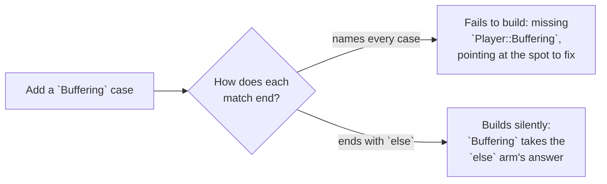

# Exhaustive

::note
<!-- sync:needs:start -->

**You'll need**: [Enum](/docs/learn/enum), [Variant match](/docs/learn/variant-match), [Guard](/docs/learn/guard), [Range pattern](/docs/learn/range-pattern)
<!-- sync:needs:end -->

::

A `match` is **exhaustive** when every value it could meet has an arm. You have already seen the compiler insist on it — a missing case in [Variant match](/docs/learn/variant-match), a missing `else` in [Match expression](/docs/learn/match-expression). This lesson collects the rules in one place and, more importantly, explains why the check is a feature you want: it is what lets a program grow without silently breaking.

## A closed list of cases

A variant or an enum has a closed list of cases, so the compiler knows every value a match on it could meet, and it insists that every one has an arm:

```rux
variant Player {
    Stopped,
    Playing(int32),
    Paused(int32)
}
```

```rux
func Describe(player: Player) -> char8[..] {
    return match player {
        .Stopped => "stopped",
        .Playing(second) if second < 5 => "just started",
        .Playing(_) => "playing",
        .Paused(_) => "paused"
    };
}
```

Every case has an arm, so no `else` is needed — and none should be written. Notice the two `.Playing` arms. A **guarded arm does not count** towards covering its case, because the guard might be false; `.Playing(second)` still needs the unguarded `.Playing(_)` below it.

## Why the check helps

That check is what makes a variant safe to grow. Suppose you add a `Buffering` case to `Player` next year:



Every match that names its cases one by one fails to compile, and the error points at the exact place to decide what buffering means. A match with `else` keeps compiling — and quietly gives `Buffering` whatever answer `else` gives.

## else on a variant is a promise

That is the trade-off in `IsPlaying`:

```rux
func IsPlaying(player: Player) -> bool {
    return match player {
        .Playing(_) => true,
        else => false
    };
}
```

An `else` on a variant is allowed, but it is a promise you make on behalf of cases that do not exist yet: a future `Buffering` would count as "not playing" with no error to warn you. Use it only when that is truly the right answer for any new case.

## else is for the values you cannot list

An integer has billions of values, so a match that produces a value from an integer must end with `else`, and deciding what the leftovers mean is up to you:

```rux
func Loudness(volume: int32) -> char8[..] {
    return match volume {
        0 => "muted",
        1..=3 => "quiet",
        10 => "maximum",
        else => "normal"
    };
}
```

Even ranges that happened to reach every value would not do instead: an integer match producing a value needs its `else`.

| Matched type         | Covered by                     | `else`                       |
| -------------------- | ------------------------------ | ---------------------------- |
| A variant or an enum | one unguarded arm per case     | allowed, but hides new cases |
| `bool`               | a `true` arm and a `false` arm | not needed                   |
| A tuple of `bool`s   | every combination              | not needed                   |
| An integer           | nothing short of `else`        | required to produce a value  |

A match used as a **statement**, producing no value, is more relaxed about integers and `bool`s: a value with no arm simply skips the match, as in [Match](/docs/learn/match). A match on a variant must still name every case.

## The program

The whole lesson is one package in the [Examples repository](https://github.com/rux-lang/Examples/tree/main/Patterns/Exhaustive). Its comments explain every step.

<!-- sync:program:start -->

```rux [Src/Main.rux]
// A variant or an enum has a closed list of cases, so the compiler knows every value a match on it
// could meet, and it insists that every one has an arm. Leave a case out and the program does not
// build. Delete the `.Paused` arm below and the compiler names what is missing:
//     error: match on 'Player' is not exhaustive; missing Player::Paused
//
// That check is what makes a variant safe to grow. Add a case such as `Buffering` to `Player` next
// year, and every match that forgot it fails to compile, pointing at the exact spot to fix. A match
// that names every case therefore has no `else`, and should not have one.
//
// `else` is for the values you cannot list. An integer has billions of them, so a match that
// produces a value from an integer must end with `else`, and deciding what the leftovers mean is
// up to you. Delete the `else` arm in `Loudness` and the compiler stops with
//     error: match on 'int32' is not exhaustive; its arms do not cover every value
// A `bool` has just two values, so `true` and `false` arms cover it, and a missing one is named:
//     error: match on 'bool8' is not exhaustive; missing false
// A match used as a statement, producing no value, may leave integers and bools out: a value with
// no arm simply skips it.
import Io::PrintLine;

variant Player {
    Stopped,
    Playing(int32),
    Paused(int32)
}

// Every case has an arm, so no `else` is needed. A guarded arm does not count towards that: the
// guard might be false, so `.Playing(second)` still needs an unguarded arm of its own. Without it
// the error would read `missing Player::Playing`.
func Describe(player: Player) -> char8[..] {
    return match player {
        .Stopped => "stopped",
        .Playing(second) if second < 5 => "just started",
        .Playing(_) => "playing",
        .Paused(_) => "paused"
    };
}

// An `else` on a variant is allowed, but it is a promise you make on behalf of cases that do not
// exist yet: a future `Buffering` would quietly count as "not playing" here, with no error to
// warn you. Use it only when that is truly the right answer for any new case.
func IsPlaying(player: Player) -> bool {
    return match player {
        .Playing(_) => true,
        else => false
    };
}

// The arms name a few volume levels, and `else` covers the rest. Even ranges that happened to reach
// every value would not do instead: an integer match producing a value needs its `else`.
func Loudness(volume: int32) -> char8[..] {
    return match volume {
        0 => "muted",
        1..=3 => "quiet",
        10 => "maximum",
        else => "normal"
    };
}

func Main() -> int {
    let states: Player[4] = [
        Player::Stopped,
        Player::Playing(2),
        Player::Playing(95),
        Player::Paused(95)
    ];
    for index in 0..4 {
        PrintLine("{:12} playing: {}", Describe(states[index]), IsPlaying(states[index]));
    }

    PrintLine("0 {}, 2 {}, 7 {}, 10 {}", Loudness(0), Loudness(2), Loudness(7), Loudness(10));
    return 0;
}
```

<!-- sync:program:end -->

## Run it

```sh
cd Examples/Patterns/Exhaustive
rux run
```

<!-- sync:output:start -->

```
stopped      playing: false
just started playing: true
playing      playing: true
paused       playing: false
0 muted, 2 quiet, 7 normal, 10 maximum
```

<!-- sync:output:end -->

## Common mistakes

::mistake
**A case with no arm.**\
Delete the `.Paused` arm and the program does not build:

```text
error: match on 'Player' is not exhaustive; missing Player::Paused
```

The message names the case, so the fix is to add its arm — not an `else`.
::

::mistake
**Only a guarded arm for a case.**\
Delete `.Playing(_) => "playing",` and the guarded `.Playing(second) if second < 5` arm is left alone. It might not match, so the error reads `missing Player::Playing`.
::

::mistake
**An integer match with no `else`.**\
Delete the `else` arm in `Loudness` and the compiler stops with:

```text
error: match on 'int32' is not exhaustive; its arms do not cover every value
```

A `bool` match is held to the same rule, but there two arms are enough; leave one out and it is named:

```text
error: match on 'bool8' is not exhaustive; missing false
```

::

## Try it yourself

1. Add a `Buffering` case to `Player` and run `rux check`. Which function fails, and which one keeps compiling?
2. Rewrite `IsPlaying` without `else`, so that a future case is reported instead of quietly counted as "not playing".
3. Give `Loudness` arms that between them cover `0..=10`, then delete the `else`. Read why it still does not compile.

## Learn more

- [`match`](/docs/lang/patterns/match) and [enumerations](/docs/lang/enums/overview) in the Rux Reference
- [Enum](/docs/learn/enum) and [Variant match](/docs/learn/variant-match) — the closed lists that make the check possible
- [Presence](/docs/learn/presence) — the same rule for optionals, where the case you cannot forget is `none`
