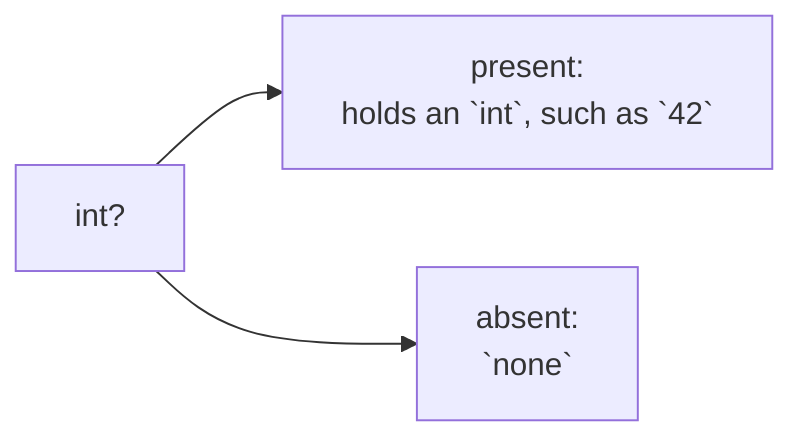

# Optional

::note
<!-- sync:needs:start -->

**You'll need**: [Variant](/docs/learn/variant), [Variant match](/docs/learn/variant-match)
<!-- sync:needs:end -->

::

Some questions have no answer. "Which is the first even number here?" has none when every number is odd. A function returning `int` cannot say so: every value an `int` holds is a perfectly good answer, so any "special" number you pick — `0`, `-1` — could also be a real result. Rux gives absence a type of its own, and this part is about using it.

## int? — an int, or nothing

`int?` is an **optional** `int`. It either holds an `int`, and is then called _present_, or it holds nothing, and is _absent_. Absence has its own spelling, `none`.



Any type can be made optional by adding `?`: `float64?`, `bool?`, `char8[..]?`. You can write an optional down directly, as a plain value or as `none`:

```rux
let known: int? = 42;
let unknown: int? = none;
```

## A plain value becomes present on its own

A plain `int` turns into a present `int?` by itself wherever an `int?` is expected, so there is nothing to wrap. `FirstEven` returns `value`, an ordinary `int`, and it arrives as a present answer:

```rux
func FirstEven(values: int[..]) -> int? {
    for value in values {
        if value % 2 == 0 {
            // A plain `int`, returned where an `int?` is expected: it becomes present.
            return value;
        }
    }
    return none;
}
```

The return type says, right in the signature, that this function may find nothing. A caller cannot miss it.

## Looking inside

An optional cannot be printed or added up as it is. First you have to find out whether there is a value inside, and the smallest way to do that is a `match` with two arms:

```rux
match answer {
    value? => PrintLine("{}: {}", label, value),
    none => PrintLine("{}: none", label)
}
```

`value?` means "present, and call what it holds `value`"; `none` means absent. The [next lesson](/docs/learn/presence) explains these patterns fully.

## The type keeps the two apart

An `int?` is not an `int` until a match has shown that a value is there. Arithmetic on it is refused, because the optional might be `none`:

| You have | You can                               | You cannot                      |
| -------- | ------------------------------------- | ------------------------------- |
| `int`    | add, compare, print it                | store `none` in it              |
| `int?`   | store an `int` or `none`, match on it | add to it, or print it directly |

That refusal is the point. In languages where any value may secretly be "null", forgetting the check is a crash at run time; here it is a compile error, at the line that forgot.

## Absent, but not why

An optional says only _that_ a value is missing, never _why_. "No even number" needs no explanation, but "could not open the file" does. When the reason matters, the fallible `int ! E` of [Part 9: Errors](/docs/learn/errors) carries it.

## The program

The whole lesson is one package in the [Examples repository](https://github.com/rux-lang/Examples/tree/main/Optionals/Optional). Its comments explain every step.

<!-- sync:program:start -->

```rux [Src/Main.rux]
// Some questions have no answer. "Which is the first even number here?" has none when every
// number is odd, and no `int` can mean "there wasn't one" — every value an `int` holds is a
// perfectly good answer.
//
// `int?` is the type for that: an optional `int`. It either holds an `int`, and is then called
// present, or it holds nothing, and is absent. Absence has its own spelling, `none`. A plain
// `int` turns into a present `int?` by itself wherever an `int?` is expected, so there is nothing
// to wrap.
import Io::PrintLine;

// The return type says, right in the signature, that this may find nothing.
func FirstEven(values: int[..]) -> int? {
    for value in values {
        if value % 2 == 0 {
            // A plain `int`, returned where an `int?` is expected: it becomes present.
            return value;
        }
    }
    return none;
}

// An optional cannot be printed or added up as it is; first you have to find out whether there
// is a value inside. This is the smallest `match` that does it. `value?` means "present, and call
// what it holds `value`", and `none` means absent. The next lesson, Presence, explains it fully.
func Show(label: char8[..], answer: int?) {
    match answer {
        value? => PrintLine("{}: {}", label, value),
        none => PrintLine("{}: none", label)
    }
}

func Main() -> int {
    // Optionals can be written down directly, too: a plain value or `none`.
    let known: int? = 42;
    let unknown: int? = none;
    Show("known", known);
    Show("unknown", unknown);

    Show("first even of 3, 7, 8, 9", FirstEven([ 3, 7, 8, 9 ]));
    Show("first even of 1, 3, 5, 7", FirstEven([ 1, 3, 5, 7 ]));

    // The type keeps the two apart. `let doubled = known * 2;` is rejected — "operator '*'
    // cannot combine left operand 'int?' with right operand 'int'" — because `known` might be
    // `none`. An `int?` is not an `int` until a match has shown that a value is there.
    //
    // An optional says only that a value is missing, never why. When the reason matters, the
    // fallible `int ! E` of the Errors part carries it.
    return 0;
}
```

<!-- sync:program:end -->

## Run it

```sh
cd Examples/Optionals/Optional
rux run
```

<!-- sync:output:start -->

```
known: 42
unknown: none
first even of 3, 7, 8, 9: 8
first even of 1, 3, 5, 7: none
```

<!-- sync:output:end -->

## Common mistakes

::mistake
**Doing arithmetic on an optional.**\
`let doubled = known * 2;` is rejected with:

```text
error: operator '*' cannot combine left operand 'int?' with right operand 'int'
```

`known` might be `none`; open it with a `match` first, or give it a fallback with [`??`](/docs/learn/coalesce).
::

::mistake
**Printing an optional directly.**\
`PrintLine("{}", known);` fails with:

```text
error: argument 2 to 'PrintLine' has type 'int?', but variadic parameter 'args' requires 'Display'
```

Only the value inside can be printed, once a match has found it.
::

::mistake
**Inventing a "no value" number.**\
Returning `-1` or `0` for "not found" from a function declared `-> int` compiles, but every caller has to know the convention, and nothing stops one from adding the `-1` to a total. Return `int?` and the compiler makes every caller deal with absence.
::

## Try it yourself

1. Write `FirstNegative(values: int[..]) -> int?` and show its answer for `[3, -2, 5]` and `[1, 2, 3]`.
2. Write `Divide(a: int, b: int) -> int?` that returns `none` when `b` is 0.
3. Try `let doubled = known * 2;` and the direct `PrintLine` of an optional, and read both errors.

## Learn more

- [Presence](/docs/learn/presence) — opening an optional with `match`
- [Coalesce](/docs/learn/coalesce) — replacing absence with a fallback in one line
- [Fallible](/docs/learn/fallible) — when the caller needs to know _why_ there is no value
