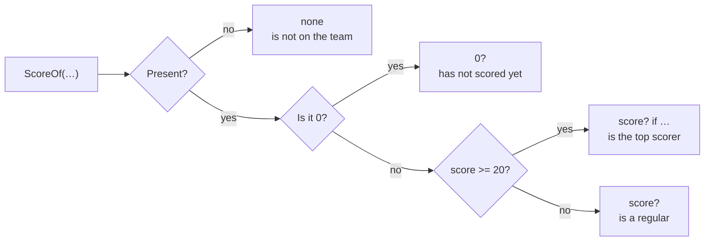

# Presence

::note
<!-- sync:needs:start -->

**You'll need**: [Optional](/docs/learn/optional), [Variant match](/docs/learn/variant-match), [Guard](/docs/learn/guard)
<!-- sync:needs:end -->

::

An `int?` holds either an `int` or nothing, and the program cannot do sums with it until it knows which. `match` is how you find out. It opens the optional and hands you what is inside — but only in the arm where something is actually there. Everything you learnt about patterns in [Part 7](/docs/learn/patterns) carries over.

## Two arms

The lesson's `ScoreOf` looks up the player wearing a number and returns their score, or `none` when nobody wears it. Opening its answer takes two arms:

```rux
match ScoreOf(players, number) {
    score? => PrintLine("#{} scored {}", number, score),
    none => PrintLine("#{} is not on the team", number)
}
```

| Arm         | Taken when              | Inside the arm                      |
| ----------- | ----------------------- | ----------------------------------- |
| `score? =>` | the optional is present | `score` is the plain `int` it holds |
| `none =>`   | the optional is absent  | there is nothing to bind            |

`score?` is a pattern, not a question. Read the `?` as "a present …": "a present value, called `score`". The name before it becomes an ordinary `int`, but only inside its own arm — there is no way to reach a `score` in the `none` arm, because there is none to reach.

## The long spelling

An optional is a two-case type, much like a [variant](/docs/learn/variant-match), and its present case has a name: `.Some`. These two arms mean exactly the same thing:

```rux
.Some(score) => PrintLine("#{} scored {}", number, score),
```

```rux
score? => PrintLine("#{} scored {}", number, score),
```

The short form is the usual one. The long one is worth recognising, because the compiler uses it in its messages, and [Nested optional](/docs/learn/nested-optional) needs it to explain two levels of absence.

## Any pattern can be present

The `?` wraps any pattern, so a literal and a [guard](/docs/learn/guard) work as usual:

```rux
func Rating(players: Player[..], number: int) -> char8[..] {
    return match ScoreOf(players, number) {
        0? => "has not scored yet",
        score? if score >= 20 => "is the top scorer",
        score? => "is a regular",
        none => "is not on the team"
    };
}
```

`0?` is "a present 0". The arms are tried from the top, so the general `score?` arm comes after the specific ones, exactly as in [Exhaustive](/docs/learn/exhaustive).



## none cannot be forgotten

A match on an optional must be exhaustive, like a match on a variant — even when it is a statement. The `none` arm is required, because absence is the case the optional exists to make you handle.

## The program

The whole lesson is one package in the [Examples repository](https://github.com/rux-lang/Examples/tree/main/Optionals/Presence). Its comments explain every step.

<!-- sync:program:start -->

```rux [Src/Main.rux]
// An `int?` holds either an `int` or nothing, and the program cannot do sums
// with it until it knows which. `match` is how you find out. It opens the
// optional and hands you what is inside, but only in the arm where something
// is actually there.
//
// There are two arms to write:
//
//     score? => ...    present: `score` is the `int` inside
//     none => ...      absent: there is nothing to bind
//
// `score?` is a pattern, not a question. Read the `?` as "a present ...". The
// name before it becomes an ordinary `int`, but only inside its arm.
import Io::PrintLine;

struct Player {
    number: int;
    score: int;
}

// The score of the player wearing `number`, or `none` when nobody does.
func ScoreOf(players: Player[..], number: int) -> int? {
    for player in players {
        if player.number == number {
            return player.score;
        }
    }
    return none;
}

func Report(players: Player[..], number: int) {
    match ScoreOf(players, number) {
        score? => PrintLine("#{} scored {}", number, score),
        none => PrintLine("#{} is not on the team", number)
    }
}

// The same match with the long spelling. `.Some(score)` and `score?` mean the
// same thing, much as a variant case is matched by name. The short form is the
// usual one.
func ReportLong(players: Player[..], number: int) {
    match ScoreOf(players, number) {
        .Some(score) => PrintLine("#{} scored {}", number, score),
        none => PrintLine("#{} is not on the team", number)
    }
}

// The `?` wraps any pattern, so a literal and a guard work as usual. The arms
// are tried from the top, so the general `score?` arm comes after the
// specific ones.
func Rating(players: Player[..], number: int) -> char8[..] {
    return match ScoreOf(players, number) {
        0? => "has not scored yet",
        score? if score >= 20 => "is the top scorer",
        score? => "is a regular",
        none => "is not on the team"
    };
}

func Main() -> int {
    let players = [
        Player { number: 4, score: 0 },
        Player { number: 7, score: 12 },
        Player { number: 10, score: 25 }
    ];

    Report(players, 7);
    Report(players, 9);
    ReportLong(players, 10);

    for number in [ 4, 7, 10, 9 ] {
        let rating = Rating(players, number);
        PrintLine("#{} {}", number, rating);
    }

    // Watch out: the `none` arm is required. If you leave it out, the
    // compiler stops with "match on 'int?' is not exhaustive; missing none",
    // because that is the case the optional exists to make you handle.
    return 0;
}
```

<!-- sync:program:end -->

## Run it

```sh
cd Examples/Optionals/Presence
rux run
```

<!-- sync:output:start -->

```
#7 scored 12
#9 is not on the team
#10 scored 25
#4 has not scored yet
#7 is a regular
#10 is the top scorer
#9 is not on the team
```

<!-- sync:output:end -->

## Common mistakes

::warning
**Leaving out the `none` arm.**\
Without it the compiler stops with `error: match on 'int?' is not exhaustive; missing none` — even for a match used as a statement.
::

::warning
**Leaving out the present arm.**\
The other half is required too. A match with only `none =>` fails with `error: match on 'int?' is not exhaustive; missing .Some(_)` — the long spelling at work.
::

::warning
**Only specific present arms.**\
`0?` and a guarded `score? if …` do not cover every present value. Without a plain `score?` arm the match is still missing `.Some(_)`.
::

## Try it yourself

1. Delete the `none` arm from `Report` and read the error.
2. Give `Rating` an arm for players who scored exactly 1, reading `"has scored once"`. Where does it go?
3. Write `Bench(players: Player[..], number: int) -> bool` that is `true` for a player with no goals and `false` otherwise — including for numbers nobody wears.

## Learn more

- [`match`](/docs/lang/statements/match) in the Rux Reference
- [Optional](/docs/learn/optional) — what `int?` is
- [Coalesce](/docs/learn/coalesce) — when all you need is a fallback, `??` is shorter than a match
