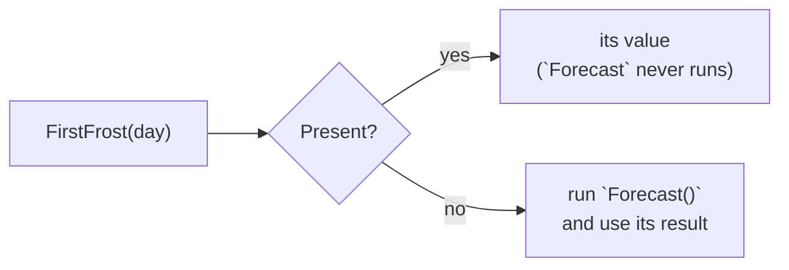

# Coalesce

::note
<!-- sync:needs:start -->

**You'll need**: [Optional](/docs/learn/optional), [Function](/docs/learn/function)
<!-- sync:needs:end -->

::

Often absence has an obvious stand-in. With no frost reading there is no frost, so report zero; with no nickname, use the real name. A whole `match` for that is a lot of code for a small idea. The **coalescing operator** `??` says it in one line.

## optional ?? fallback

```rux
PrintLine("monday:  {}", FirstFrost(monday) ?? 0);
PrintLine("tuesday: {}", FirstFrost(tuesday) ?? 0);
```

When the optional is present you get what is inside it. When it is `none` you get the fallback. Either way the result is a plain `int` — not an `int?` — so the rest of the program never has to think about absence again. Monday has a frost and prints `-4`; Tuesday has none and prints `0`.

It is a shorter way to write a match you already know:

| With `??`              | Means the same as                              |
| ---------------------- | ---------------------------------------------- |
| `FirstFrost(day) ?? 0` | `match FirstFrost(day) { t? => t, none => 0 }` |

The fallback must have the type of the value inside: an `int?` takes an `int` fallback.

## The fallback is lazy

The fallback is evaluated only when it is needed. `Forecast` prints a line whenever it runs, so you can see when that is:

```rux
PrintLine("  {}", FirstFrost(monday) ?? Forecast());
PrintLine("  {}", FirstFrost(tuesday) ?? Forecast());
```



Monday has a frost, so the forecast is never asked. Tuesday has none, so it is — and `(asking the forecast)` appears in the output only once. That matters when the fallback is slow, or does something you can see, such as printing or reading a file.

## Chaining

`??` chains. The optionals are tried from left to right, the first present one wins, and the last fallback covers the case where every one is absent:

```rux
let either = FirstFrost(tuesday) ?? FirstFrost(monday) ?? 0;
```

Tuesday is `none`, Monday is `-4`, so `either` is `-4`, and the final `0` is never needed.

## Mind the precedence

`==` binds more tightly than `??`, so a comparison next to a fallback needs parentheses:

```rux
let mild = (FirstFrost(tuesday) ?? 0) == 0;
```

Without them, `FirstFrost(tuesday) ?? 0 == 0` would mean `FirstFrost(tuesday) ?? (0 == 0)` — an `int` optional with a `bool` fallback.

## The program

The whole lesson is one package in the [Examples repository](https://github.com/rux-lang/Examples/tree/main/Optionals/Coalesce). Its comments explain every step.

<!-- sync:program:start -->

```rux [Src/Main.rux]
// Often absence has an obvious stand-in. With no reading there is no frost,
// so report zero. A whole `match` for that is a lot of code, and `??` says it
// in one line:
//
//     optional ?? fallback
//
// When the optional is present you get what is inside it. When it is `none`
// you get the fallback. Either way the result is a plain `int`, so the rest of
// the program never has to think about absence again.
import Io::PrintLine;

// The first temperature below zero, or `none` on a mild day.
func FirstFrost(readings: int[..]) -> int? {
    for reading in readings {
        if reading < 0 {
            return reading;
        }
    }
    return none;
}

// A slow fallback, which prints so that you can see when it runs.
func Forecast() -> int {
    PrintLine("  (asking the forecast)");
    return -2;
}

func Main() -> int {
    let monday = [ 3, 1, -4, -1 ];
    let tuesday = [ 5, 6, 4, 2 ];

    PrintLine("monday:  {}", FirstFrost(monday) ?? 0);
    PrintLine("tuesday: {}", FirstFrost(tuesday) ?? 0);

    // The fallback is lazy: it is evaluated only when it is needed. Monday has
    // a frost, so the forecast is never asked. Tuesday has none, so it is.
    PrintLine("monday or forecast:");
    PrintLine("  {}", FirstFrost(monday) ?? Forecast());
    PrintLine("tuesday or forecast:");
    PrintLine("  {}", FirstFrost(tuesday) ?? Forecast());

    // `??` chains. The optionals are tried from left to right, the first
    // present one wins, and the last fallback covers the case where every one
    // is absent.
    let either = FirstFrost(tuesday) ?? FirstFrost(monday) ?? 0;
    PrintLine("first frost this week: {}", either);

    // Watch out: `==` binds more tightly than `??`. Without the parentheses,
    // `FirstFrost(tuesday) ?? 0 == 0` would mean `FirstFrost(tuesday) ?? (0 == 0)`,
    // which mixes an `int` with a `bool` and does not compile.
    let mild = (FirstFrost(tuesday) ?? 0) == 0;
    PrintLine("tuesday was mild: {}", mild);
    return 0;
}
```

<!-- sync:program:end -->

## Run it

```sh
cd Examples/Optionals/Coalesce
rux run
```

<!-- sync:output:start -->

```
monday:  -4
tuesday: 0
monday or forecast:
  -4
tuesday or forecast:
  (asking the forecast)
  -2
first frost this week: -4
tuesday was mild: true
```

<!-- sync:output:end -->

## Common mistakes

::warning
**A comparison without parentheses.**\
`let mild = FirstFrost(tuesday) ?? 0 == 0;` reads as `FirstFrost(tuesday) ?? (0 == 0)` and stops with `error: coalescing fallback has type 'bool8', but the optional payload is 'int'`. Wrap the coalescing part: `(FirstFrost(tuesday) ?? 0) == 0`.
::

::warning
**`??` on a value that is not optional.**\
A plain `int` is never absent, so there is nothing to fall back from: `count ?? 0` fails with `error: operator '??' requires an optional left operand, but found 'int'`. Remove the `??`.
::

::warning
**A fallback that always runs — in your head.**\
The fallback runs only for `none`. If it has an effect you rely on, such as a line of output, that effect happens only on the absent path, as the forecast shows.
::

## Try it yourself

1. Print the first frost of a week of three days, `FirstFrost(a) ?? FirstFrost(b) ?? FirstFrost(c) ?? 0`, with only the last day frosty.
2. Make `Forecast` return `-9` and check that Monday's line still prints `-4`.
3. Declare `let nickname: char8[..]? = none;` and print `nickname ?? "anonymous"`.

## Learn more

- [Presence](/docs/learn/presence) — the `match` that `??` abbreviates
- [Coalesce exit](/docs/learn/coalesce-exit) — a fallback that leaves the function or loop instead of producing a value
- [Precedence](/docs/learn/precedence) — how Rux decides which operator binds first
