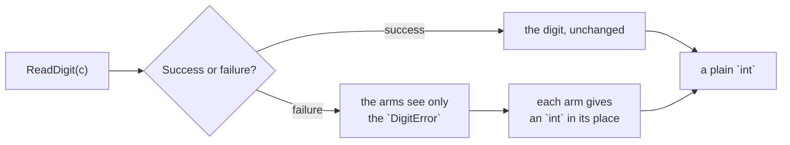

# Catch

::note
<!-- sync:needs:start -->

**You'll need**: [Outcome](/docs/learn/outcome), [Variant match](/docs/learn/variant-match), [Guard](/docs/learn/guard)
<!-- sync:needs:end -->

::

`catch` turns a fallible back into a plain value. `outcome catch { arms }` lets a success straight through, unchanged. A failure goes to the arms, which see only the error and must produce a value of the success type in its place.

The example reads a digit someone typed. A few typing slips are easy to forgive: a capital O was surely meant as 0, and a lower-case l as 1. Anything else becomes -1, meaning unreadable.

## Success passes, failure goes to the arms

```rux
func ForgivingDigit(c: char) -> int {
    return ReadDigit(c) catch {
        DigitError::Letter(letter) if letter == 'O' => 0,
        DigitError::Letter(letter) if letter == 'l' => 1,
        DigitError::Letter(_) => -1,
        DigitError::Symbol(_) => -1,
        DigitError::Blank => -1
    };
}
```

`ForgivingDigit` returns a plain `int`. After the `catch` there is no failure left to handle, so the function itself cannot fail.



## The arms are match arms

When the error is a [variant](/docs/learn/variant), each arm names a case, just as in a [variant match](/docs/learn/variant-match), and an arm may add a [guard](/docs/learn/guard) with `if`. Together the arms must cover every error, so no failure is left over.

The order is doing real work here. The two guarded `Letter` arms come first; `DigitError::Letter(_)` catches every other letter after them. Put `Letter(_)` first and it takes every letter, the O and the l included — and the compiler does not point it out. Every letter would quietly read as -1.

|              | `match`                          | `catch`                  |
| ------------ | -------------------------------- | ------------------------ |
| Its arms see | the whole outcome                | only the error           |
| A success    | needs an arm of its own          | passes through unchanged |
| Patterns     | `.Success(...)`, `.Failure(...)` | the error's own patterns |
| The result   | whatever the arms produce        | the success type         |

## An arm may leave instead

Every arm has to give back an `int`, because that is what a success would have been. An arm that has no sensible value may leave the function instead, with `return`:

```rux
func DigitOrStop(c: char) -> int {
    let digit = ReadDigit(c) catch {
        DigitError::Blank => return 0,
        else => -1
    };
    return digit * 2;
}
```

A blank makes `DigitOrStop` return 0 at once; any other failure carries on with -1. The `else` arm is the default arm, as in `match`, and covers whatever cases are left.

## The program

The whole lesson is one package in the [Examples repository](https://github.com/rux-lang/Examples/tree/main/Errors/Catch). Its comments explain every step.

<!-- sync:program:start -->

```rux [Src/Main.rux]
// `catch` turns a fallible back into a plain value. `outcome catch { arms }` lets a success
// straight through, unchanged. A failure goes to the arms, which see only the error and must
// produce a value of the success type in its place.
//
// When the error is a variant, each arm names a case, just as in a `match`, and an arm may add a
// guard with `if`. Together the arms must cover every error, so no failure is left over.
//
// The example reads a digit someone typed. A few typing slips are easy to forgive: a capital O
// was surely meant as 0, and a lower-case l as 1. Anything else becomes -1, meaning unreadable.
import Io::PrintLine;

variant DigitError {
    Blank,
    Letter(char),
    Symbol(char)
}

func ReadDigit(c: char) -> int ! DigitError {
    if c == ' ' {
        fail DigitError::Blank;
    }
    if (c >= 'a' && c <= 'z') || (c >= 'A' && c <= 'Z') {
        fail DigitError::Letter(c);
    }
    if c < '0' || c > '9' {
        fail DigitError::Symbol(c);
    }
    return (c as int) - ('0' as int);
}

// The result is a plain `int`: after the `catch`, there is no failure left to handle.
func ForgivingDigit(c: char) -> int {
    return ReadDigit(c) catch {
        DigitError::Letter(letter) if letter == 'O' => 0,
        DigitError::Letter(letter) if letter == 'l' => 1,
        DigitError::Letter(_) => -1,
        DigitError::Symbol(_) => -1,
        DigitError::Blank => -1
    };
}

func Show(c: char) {
    PrintLine("'{}' reads as {}", c, ForgivingDigit(c));
}

func Main() -> int {
    Show('7');
    Show('O');
    Show('l');
    Show('x');
    Show('#');
    Show(' ');

    // Every arm has to give back an `int`, because that is what a success would have been; an
    // arm that has no sensible value may leave the function instead, with `return`. And the
    // arms must cover every case: drop the `Blank` arm and the compiler says "match on
    // 'DigitError' is not exhaustive; missing DigitError::Blank".
    return 0;
}
```

<!-- sync:program:end -->

## Run it

```sh
cd Examples/Errors/Catch
rux run
```

<!-- sync:output:start -->

```
'7' reads as 7
'O' reads as 0
'l' reads as 1
'x' reads as -1
'#' reads as -1
' ' reads as -1
```

<!-- sync:output:end -->

## Common mistakes

::warning
**An arm of the wrong type.**\
`DigitError::Blank => "blank"` is `error: 'catch' arm produces 'char8[..]', but the recovered value has type 'int'`. A `catch` arm replaces the success, so it must have the success type.
::

::warning
**Missing a case.**\
Drop the `Blank` arm and the compiler says `error: match on 'DigitError' is not exhaustive; missing DigitError::Blank`. Add the arm, or an `else` arm for everything left.
::

::warning
**A catch-all before the specific arms.**\
`DigitError::Letter(_)` above the guarded `Letter` arms compiles, but swallows them: `'O'` then reads as -1. Specific arms first, general ones after.
::

## Try it yourself

1. Forgive a capital `S` as 5 and a capital `B` as 8.
2. Make a blank read as 0 instead of -1. Predict the last line of the output before you run it.
3. Replace the last three arms with a single `else => -1`. Does the output change?

## Learn more

- [Catch fallback](/docs/learn/catch-fallback) — one `else` arm for every error
- [Propagate](/docs/learn/propagate) — when the failure is the caller's to handle
- [Guard](/docs/learn/guard) — the `if` that refines an arm
- [Variant match](/docs/learn/variant-match) — the patterns `catch` arms use
