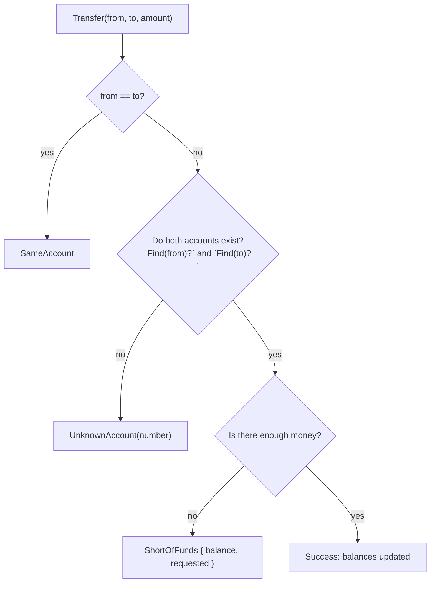

# Error variant

::note
<!-- sync:needs:start -->

**You'll need**: [Propagate](/docs/learn/propagate), [Variant match](/docs/learn/variant-match), [Struct pattern](/docs/learn/struct-pattern)
<!-- sync:needs:end -->

::

An operation that can go wrong in several ways deserves an error type that lists those ways. A [variant](/docs/learn/variant) does that: one case per kind of failure, and each case carries only the details that make sense for it.

The caller can then match on the case to decide what to do, and read the details to say precisely what went wrong — far more than a single error code could tell it.

## One case per way to fail

A transfer between three bank accounts can fail in three ways:

```rux
variant TransferError {
    SameAccount,
    UnknownAccount(int),
    ShortOfFunds { balance: int; requested: int; }
}
```

| Case             | Shape                     | Carries                              |
| ---------------- | ------------------------- | ------------------------------------ |
| `SameAccount`    | bare                      | nothing — the case says it all       |
| `UnknownAccount` | one fact, in parentheses  | the account number that was wrong    |
| `ShortOfFunds`   | several facts, with names | the balance and the amount asked for |

A case with several facts gives them names, like a small [struct](/docs/learn/struct), so nobody has to remember which number came first.

## Failing with each case

Each `fail` builds the case that fits, with its details:

```rux
if from == to {
    fail TransferError::SameAccount;
}
```

```rux
if balances[source] < amount {
    fail TransferError::ShortOfFunds { balance: balances[source], requested: amount };
}
```

`UnknownAccount` comes from a helper, `Find`, which turns an account number into a position in the list of balances. It fails with the same error type, so `Transfer` passes its failures on with [`?`](/docs/learn/propagate), unchanged:

```rux
let source = Find(from)?;
let target = Find(to)?;
```

The checks run in order, and the first one that fails decides the error:



## Reading the details

`Explain` gives one message per case, each built from the details that case carries. The patterns are the [struct patterns](/docs/learn/struct-pattern) you already know:

```rux
match error {
    .SameAccount => PrintLine("    refused: an account cannot pay itself"),
    .UnknownAccount(number) => PrintLine("    refused: there is no account {}", number),
    .ShortOfFunds { balance, requested } => PrintLine(
        "    refused: asked for {} but only {} is there", requested, balance)
}
```

`.ShortOfFunds { balance, requested }` binds each field to a variable of the same name. A pattern written with field names may also leave fields out — `.ShortOfFunds { requested }` binds only the one it needs.

Because the match must cover every case, adding a fourth way to fail later makes the compiler point at every `match` that does not handle it yet. That is the main payoff of a variant error: no new failure goes unexplained.

## The program

The whole lesson is one package in the [Examples repository](https://github.com/rux-lang/Examples/tree/main/Errors/ErrorVariant). Its comments explain every step.

<!-- sync:program:start -->

```rux [Src/Main.rux]
// An operation that can go wrong in several ways deserves an error type that lists those ways.
// A variant does that: one case per kind of failure, and each case carries only the details that
// make sense for it.
//
// A case with nothing to add is bare. A case with one fact carries it in parentheses. A case with
// several facts gives them names, like a small struct. The caller can then match on the case to
// decide what to do, and read the details to say precisely what went wrong — far more than a
// single error code could tell it.
import Io::PrintLine;

variant TransferError {
    SameAccount,
    UnknownAccount(int),
    ShortOfFunds { balance: int; requested: int; }
}

// Turns an account number into a position in the list of balances.
func Find(number: int) -> int ! TransferError {
    if number < 1 || number > 3 {
        fail TransferError::UnknownAccount(number);
    }
    return number - 1;
}

func Transfer(balances: &var int[3], from: int, to: int, amount: int) -> ! TransferError {
    if from == to {
        fail TransferError::SameAccount;
    }
    // The same error type all the way through, so `?` passes each failure on unchanged.
    let source = Find(from)?;
    let target = Find(to)?;
    if balances[source] < amount {
        fail TransferError::ShortOfFunds { balance: balances[source], requested: amount };
    }
    balances[source] -= amount;
    balances[target] += amount;
}

// One message per case, each built from the details that case carries.
func Explain(error: TransferError) {
    match error {
        .SameAccount => PrintLine("    refused: an account cannot pay itself"),
        .UnknownAccount(number) => PrintLine("    refused: there is no account {}", number),
        .ShortOfFunds { balance, requested } => PrintLine(
            "    refused: asked for {} but only {} is there", requested, balance)
    }
}

func Attempt(balances: &var int[3], from: int, to: int, amount: int) {
    PrintLine("move {} from account {} to account {}", amount, from, to);
    match Transfer(balances, from, to, amount) {
        .Success(()) => PrintLine("    done: balances {}, {}, {}", balances[0], balances[1],
            balances[2]),
        .Failure(error) => Explain(error)
    }
}

func Main() -> int {
    var balances: int[3] = [100, 50, 0];
    Attempt(balances, 1, 3, 30);
    Attempt(balances, 2, 2, 10);
    Attempt(balances, 1, 7, 10);
    Attempt(balances, 3, 1, 45);
    return 0;
}
```

<!-- sync:program:end -->

## Run it

```sh
cd Examples/Errors/ErrorVariant
rux run
```

<!-- sync:output:start -->

```
move 30 from account 1 to account 3
    done: balances 70, 50, 30
move 10 from account 2 to account 2
    refused: an account cannot pay itself
move 10 from account 1 to account 7
    refused: there is no account 7
move 45 from account 3 to account 1
    refused: asked for 45 but only 30 is there
```

<!-- sync:output:end -->

## Common mistakes

::warning
**Forgetting a case.**\
Drop the `SameAccount` arm from `Explain` and the compiler says `error: match on 'TransferError' is not exhaustive; missing TransferError::SameAccount`.
::

::warning
**Giving a bare case a payload.**\
`fail TransferError::SameAccount(from);` is `error: call to 'TransferError::SameAccount' expects 0 arguments, but 1 was provided`. If the detail matters, declare the case with it.
::

## Try it yourself

1. Add a case `ZeroAmount` and refuse a transfer of 0 before any other check. Follow the compiler to every match that needs a new arm.
2. Make `ShortOfFunds` print how much is missing as well, using only the two fields it already carries.
3. Add `Attempt(balances, 2, 1, 50);` at the end and predict the balances it prints.

## Learn more

- [Variant](/docs/learn/variant) and [Variant match](/docs/learn/variant-match) — the type and its patterns
- [Struct pattern](/docs/learn/struct-pattern) — binding named fields
- [Error mapping](/docs/learn/error-mapping) — turning a lower-level error into one of these cases
- [Error sum](/docs/learn/error-sum) — the alternative when the errors are unrelated types
