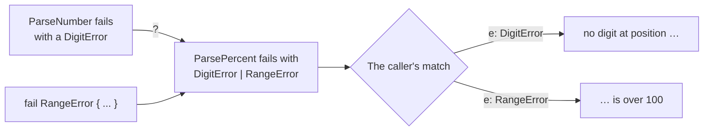

# Error sum

::note
<!-- sync:needs:start -->

**You'll need**: [Outcome](/docs/learn/outcome), [Propagate](/docs/learn/propagate)
<!-- sync:needs:end -->

::

Some functions can fail in more than one unrelated way. Reading a percentage can find a character that is not a digit, or a perfectly good number that is bigger than 100. Those are two different error types, and the error channel can hold either one.

## Two errors in one channel

The two errors are separate structs, each with its own details:

```rux
struct DigitError {
    position: uint;
}

struct RangeError {
    value: int;
    limit: int;
}
```

`ParsePercent` names both after the `!`:

```rux
func ParsePercent(text: char8[..]) -> int ! (DigitError | RangeError) {
```

`A | B` is a _sum_: one value that is an `A` or a `B`, and knows which. Sums have a part of their own, [Sum types](/docs/learn/sum-types), straight after this one; here you need only what it means in an error channel. The order does not matter — `(RangeError | DigitError)` is the same type. The parentheses are for the reader: in a type, `|` binds tighter than `!`, so they could be left out, but with them nobody has to remember that.

## Widening needs no code

The surprise is how little the function body has to do:

```rux
let value = ParseNumber(text)?;
if value > 100 {
    fail RangeError { value: value, limit: 100 };
}
return value;
```

`ParseNumber` fails with a plain `DigitError`, yet `?` passes it on unchanged — a `DigitError` fits into the wider sum on its own. `fail RangeError { ... }` needs no wrapping either. This is called _widening_: a narrower error always fits into a sum that includes it.



## Telling the members apart

The caller tells the members apart with a _typed pattern_. `e: DigitError` matches only that member and binds it as a plain `DigitError`, so its fields are right there:

```rux
match ParsePercent(text) {
    .Success(percent) => PrintLine("{:5} -> {}%", text, percent),
    .Failure(e: DigitError) => PrintLine("{:5} -> no digit at position {}", text, e.position),
    .Failure(e: RangeError) => PrintLine("{:5} -> {} is over {}", text, e.value, e.limit)
}
```

The match must cover every member of the sum, or the compiler names the missing one.

## A sum or a variant?

[Error variant](/docs/learn/error-variant) solved a similar problem with one type and several cases. Both work; they suit different situations.

|                            | Error sum `A \| B`                         | Error variant                   |
| -------------------------- | ------------------------------------------ | ------------------------------- |
| The errors are             | separate types that already exist          | cases you declare together      |
| Passing one on with `?`    | widens on its own                          | needs a mapping into a case     |
| Adding a new kind of error | changes every signature that lists the sum | one new case in one declaration |
| Best for                   | combining errors from different places     | a stable, named set of failures |

## The program

The whole lesson is one package in the [Examples repository](https://github.com/rux-lang/Examples/tree/main/Errors/ErrorSum). Its comments explain every step.

<!-- sync:program:start -->

```rux [Src/Main.rux]
// Some functions can fail in more than one unrelated way. Reading a percentage
// can find a character that is not a digit, or a perfectly good number that
// is bigger than 100. Those are two different error types, and the error
// channel can hold either one:
//
//     func ParsePercent(text: char8[..]) -> int ! (DigitError | RangeError)
//
// `A | B` is a sum: one value that is an `A` or a `B`, and knows which. The
// order does not matter — `(RangeError | DigitError)` is the same type.
//
// The surprise is how little the function body has to do. A `DigitError`
// fits into the wider sum on its own, so `ParseNumber(text)?` passes it on
// unchanged and `fail RangeError { ... }` needs no wrapping either. This is
// called widening: a narrower error always fits into a sum that includes it.
import Io::PrintLine;

struct DigitError {
    position: uint;
}

struct RangeError {
    value: int;
    limit: int;
}

func ParseNumber(text: char8[..]) -> int ! DigitError {
    var total = 0;
    for i in 0..text.length {
        let byte = text[i];
        if byte < c8'0' || byte > c8'9' {
            fail DigitError { position: i };
        }
        total = total * 10 + ((byte as int) - 48);
    }
    return total;
}

func ParsePercent(text: char8[..]) -> int ! (DigitError | RangeError) {
    // A `DigitError` widens into the sum as it passes through `?`.
    let value = ParseNumber(text)?;
    if value > 100 {
        fail RangeError { value: value, limit: 100 };
    }
    return value;
}

// The caller tells the members apart with a typed pattern: `e: DigitError`
// matches only that member and binds it as a plain `DigitError`. The match
// must cover every member of the sum, or the compiler names the missing one.
// Drop the `RangeError` arm and it says "match on 'int ! (DigitError |
// RangeError)' is not exhaustive; missing .Failure(_: RangeError)".
func Show(text: char8[..]) {
    match ParsePercent(text) {
        .Success(percent) => PrintLine("{:5} -> {}%", text, percent),
        .Failure(e: DigitError) => PrintLine("{:5} -> no digit at position {}", text, e.position),
        .Failure(e: RangeError) => PrintLine("{:5} -> {} is over {}", text, e.value, e.limit)
    }
}

func Main() -> int {
    Show("75");
    Show("7%");
    Show("250");
    return 0;
}
```

<!-- sync:program:end -->

## Run it

```sh
cd Examples/Errors/ErrorSum
rux run
```

<!-- sync:output:start -->

```
75    -> 75%
7%    -> no digit at position 1
250   -> 250 is over 100
```

<!-- sync:output:end -->

## Common mistakes

::warning
**Leaving out a member.**\
Drop the `RangeError` arm and the compiler says `error: match on 'int ! (DigitError | RangeError)' is not exhaustive; missing .Failure(_: RangeError)`.
::

::warning
**Failing with a type that is not in the sum.**\
`fail 5;` in `ParsePercent` is `error: 'fail' value must have type 'DigitError | RangeError', but found 'int'`. Widening only accepts a member of the sum.
::

::warning
**An untyped failure arm first.**\
`.Failure(e) =>` matches every member, so a later `.Failure(e: RangeError)` arm is `error: match arm is unreachable because earlier arms already match every value it matches`.
::

## Try it yourself

1. Add `Show("100");` and `Show("101");` and predict both lines.
2. `Show("")` prints `0%`. Add an `EmptyError` struct, put it in the sum, and fail with it on empty text. What else does the compiler ask you to change?
3. Swap the order of the members in the signature to `(RangeError | DigitError)` and check that nothing else has to change.

## Learn more

- [Sum types](/docs/learn/sum-types) — the next part, all about `A | B`
- [Typed pattern](/docs/learn/typed-pattern) — `e: DigitError` in detail
- [Sum widening](/docs/learn/sum-widening) — when a narrower type fits a wider sum
- [Error variant](/docs/learn/error-variant) — the alternative with named cases
