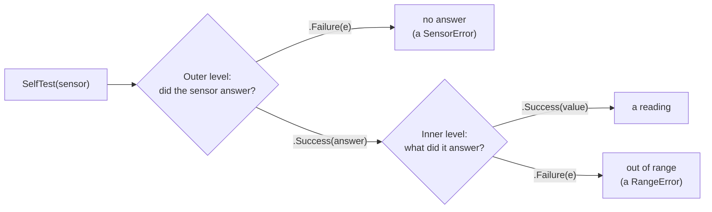

# Nested fallible

::note
<!-- sync:needs:start -->

**You'll need**: [Nested optional](/docs/learn/nested-optional), [Outcome](/docs/learn/outcome)
<!-- sync:needs:end -->

::

Optionals and fallibles nest, and each level keeps its own meaning. You saw that with optionals in [Nested optional](/docs/learn/nested-optional); this lesson does the same with fallibles. Two shapes come up all the time, and both are about keeping two different answers apart.

## The next value, the end, or a failure

`int? ! SensorError` is the shape of "read the next value". Three answers are possible: a value, no more values, or the read itself broke:

```rux
func Reading(sensor: int, index: int) -> int? ! SensorError {
```

Running out is not an error, and a broken sensor is not "no more" — so both levels are needed. Patterns nest to reach each answer:

```rux
match Reading(sensor, index) {
    .Success(value?) => Print(" {}", value),
    .Success(none) => {
        PrintLine(" (end)");
        break;
    },
    .Failure(e) => {
        PrintLine(" (sensor {} broke)", e.sensor);
        break;
    }
}
```

| Pattern            | Means                                  |
| ------------------ | -------------------------------------- |
| `.Success(value?)` | the read worked and found a value      |
| `.Success(none)`   | the read worked and found nothing more |
| `.Failure(e)`      | the read itself broke                  |

Walking a folder in the `FileSystem` package has exactly this shape, as you will see in [Directory](/docs/learn/directory).

## An answer that can itself fail

`(int ! RangeError) ! SensorError` is the shape of "ask for a result that can itself fail". The outer failure means the question never got an answer. A success holds the answer — and that answer may be a failure of its own: the sensor replied, and what it replied was "out of range".

```rux
if sensor == 2 {
    return .Success(.Failure(RangeError { value: 999 }));
}
return .Success(.Success(21));
```

The parentheses are required. A type holds at most one `!` without them, so `int ! RangeError ! SensorError` is refused, and the help line suggests the two groupings — `(T ! E) ! F` or `T ! (E ! F)` — which mean different things.



## Levels never merge

An inner failure is ordinary data inside a success, so `?` or `catch` on the outer level never touches it. Here `catch` handles only the outer failure, and the inner one comes through intact:

```rux
let inner = SelfTest(2) catch { else => .Success(0) };
match inner {
    .Success(v) => PrintLine("ok {}", v),
    .Failure(e) => PrintLine("inner failure {}", e.value)
}
```

Sensor 2 did answer, so the `catch` has nothing to do, and the program prints `inner failure 999`. The `else` arm's `.Success(0)` would only stand in for an outer failure — and since it replaces an answer, it has to be one, an `int ! RangeError`.

## The program

The whole lesson is one package in the [Examples repository](https://github.com/rux-lang/Examples/tree/main/Errors/NestedFallible). Its comments explain every step.

<!-- sync:program:start -->

```rux [Src/Main.rux]
// Native forms nest, and each level keeps its own meaning. Two shapes come up
// all the time.
//
// `int? ! SensorError` — "read the next value". Three answers are possible:
// a value, no more values (`none`), or the read itself broke (a failure).
// Running out is not an error and a broken sensor is not "no more", so both
// levels are needed. Walking a folder in the `FileSystem` package has exactly
// this shape.
//
// `(int ! RangeError) ! SensorError` — "ask for a result that can itself
// fail". The outer failure means the question never got an answer. A success
// holds the answer, and that answer may be a failure of its own: the sensor
// replied, and what it replied was "out of range".
//
// Levels never merge. An inner failure is ordinary data inside a success, so
// `?` or `catch` on the outer level never touches it. Patterns nest to reach
// every case: `.Success(value?)`, `.Success(none)`, `.Success(.Failure(e))`.
import Io::{ Print, PrintLine };

struct SensorError {
    sensor: int;
}

struct RangeError {
    value: int;
}

// Sensor 1 logged three readings. Sensor 2 broke while reading its third.
func Reading(sensor: int, index: int) -> int? ! SensorError {
    if sensor == 2 && index == 2 {
        fail SensorError { sensor: sensor };
    }
    if index >= 3 {
        return none;
    }
    return 20 + index;
}

// Sensor 1 answers 21, sensor 2 answers with a reading it rejects, and
// sensor 3 does not answer at all.
func SelfTest(sensor: int) -> (int ! RangeError) ! SensorError {
    if sensor == 3 {
        fail SensorError { sensor: sensor };
    }
    if sensor == 2 {
        return .Success(.Failure(RangeError { value: 999 }));
    }
    return .Success(.Success(21));
}

func Main() -> int {
    for sensor in 1..=2 {
        Print("sensor {} log:", sensor);
        for index in 0..10 {
            match Reading(sensor, index) {
                .Success(value?) => Print(" {}", value),
                .Success(none) => {
                    PrintLine(" (end)");
                    break;
                },
                .Failure(e) => {
                    PrintLine(" (sensor {} broke)", e.sensor);
                    break;
                }
            }
        }
    }

    for sensor in 1..=3 {
        match SelfTest(sensor) {
            .Success(.Success(value)) => PrintLine("sensor {} test: reads {}", sensor, value),
            .Success(.Failure(e)) => PrintLine("sensor {} test: {} is out of range",
                sensor, e.value),
            .Failure(e) => PrintLine("sensor {} test: no answer", e.sensor)
        }
    }
    return 0;
}
```

<!-- sync:program:end -->

## Run it

```sh
cd Examples/Errors/NestedFallible
rux run
```

<!-- sync:output:start -->

```
sensor 1 log: 20 21 22 (end)
sensor 2 log: 20 21 (sensor 2 broke)
sensor 1 test: reads 21
sensor 2 test: 999 is out of range
sensor 3 test: no answer
```

<!-- sync:output:end -->

## Common mistakes

::warning
**Forgetting the end of the data.**\
Drop the `.Success(none)` arm and the compiler says `error: match on 'int? ! SensorError' is not exhaustive; missing .Success(none)`.
::

::warning
**Treating the outer success as the reading.**\
In `SelfTest`'s match, `.Success(value)` binds the inner `int ! RangeError`, not an `int`. `value + 1` there is `error: operator '+' cannot combine left operand 'int ! RangeError' with right operand 'int'`. Match one level deeper with `.Success(.Success(value))`.
::

::warning
**Leaving out the parentheses.**\
`int ! RangeError ! SensorError` is `error: a type contains at most one unparenthesized '!'`. Group the level you mean.
::

## Try it yourself

1. Extend the first loop to sensor 3 with `1..=3`. Predict its log line before you run.
2. Make sensor 1's self-test answer 150 and treat anything over 100 as out of range.
3. Write `func FirstReading(sensor: int) -> int? ! SensorError` that returns the reading at index 0 using `?` on the outer level. What type does `Reading(sensor, 0)?` have?

## Learn more

- [Nested optional](/docs/learn/nested-optional) — the same idea with `T??`
- [Outcome](/docs/learn/outcome) — `.Success` and `.Failure` as patterns and constructors
- [Iterator](/docs/learn/iterator) — `T?` as "the next item, or the end"
- [Directory](/docs/learn/directory) — a real `T? ! E` from the `FileSystem` package
