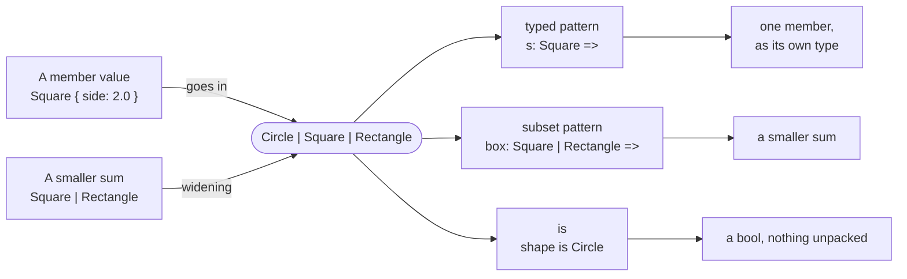

# Part 10: Sum types

A setting in a configuration file is a number, a switch or a word. A token from a tokenizer is a number, a name or an operator. Rux writes "one of these types" directly in the type: `int32 | bool | char8[..]`. The value always knows which member it holds, and the compiler will not let you treat it as any one of them until you have asked. This part shows how to build such a value, how to ask, and how sums of different sizes fit together.

## What you will learn

- What `A | B` means, and why it is a _set_ of types: order and duplicates make no difference, and `int32 | int32` is plain `int32`.
- How a value goes into a sum, and when a literal is ambiguous.
- Matching a sum by the type it holds with a typed pattern, `n: int32 =>`, and covering every member.
- Handling several members in one arm with a subset pattern, `box: Square | Rectangle =>`, and passing the smaller sum on.
- Asking which member is active with `is`, which answers with a `bool` and never unpacks anything.
- Widening: a smaller sum fits wherever a larger one is expected, but never the other way round.

## Into a sum and back out



| You want to…                             | Use                                        | Lesson                                       |
| ---------------------------------------- | ------------------------------------------ | -------------------------------------------- |
| use the value inside                     | `match` with `n: int32 =>`                 | [Typed pattern](/docs/learn/typed-pattern)   |
| handle several members alike             | `match` with `box: Square \| Rectangle =>` | [Subset pattern](/docs/learn/subset-pattern) |
| only know which member it is             | `value is T`, `value is (A \| B)`          | [The is operator](/docs/learn/is)            |
| pass a smaller sum to a larger parameter | nothing — it widens by itself              | [Sum widening](/docs/learn/sum-widening)     |

## Lessons

<!-- sync:lessons:start -->

|      | Lesson                                       | What you will learn                                         |
| ---- | -------------------------------------------- | ----------------------------------------------------------- |
| 10.1 | [Sum type](/docs/learn/sum-type)             | a value that can be an `int32` or a `bool`: `int32 \| bool` |
| 10.2 | [Typed pattern](/docs/learn/typed-pattern)   | match a sum by the type it holds                            |
| 10.3 | [Subset pattern](/docs/learn/subset-pattern) | match several members of a sum in one arm                   |
| 10.4 | [The is operator](/docs/learn/is)            | ask which type a sum holds with `is`                        |
| 10.5 | [Sum widening](/docs/learn/sum-widening)     | pass a smaller sum where a larger one is expected           |

<!-- sync:lessons:end -->

## Before you start

Finish Parts 1–9 first. This part leans on [Type alias](/docs/learn/type-alias), [Variant](/docs/learn/variant) and [Variant match](/docs/learn/variant-match) from Part 6 — a sum is matched much as a variant is — and on [Error sum](/docs/learn/error-sum) from Part 9, where you first wrote `A | B` as a function's error type. Each lesson's package is in the Examples repository's `SumTypes/` folder:

```sh
cd Examples/SumTypes/SumType
rux run
```

## After this part

[Part 11: Ownership](/docs/learn/ownership) turns from what a value _is_ to who _owns_ it — copies, moves, destructors and `defer`. Sums come back in [Part 13: Generics](/docs/learn/generics), where [Generic sum](/docs/learn/generic-sum) builds `T | U` from type parameters and the "a sum is a set" rule decides what `T | U` becomes when `T` and `U` are the same type. The next checkpoint projects, [Circle](/docs/learn/circle) and [Quadratic](/docs/learn/quadratic), come after Part 16.

For the rules behind this part, see [`match`](/docs/lang/patterns/match), [Type tests](/docs/lang/sums/type-tests) and [Type aliases](/docs/lang/types/aliases) in the Rux Reference.
