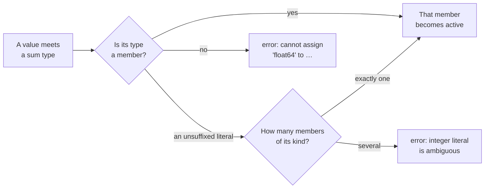

# Sum type

::note
<!-- sync:needs:start -->

**You'll need**: [Type alias](/docs/learn/type-alias), [Variant](/docs/learn/variant), [Error sum](/docs/learn/error-sum)
<!-- sync:needs:end -->

::

A _sum type_ holds one value whose type is one of a short list. `int32 | bool` reads "an `int32` or a `bool`": a variable of that type can hold `8080` now and `true` later, and it always knows which of the two it is holding.

You have met the idea twice already. A [variant](/docs/learn/variant) holds one of several cases, and an [error sum](/docs/learn/error-sum) let a function fail in two unrelated ways. A sum type is the general form: any types at all, joined with `|`. This lesson builds sums, stores them and compares them. Getting a member back out takes a pattern, and that is the [next lesson](/docs/learn/typed-pattern).

## A value of one of several types

A setting in a configuration file might be a number, a switch or a word. A [type alias](/docs/learn/type-alias) gives that sum a short name — it is still exactly `int32 | bool | char8[..]`, just easier to write:

```rux
type Setting = int32 | bool | char8[..];
```

A value of any member type goes straight into the sum, with nothing to wrap it in:

```rux
let port: Setting = 8080;
let verbose: Setting = true;
let name: Setting = "server";
```

The value picks the member. `8080` is an integer, and `Setting` has exactly one integer member, so `port` holds an `int32`. `true` can only be the `bool`, and `"server"` only the text.



## Switching members

A `var` sum can change its member, not only its value. Each assignment replaces both the value and the record of which member is active:

```rux
var limit: int32 | bool = 100;
limit = false;
limit = 250;
```

`limit` starts as the number 100, becomes the switch `false`, and ends as the number 250. A plain `int32` variable could never hold `false`, and a `bool` could never hold 250; the sum can hold either.

## A set of types

A variant names its cases. A sum names only types, so its list is a **set**: the order the types are written in does not matter, and a type written twice counts once. These are three spellings of one type:

```rux
let reordered: bool | int32 = limit;
let repeated: int32 | bool | int32 = reordered;
```

No conversion happens on either line, because there is nothing to convert — `limit`, `reordered` and `repeated` all have the same type. The compiler even writes every sum in its own sorted order in error messages, so `int32 | bool` appears there as `bool8 | int32` (`bool8` is `bool`'s full name).

The same rule makes a sum of one type just that type. `int32 | int32` collapses to `int32`, so it takes part in arithmetic like any other integer:

```rux
let single: int32 | int32 = 20;
PrintLine("single + 1         {}", single + 1);
```

| Written                  | Is the type     |
| ------------------------ | --------------- |
| `int32 \| bool`          | `int32 \| bool` |
| `bool \| int32`          | the same type   |
| `int32 \| bool \| int32` | the same type   |
| `int32 \| int32`         | plain `int32`   |

That collapse looks like a curiosity now. It matters in [Generic sum](/docs/learn/generic-sum), where `T | U` is written before anyone knows whether `T` and `U` are the same type.

## Comparing sums

Two sums are equal when the same member is active and the values agree:

```rux
let off: int32 | bool = false;
let zero: int32 | bool = 0;
PrintLine("limit == 250       {}", limit == 250);
PrintLine("repeated == limit  {}", repeated == limit);
PrintLine("off == zero        {}", off == zero);
```

`off == zero` is `false`. A switch and a number are never equal, whatever their bits look like — `false` and `0` may well be the same byte in memory, but the sum remembers that one is a `bool` and the other an `int32`.

## Sum or variant?

Both hold one of several things. The difference is what the alternatives are called:

|                      | Variant                         | Sum                              |
| -------------------- | ------------------------------- | -------------------------------- |
| Declared as          | `variant Reading { … }`         | `int32 \| bool`, no declaration  |
| Alternatives are     | named cases, such as `.Exact`   | types, such as `int32`           |
| Two of the same type | allowed, as two different cases | impossible — duplicates collapse |
| Matched with         | `.Exact(value) =>`              | `value: int32 =>`                |

Reach for a variant when the cases _mean_ different things even if they carry the same type — a temperature in Celsius and one in Fahrenheit are both `float64`. Reach for a sum when the types themselves are the difference, as with a setting that is a number, a switch or a word.

## The program

The whole lesson is one package in the [Examples repository](https://github.com/rux-lang/Examples/tree/main/SumTypes/SumType). Its comments explain every step.

<!-- sync:program:start -->

```rux [Src/Main.rux]
// A sum type holds one value whose type is one of a short list. `int32 | bool` is "an int32 or
// a bool": a variable of that type can hold 8080 now and `true` later, and it always knows which
// of the two it is holding.
//
// You have met this shape before. A variant also holds one of several things, but it names its
// cases. A sum names only types, so its list is a *set* of types: the order they are written in
// does not matter, and a type written twice counts once. `int32 | bool`, `bool | int32` and
// `int32 | bool | int32` are three spellings of one type.
//
// Getting a member back out takes a pattern, and that is the next lesson. Here a sum is only
// built, stored, reassigned and compared.
import Io::PrintLine;

// A setting in a configuration file is a number, a switch or a word. A type alias gives the sum
// a short name; it is still exactly `int32 | bool | char8[..]`.
type Setting = int32 | bool | char8[..];

func Main() -> int {
    // A value of any member type goes straight into the sum. The value picks the member: 8080
    // is an integer, and the sum has exactly one integer member to put it in.
    let port: Setting = 8080;
    let verbose: Setting = true;
    let name: Setting = "server";

    // A `var` sum can switch members. Each assignment replaces both the value and the record of
    // which member is active.
    var limit: int32 | bool = 100;
    limit = false;
    limit = 250;

    // Order and duplicates do not make a new type, so these copies need no conversion at all.
    let reordered: bool | int32 = limit;
    let repeated: int32 | bool | int32 = reordered;

    // Two sums are equal when the same member is active and the values agree. A number and a
    // switch are never equal, whatever their bits look like.
    let off: int32 | bool = false;
    let zero: int32 | bool = 0;
    PrintLine("limit == 250       {}", limit == 250);
    PrintLine("repeated == limit  {}", repeated == limit);
    PrintLine("off == zero        {}", off == zero);

    // A sum of one type is just that type: `int32 | int32` collapses to `int32`, so it takes
    // part in arithmetic like any other integer.
    let single: int32 | int32 = 20;
    PrintLine("single + 1         {}", single + 1);

    // The other settings are stored and ready, but printing one needs its member first.
    // `PrintLine("{}", port)` is rejected: a sum is not a number, even when it holds one.
    return 0;
}
```

<!-- sync:program:end -->

## Run it

```sh
cd Examples/SumTypes/SumType
rux run
```

<!-- sync:output:start -->

```
limit == 250       true
repeated == limit  true
off == zero        false
single + 1         21
```

<!-- sync:output:end -->

## Common mistakes

::warning
**Using a sum as if it were its member.**\
A sum is not a number, even while it holds one. `PrintLine("{}", port)` fails with `error: argument 2 to 'PrintLine' has type 'bool8 | char8[..] | int32', but variadic parameter 'args' requires 'Display'`, and with `let x: int32 | bool = 3;` the sum `x + 1` fails with `error: operator '+' cannot combine left operand 'bool8 | int32' with right operand 'int'`. Take the member out with a [typed pattern](/docs/learn/typed-pattern) first.
::

::warning
**A literal that fits more than one member.**\
`let s: int32 | int64 = 5;` fails with `error: integer literal is ambiguous for 'int32 | int64', which has several integer members; add a suffix or a cast`. The compiler will not guess which integer you meant. Write `5i64`, or `5 as int32`.
::

::warning
**A value whose type is not a member.**\
`let s: int32 | bool = 2.5;` fails with `error: cannot assign 'float64' to 'bool8 | int32'`. A sum holds its members and nothing else — no conversion is tried.
::

::warning
**Comparing a sum with a plain value.**\
`limit == false` fails with `error: operator '==' cannot compare 'bool8 | int32' with 'bool8'`, and the compiler's note explains why: a comparison never injects, widens, or wraps an operand. Give the value the sum's type first, as the program does with `let off: int32 | bool = false;`, and compare two sums.
::

## Try it yourself

1. Add `float64` to `Setting` and store `let ratio: Setting = 0.75;`. Why is `0.75` not ambiguous, when an integer literal would be for `int32 | int64`?
2. Declare `let wide: int32 | int64 = 5;`, read the error, then fix it with a suffix.
3. Declare `let alsoOff: bool | int32 = false;` and print `off == alsoOff`. The two types are spelled differently — can they be compared?
4. Try `PrintLine("{}", port);` and read which parameter type the sum fails to satisfy.

## Learn more

- [Typed pattern](/docs/learn/typed-pattern) — getting a member back out of a sum
- [Variant](/docs/learn/variant) and [Error sum](/docs/learn/error-sum) — the two forms you met before this one
- [Type aliases](/docs/lang/types/aliases) in the Rux Reference
