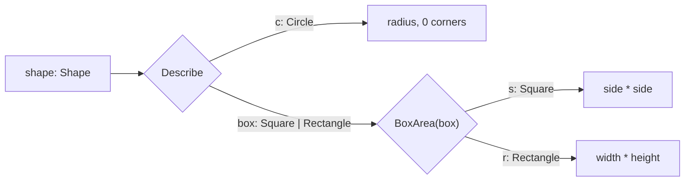

# Subset pattern

::note
<!-- sync:needs:start -->

**You'll need**: [Typed pattern](/docs/learn/typed-pattern), [Struct](/docs/learn/struct)
<!-- sync:needs:end -->

::

A typed pattern can name more than one member. The arm `box: Square | Rectangle =>` matches when the active member is either of the two, and `box` is then a **smaller sum**: still one of several types, but only the ones the arm let through.

That is useful when some members are handled the same way. A circle has no corners, while a square and a rectangle both have four — so counting corners needs two arms, not three. And when the shared members still need work of their own, the smaller sum can be handed on whole to a function that takes exactly those members.

## The shapes

Each shape is a [struct](/docs/learn/struct) of its own, and `Shape` is the sum of all three:

```rux
struct Circle {
    radius: float64;
}

struct Square {
    side: float64;
}

struct Rectangle {
    width: float64;
    height: float64;
}

type Shape = Circle | Square | Rectangle;
```

## Several members in one arm

Write the members after the colon, joined by `|` just as in the type itself:

```rux
func Corners(shape: Shape) -> int32 {
    return match shape {
        _: Circle => 0,
        _: Square | Rectangle => 4
    };
}
```

A subset needs no binding either: `_: Square | Rectangle` only asks the question. The match is still exhaustive — between them, the two arms cover all three members.

## The binding is a smaller sum

With a name instead of `_`, the arm binds what it matched. Here `box` has the type `Square | Rectangle`:

```rux
func Describe(shape: Shape) {
    match shape {
        c: Circle => PrintLine("circle, radius {}, {} corners", c.radius, Corners(shape)),
        box: Square | Rectangle => PrintLine("box, area {}, {} corners", BoxArea(box),
            Corners(shape))
    }
}
```

`box` is not a square, and it is not a rectangle — it is whichever of the two `shape` held, and it remembers which. That is exactly what `BoxArea` takes, so `box` is passed on whole:

```rux
func BoxArea(box: Square | Rectangle) -> float64 {
    return match box {
        s: Square => s.side * s.side,
        r: Rectangle => r.width * r.height
    };
}
```

`BoxArea` only ever sees boxes, so it matches two members and no more. It never has to say what to do with a circle, because a circle cannot reach it.



| Pattern                    | Matches when the active member is | The binding's type    |
| -------------------------- | --------------------------------- | --------------------- |
| `c: Circle`                | `Circle`                          | `Circle`              |
| `box: Square \| Rectangle` | `Square` or `Rectangle`           | `Square \| Rectangle` |
| `_: Square \| Rectangle`   | `Square` or `Rectangle`           | nothing is bound      |

## The first matching arm wins

Arms are tried from the top, and the first one whose types include the active member runs. Two subsets may share a member — with `round: Circle | Square =>` above `box: Square | Rectangle =>`, a square goes to the first arm and a rectangle to the second.

What the compiler refuses is an arm that can _never_ run. Once `box: Square | Rectangle` has taken every square, a later `s: Square =>` would be dead code, and it is an error rather than a silent leftover.

## The program

The whole lesson is one package in the [Examples repository](https://github.com/rux-lang/Examples/tree/main/SumTypes/SubsetPattern). Its comments explain every step.

<!-- sync:program:start -->

```rux [Src/Main.rux]
// A typed pattern can name more than one member. The arm `box: Square | Rectangle =>` matches
// when the active member is either of the two, and `box` is then a *smaller sum*: it is still
// one of several types, but only the ones the arm let through.
//
// That is useful when some members are handled the same way. A circle has no corners and a
// square and a rectangle both have four, so the corner count needs two arms, not three. And when
// the shared members need their own work, the smaller sum can be handed on whole to a function
// that takes exactly those members, and matched again there.
//
// An arm after a subset may not repeat a member the subset already took. Add `s: Square =>`
// after the `box` arm in `Describe` and the compiler refuses the arm that can never run:
//     error: match arm is unreachable because earlier arms already match every value it matches
import Io::PrintLine;

struct Circle {
    radius: float64;
}

struct Square {
    side: float64;
}

struct Rectangle {
    width: float64;
    height: float64;
}

type Shape = Circle | Square | Rectangle;

// A subset needs no binding either: `_: Square | Rectangle` only asks the question.
func Corners(shape: Shape) -> int32 {
    return match shape {
        _: Circle => 0,
        _: Square | Rectangle => 4
    };
}

// This function only ever sees boxes, so it matches two members and no more.
func BoxArea(box: Square | Rectangle) -> float64 {
    return match box {
        s: Square => s.side * s.side,
        r: Rectangle => r.width * r.height
    };
}

func Describe(shape: Shape) {
    match shape {
        c: Circle => PrintLine("circle, radius {}, {} corners", c.radius, Corners(shape)),
        box: Square | Rectangle => PrintLine("box, area {}, {} corners", BoxArea(box),
            Corners(shape))
    }
}

func Main() -> int {
    let wheel: Shape = Circle { radius: 1.5 };
    let tile: Shape = Square { side: 2.0 };
    let door: Shape = Rectangle { width: 1.0, height: 2.5 };

    Describe(wheel);
    Describe(tile);
    Describe(door);
    return 0;
}
```

<!-- sync:program:end -->

## Run it

```sh
cd Examples/SumTypes/SubsetPattern
rux run
```

<!-- sync:output:start -->

```
circle, radius 1.5, 0 corners
box, area 4.0, 4 corners
box, area 2.5, 4 corners
```

<!-- sync:output:end -->

## Common mistakes

::warning
**An arm that an earlier subset already covers.**\
Add `s: Square =>` after the `box` arm in `Describe` and it fails with `error: match arm is unreachable because earlier arms already match every value it matches`. Every square has already gone to `box`. Either delete the arm, or move it above the subset so squares are handled on their own first.
::

::warning
**Reading a field through a smaller sum.**\
Inside the `box` arm, `box.side` fails with `error: type 'Rectangle | Square' has no field 'side'`. A rectangle has no `side`, and `box` might be one. Match `box` again, as `BoxArea` does, to reach the fields of each member.
::

## Try it yourself

1. Add `struct Triangle { base: float64; height: float64; }` to `Shape`. Which matches does the compiler now reject, and what does each one need?
2. Write `func IsRound(shape: Shape) -> bool` with exactly two arms.
3. Move `s: Square =>` above the `box` arm in `Describe`, so squares print differently from rectangles. Which members can still reach `box` now?

## Learn more

- [The is operator](/docs/learn/is) — ask which member a sum holds without unpacking it
- [Sum widening](/docs/learn/sum-widening) — passing a smaller sum where a larger one is expected
- [`match`](/docs/lang/patterns/match) in the Rux Reference
