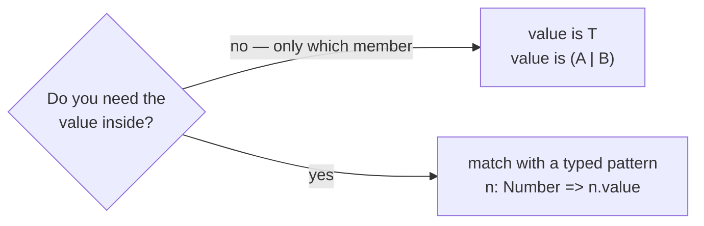

# The is operator

::note
<!-- sync:needs:start -->

**You'll need**: [Subset pattern](/docs/learn/subset-pattern), [For](/docs/learn/for), [Array](/docs/learn/array)
<!-- sync:needs:end -->

::

Sometimes a program only needs to know _which_ member a sum holds, not what is inside it. Is this token a number? Is it an operator? `value is T` answers with a plain `bool`: `true` when the active member is `T`.

A [typed pattern](/docs/learn/typed-pattern) can answer the same question, but it takes a whole `match` with an arm for every member. `is` is the one-line version for when a yes or no is all you want.

## The tokens

A tokenizer turns the text `price + 2 - discount + 1` into pieces, and each piece is one of four types:

```rux
struct Number {
    value: int32;
}

struct Name {
    text: char8[..];
}

struct Plus {}

struct Minus {}

type Token = Number | Name | Plus | Minus;
```

`Plus` and `Minus` carry no fields at all — for them, the type _is_ the whole message.

The [array](/docs/learn/array) is annotated `Token[7]`, which makes every element a `Token`, so one array holds all four member types side by side:

```rux
let tokens: Token[7] = [
    Name { text: "price" },
    Plus {},
    Number { value: 2 },
    Minus {},
    Name { text: "discount" },
    Plus {},
    Number { value: 1 }
];
```

## Asking which member

Inside the [loop](/docs/learn/for), `is` sorts the tokens without unpacking any of them:

```rux
for token in tokens {
    if token is Number {
        numbers++;
    }
    if token is (Plus | Minus) {
        operators++;
    }
}
```

`token is Number` is `true` for the two numbers. Put a smaller sum in parentheses, `token is (Plus | Minus)`, and the test is `true` when the active member is any one of them — the three operators here. It is the `is` form of a [subset pattern](/docs/learn/subset-pattern).

The parentheses are required. Without them, `token is Plus | Minus` is refused, and the compiler's help shows the grouped form to write instead.

## An ordinary bool

The result is a `bool` like any other, so it can be stored, printed or combined with `&&` and `||`:

```rux
let startsWithName = tokens[0] is Name;
PrintLine("starts with a name: {}", startsWithName);
PrintLine("ends with a number: {}", tokens[6] is Number);
```

## What is does not do

`is` only asks. Two things follow from that.

**It does not narrow.** Inside `if token is Number { … }`, `token` is still the whole `Token`, not a `Number`. Reading `token.value` there is rejected, because a `Name`, a `Plus` or a `Minus` has no `value`. To use what is inside, bind it with a typed pattern in a `match`.

**It does not quietly answer `false`.** A test that could never be true is a mistake, and the compiler says so. `token is bool` is refused because `bool` is not a member of `Token`. On a value that is not a sum at all, `is` compares exact types, and a mismatch is an error too.



| You want                        | Write                            | You get         |
| ------------------------------- | -------------------------------- | --------------- |
| to know the member              | `token is Number`                | a `bool`        |
| to know if it is one of several | `token is (Plus \| Minus)`       | a `bool`        |
| the value inside                | `match token { n: Number => … }` | `n`, a `Number` |

## The program

The whole lesson is one package in the [Examples repository](https://github.com/rux-lang/Examples/tree/main/SumTypes/Is). Its comments explain every step.

<!-- sync:program:start -->

```rux [Src/Main.rux]
// Sometimes a program only needs to know *which* member a sum holds, not what is inside it.
// `value is T` answers that with a plain `bool`: true when the active member is `T`. Put a smaller
// sum in parentheses, `value is (Plus | Minus)`, and it is true when the active member is any one
// of them. The parentheses are required: `token is Plus | Minus` is refused with
//       error: a sum type after 'is' must be grouped
//       help: write 'value is (Plus | Minus)'
//
// Two things `is` does not do:
//
// - It does not narrow. Inside `if token is Number { ... }`, `token` is still the whole sum, so
//   `token.value` is rejected:
//       error: type 'Minus | Name | Number | Plus' has no field 'value'
//   To use what is inside, bind it with a typed pattern in a `match`.
//
// - It does not quietly answer `false`. A test that could never be true is a mistake, and the
//   compiler says so. `token is bool` is refused because `bool` is not one of the members:
//       error: type 'bool8' is not a member or subset of sum 'Minus | Name | Number | Plus'
//   On a value that is not a sum at all, `is` compares exact types, and a mismatch is an error
//   too. The counter `numbers` is an `int`, so `numbers is bool` gives
//       error: 'is bool8' can never be true for a value of type 'int'
import Io::PrintLine;

// The pieces of the expression `price + 2 - discount + 1`, as a tokenizer might hand them over.
struct Number {
    value: int32;
}

struct Name {
    text: char8[..];
}

struct Plus {}

struct Minus {}

type Token = Number | Name | Plus | Minus;

func Main() -> int {
    // The annotation makes every element a `Token`, so one array holds all four member types.
    let tokens: Token[7] = [
        Name { text: "price" },
        Plus {},
        Number { value: 2 },
        Minus {},
        Name { text: "discount" },
        Plus {},
        Number { value: 1 }
    ];

    var numbers = 0;
    var operators = 0;
    for token in tokens {
        // `is` only asks; the token is untouched and keeps its type.
        if token is Number {
            numbers++;
        }
        if token is (Plus | Minus) {
            operators++;
        }
    }
    PrintLine("{} numbers, {} operators", numbers, operators);

    // The result is an ordinary boolean, so it can be stored and printed like one.
    let startsWithName = tokens[0] is Name;
    PrintLine("starts with a name: {}", startsWithName);
    PrintLine("ends with a number: {}", tokens[6] is Number);
    return 0;
}
```

<!-- sync:program:end -->

## Run it

```sh
cd Examples/SumTypes/Is
rux run
```

<!-- sync:output:start -->

```
2 numbers, 3 operators
starts with a name: true
ends with a number: true
```

<!-- sync:output:end -->

## Common mistakes

::warning
**A sum after `is` without parentheses.**\
`token is Plus | Minus` fails with `error: a sum type after 'is' must be grouped`, and the help says `write 'value is (Plus | Minus)'`.
::

::warning
**Expecting `is` to narrow.**\
`if token is Number { PrintLine("{}", token.value); }` fails with `error: type 'Minus | Name | Number | Plus' has no field 'value'`. After the test `token` is still the whole sum. Use `match token { n: Number => …, else => {} }` to get at the number.
::

::warning
**Testing a type that is not a member.**\
`token is bool` fails with `error: type 'bool8' is not a member or subset of sum 'Minus | Name | Number | Plus'`. A test that can never be true is an error, not a constant `false`.
::

::warning
**Testing a value that is not a sum.**\
The counter `numbers` is an `int`, so `numbers is bool` fails with `error: 'is bool8' can never be true for a value of type 'int'`. On an ordinary value, `is` compares exact types.
::

## Try it yourself

1. Count the `Name` tokens as well, and print all three counts.
2. Write `func IsOperator(token: Token) -> bool` with `is`, and use it in the loop.
3. Add up the values of all the `Number` tokens. Why does this one need a `match` with an `else => {}` arm rather than `is`?

## Learn more

- [Typed pattern](/docs/learn/typed-pattern) and [Subset pattern](/docs/learn/subset-pattern) — the patterns `is` mirrors
- [Sum widening](/docs/learn/sum-widening) — the next lesson
- [Type tests](/docs/lang/sums/type-tests) in the Rux Reference
