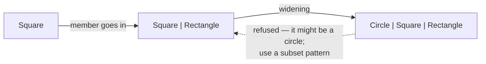

# Sum widening

::note
<!-- sync:needs:start -->

**You'll need**: [Subset pattern](/docs/learn/subset-pattern), [The is operator](/docs/learn/is)
<!-- sync:needs:end -->

::

A smaller sum fits wherever a larger one is expected. A value of `Square | Rectangle` is always one of those two, and both are members of `Circle | Square | Rectangle` — so the compiler accepts it there without a word. This is _widening_: the set of possible members grows, while the value itself, and which member is active, stays exactly as it was.

You have already seen widening once, in [Error sum](/docs/learn/error-sum), where a `DigitError` fitted into a function that fails with `DigitError | RangeError`. This lesson shows the same step with a whole sum on the narrow side.

## An honest return type

`Box` builds a square when the sides are equal and a rectangle otherwise. It can never produce a circle, so its return type says exactly that:

```rux
func Box(width: float64, height: float64) -> Square | Rectangle {
    if width == height {
        return Square { side: width };
    }
    return Rectangle { width: width, height: height };
}
```

Each `return` puts a single struct into the two-member sum — the step you met in [Sum type](/docs/learn/sum-type), a value going into a sum that has its type as a member.

Returning `Shape` would also compile, but it would throw information away: every caller would then have to be ready for a circle that never comes.

## One value, two functions

`Area` works only on boxes, and `Describe` on any shape:

```rux
func Area(box: Square | Rectangle) -> float64 {
    return match box {
        s: Square => s.side * s.side,
        r: Rectangle => r.width * r.height
    };
}
```

The same two values serve both — as they are for `Area`, widened for `Describe`:

```rux
let tile = Box(2.0, 2.0);
let door = Box(1.0, 2.5);

PrintLine("areas {} and {}", Area(tile), Area(door));
Describe(tile);
Describe(door);
```

`Describe(tile)` passes a `Square | Rectangle` to a `Shape` parameter. Nothing about the value changes: `tile` was a square, and inside `Describe` it is still a square, matched by the `s: Square` arm.

## Where widening happens

Widening happens in the same places a value is handed on — on assignment, on a call, and on `return`:

```rux
let anything: Shape = tile;
Describe(anything);
Describe(Circle { radius: 0.5 });
```

`anything` holds the square from `tile`, now with room for a circle too. The last line is the single-member step again: a `Circle` going straight into `Shape`.

| From                  | To                    | Accepted?                 |
| --------------------- | --------------------- | ------------------------- |
| `Circle`              | `Shape`               | yes — a member goes in    |
| `Square \| Rectangle` | `Shape`               | yes — widening            |
| `Shape`               | `Square \| Rectangle` | no — it might be a circle |

## Only one way



A `Shape` might be a circle, and `Square | Rectangle` has no room for one, so the compiler refuses to narrow it — even when you know, this time, that it holds a square. Getting the smaller sum back out of the larger one takes a [subset pattern](/docs/learn/subset-pattern): `box: Square | Rectangle =>` is exactly the arm that proves the circle is not there.

## The program

The whole lesson is one package in the [Examples repository](https://github.com/rux-lang/Examples/tree/main/SumTypes/SumWidening). Its comments explain every step.

<!-- sync:program:start -->

```rux [Src/Main.rux]
// A smaller sum fits wherever a larger one is expected. A value of `Square | Rectangle` is
// always one of those two, and both are members of `Circle | Square | Rectangle`, so the
// compiler accepts it there without a word. This is *widening*: the set of possible members
// grows, while the value itself, and which member is active, stays exactly as it was.
//
// It is the same step a single member takes when it goes into a sum, `let s: Shape = tile;`,
// just with more than one member at a time. It happens on assignment, on a call and on `return`.
//
// It only goes one way. A `Shape` might be a circle, which `Square | Rectangle` has no room for,
// so passing a `Shape` to `Area` below is refused:
//     error: argument 1 to 'Area' has type 'Circle | Rectangle | Square', but parameter 'box'
//            requires 'Rectangle | Square'
// Getting the smaller sum back out of the larger one takes a subset pattern.
import Io::PrintLine;

struct Circle {
    radius: float64;
}

struct Square {
    side: float64;
}

struct Rectangle {
    width: float64;
    height: float64;
}

type Shape = Circle | Square | Rectangle;

// Equal sides make a square, anything else a rectangle, so the honest result type is the
// two-member sum, not the whole `Shape`.
func Box(width: float64, height: float64) -> Square | Rectangle {
    if width == height {
        return Square { side: width };
    }
    return Rectangle { width: width, height: height };
}

func Area(box: Square | Rectangle) -> float64 {
    return match box {
        s: Square => s.side * s.side,
        r: Rectangle => r.width * r.height
    };
}

func Describe(shape: Shape) {
    match shape {
        c: Circle => PrintLine("circle    radius {}", c.radius),
        s: Square => PrintLine("square    side {}", s.side),
        r: Rectangle => PrintLine("rectangle {} by {}", r.width, r.height)
    }
}

func Main() -> int {
    let tile = Box(2.0, 2.0);
    let door = Box(1.0, 2.5);

    // The same two values serve both functions: as they are for `Area`, widened for `Describe`.
    PrintLine("areas {} and {}", Area(tile), Area(door));
    Describe(tile);
    Describe(door);

    // Widening on assignment: the square stays a square inside the larger sum.
    let anything: Shape = tile;
    Describe(anything);
    Describe(Circle { radius: 0.5 });
    return 0;
}
```

<!-- sync:program:end -->

## Run it

```sh
cd Examples/SumTypes/SumWidening
rux run
```

<!-- sync:output:start -->

```
areas 4.0 and 2.5
square    side 2.0
rectangle 1.0 by 2.5
square    side 2.0
circle    radius 0.5
```

<!-- sync:output:end -->

## Common mistakes

::warning
**Passing the larger sum where the smaller one is expected.**\
`Area(anything)` with `anything: Shape` fails with `error: argument 1 to 'Area' has type 'Circle | Rectangle | Square', but parameter 'box' requires 'Rectangle | Square'`. Match `anything` with a `box: Square | Rectangle` arm and pass `box` instead.
::

::warning
**Narrowing on assignment.**\
`let b: Square | Rectangle = anything;` fails the same way, as `error: cannot assign 'Circle | Rectangle | Square' to 'Rectangle | Square'`. Knowing that `anything` holds a square right now is not enough — the type says it might not.
::

::warning
**Returning a wider type than the function produces.**\
Not an error, but a cost: had `Box` returned `Shape`, `Area(tile)` would be refused, because `tile` would then be a `Shape`. Give a function the narrowest return type that is true, and let widening do the rest at the call site.
::

## Try it yourself

1. Change `Box`'s return type to `Shape` and run the program. Which line is now rejected, and why?
2. After `let anything: Shape = tile;`, print the area of `anything` using a `match` with a subset arm and a `Circle` arm.
3. Write `func Wheel(radius: float64) -> Circle` and pass its result to `Describe`. Is that widening, or a member going into a sum?

## Learn more

- [Subset pattern](/docs/learn/subset-pattern) — the way back from a larger sum to a smaller one
- [Error sum](/docs/learn/error-sum) — widening in a function's error channel
- [Generic sum](/docs/learn/generic-sum) — sums built from type parameters, in the Generics part
