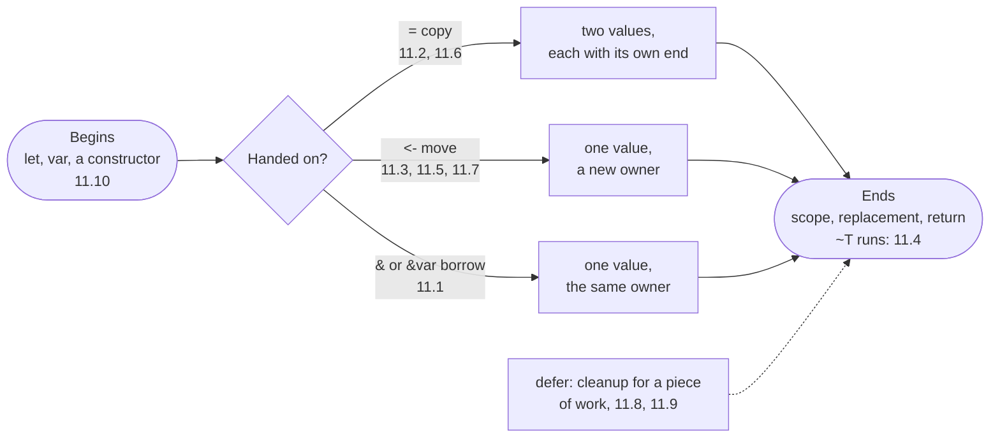

# Part 11: Ownership

Every value in a Rux program has exactly one owner — a variable, a parameter, a field — and the owner decides when the value's life ends. Most of the time you never think about it: numbers and small structs are copied freely, and nothing needs cleaning up. This part is about the values where it matters — a hotel key that must be handed back once, a valve that must be closed on every path, a sheet whose copies must each be shredded — and about the rules the compiler checks so that cleanup happens exactly once, never twice and never not at all.

## What you will learn

- Why a `&var` borrow is exclusive, and why a borrow ends at its last use.
- What a copy is, and where one happens: binding, passing, returning and assigning.
- Handing a value on with `<-` in a binding, an argument and a return, and what happens to the old name.
- Writing a destructor, `func ~T(self: &var T)`, and when the compiler runs it — newest value first.
- Prohibiting copies with a bodyless `func =`, or writing your own copy with a body.
- Why one field cannot be moved out of a struct, and how a moving pattern takes it apart instead.
- Registering cleanup with `defer`, its reverse order, and how it meets `return`.
- Declaring a `var` without a value, and the compiler's check that every path assigns it.

## The life of a value



| A type that…                    | Write in `extend T`                     | Lesson                                    |
| ------------------------------- | --------------------------------------- | ----------------------------------------- |
| needs nothing special           | nothing — copies field by field         | [Copy](/docs/learn/copy)                  |
| must clean up when a value ends | `func ~T(self: &var T) { … }`           | [Destructor](/docs/learn/destructor)      |
| must never exist twice          | `func =(self: &var T, other: &T);`      | [Non-copyable types](/docs/learn/no-copy) |
| needs real work to duplicate    | `func =(self: &var T, other: &T) { … }` | [Custom copy](/docs/learn/custom-copy)    |

## Lessons

<!-- sync:lessons:start -->

|       | Lesson                                       | What you will learn                                                         |
| ----- | -------------------------------------------- | --------------------------------------------------------------------------- |
| 11.1  | [Exclusivity](/docs/learn/exclusivity)       | one writer at a time: the rule that keeps borrows safe                      |
| 11.2  | [Copy](/docs/learn/copy)                     | assignment copies a value, and the copies are independent                   |
| 11.3  | [Move](/docs/learn/move)                     | hand a value over with `<-` instead of copying it                           |
| 11.4  | [Destructor](/docs/learn/destructor)         | run cleanup when a value goes out of scope with `~T`                        |
| 11.5  | [Non-copyable types](/docs/learn/no-copy)    | forbid copying a type that owns a resource                                  |
| 11.6  | [Custom copy](/docs/learn/custom-copy)       | write your own copy for a type that needs real work to duplicate            |
| 11.7  | [Partial move](/docs/learn/partial-move)     | move one field out of a struct, and what is cleaned up after                |
| 11.8  | [Defer](/docs/learn/defer)                   | schedule cleanup at the point you start the work, so it cannot be forgotten |
| 11.9  | [Defer return](/docs/learn/defer-return)     | what a deferred action sees when the function returns a value               |
| 11.10 | [Initialization](/docs/learn/initialization) | a variable must be assigned before it is read                               |

<!-- sync:lessons:end -->

## Before you start

Finish Parts 1–10 first. This part leans most on [Part 6: Types](/docs/learn/types) — [Reference](/docs/learn/reference), [Mutable reference](/docs/learn/mutable-reference), [Method](/docs/learn/method) and [Constructor](/docs/learn/constructor) — and on [Destructure](/docs/learn/destructure) and [Struct pattern](/docs/learn/struct-pattern), which [Partial move](/docs/learn/partial-move) turns into a way of taking values apart. Each lesson's package is in the Examples repository's `Ownership/` folder:

```sh
cd Examples/Ownership/Exclusivity
rux run
```

## After this part

[Part 12: Interfaces](/docs/learn/interfaces) describes behaviour that many types share — and lets a type declare its own `==` and other operators the way this part declared its own `=`. Ownership comes back in [Part 15: Memory](/docs/learn/memory), where a [Box](/docs/learn/box) owns a block of memory and gives it back in its destructor, exactly as the keys and sheets here gave back their rooms and paper. The next checkpoint projects, [Circle](/docs/learn/circle) and [Quadratic](/docs/learn/quadratic), come after Part 16.

For related rules, see [Mutability of structs](/docs/lang/variables/mutability), [`var`](/docs/lang/variables/var) and [Methods](/docs/lang/structs/methods) in the Rux Reference.
