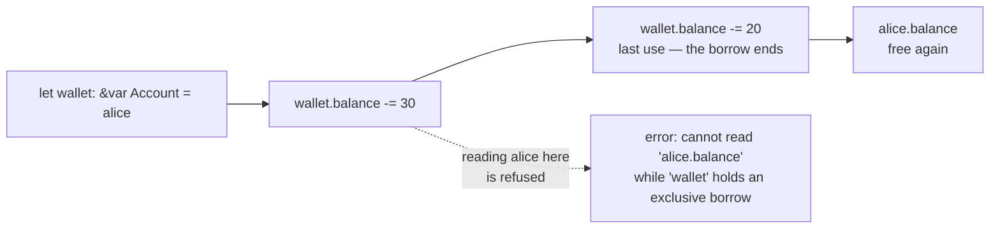

# Exclusivity

::note
<!-- sync:needs:start -->

**You'll need**: [Mutable reference](/docs/learn/mutable-reference), [Reference](/docs/learn/reference)
<!-- sync:needs:end -->

::

This part is about _ownership_: which name a value belongs to, who may change it, and when it is cleaned up. It starts with a rule you have already bumped into. A `&var` borrow is **exclusive** — while it is alive, it is the only way to reach the value. No second `&var` borrow, and no reading the value by its own name either. Read-only `&` borrows have no such limit, because any number of readers can look at a value without harming it.

"While it is alive" is shorter than it looks. A borrow ends at its **last use**, not at the end of the block it was made in, so a borrow that has finished its work is no obstacle.

## Two accounts, two borrows

`Merge` moves everything from one account into another. It takes both as `&var`, because it changes both:

```rux
func Merge(into: &var Account, from: &var Account) {
    into.balance += from.balance;
    from.balance = 0;
}
```

Called with two different accounts, the two borrows do not overlap, and all is well:

```rux
var alice = Account { owner: "Alice", balance: 100 };
var bob = Account { owner: "Bob", balance: 20 };

Merge(alice, bob);
```

Alice ends with 120 and Bob with 0.

## Why the rule exists

`Merge` is written for two _different_ accounts. Follow what it would do if `into` and `from` were the same one, with a balance of 100:

1. `into.balance += from.balance` — the balance becomes 200.
2. `from.balance = 0` — but `from` is `into`, so the balance becomes 0.

Merging an account with itself would wipe out the money. Nothing in `Merge` is wrong; it simply assumes its two parameters are two things. Exclusivity makes that assumption safe, by making the bad call impossible to write:

```rux
Merge(alice, alice);
```

```
error: call arguments create overlapping exclusive borrows of 'alice'
  note: an earlier argument borrows the same storage at 40:11
  help: split the accesses into non-overlapping calls
```

## Readers may share

Read-only borrows may overlap freely. `Richer` takes two `&Account` and changes neither, so the same account twice is fine:

```rux
func Richer(left: &Account, right: &Account) -> char8[..] {
    let owner = left.balance >= right.balance ? left.owner : right.owner;
    return owner;
}
```

```rux
PrintLine("richer of Alice and Alice: {}", Richer(alice, alice));
```

| While this is alive… | Another `&` borrow | Another `&var` borrow | Reading by name | Writing by name |
| -------------------- | ------------------ | --------------------- | --------------- | --------------- |
| a `&` borrow         | yes                | no                    | yes             | no              |
| a `&var` borrow      | no                 | no                    | no              | no              |

## A borrow ends at its last use

A borrow does not have to be a parameter. Here `wallet` is a local `&var` borrow of `alice`:

```rux
let wallet: &var Account = alice;
wallet.balance -= 30;
wallet.balance -= 20;
PrintLine("after spending: Alice {}", alice.balance);
```

The second `wallet` line is its last use, and from there on `alice` is free again, so reading it by name on the next line is accepted.



Move that `PrintLine` above the second `wallet` line and `wallet` is still alive when `alice` is read. The compiler refuses, and its help names both ways out: read through `wallet`, or wait until its last use.

## The program

The whole lesson is one package in the [Examples repository](https://github.com/rux-lang/Examples/tree/main/Ownership/Exclusivity). Its comments explain every step.

<!-- sync:program:start -->

```rux [Src/Main.rux]
// A `&var` borrow is exclusive. While it is alive, it is the only way to reach the value: no
// second `&var` borrow, and no reading the value by its own name either. Read-only `&` borrows
// have no such limit, because any number of readers can look at a value without harming it.
//
// "While it is alive" is shorter than it looks. A borrow ends at its last use, not at the end of
// the block it was made in, so a borrow that has finished its work is no obstacle.
//
// The rule exists for functions like `Merge` below. It takes two accounts and is written for two
// different ones. Handed the same account twice, it would add the balance to itself and then wipe
// it out. Exclusivity makes that call impossible to write.
import Io::PrintLine;

struct Account {
    owner: char8[..];
    balance: int32;
}

// Moves everything from one account into another.
func Merge(into: &var Account, from: &var Account) {
    into.balance += from.balance;
    from.balance = 0;
}

// Two read-only borrows of the same account are fine: neither can change it.
func Richer(left: &Account, right: &Account) -> char8[..] {
    let owner = left.balance >= right.balance ? left.owner : right.owner;
    return owner;
}

func Main() -> int {
    var alice = Account { owner: "Alice", balance: 100 };
    var bob = Account { owner: "Bob", balance: 20 };

    // Two different accounts: two exclusive borrows that do not overlap.
    Merge(alice, bob);
    PrintLine("after merge: Alice {}, Bob {}", alice.balance, bob.balance);

    // The same account twice is refused:
    //
    //     Merge(alice, alice);
    //
    // error: call arguments create overlapping exclusive borrows of 'alice'
    //   note: an earlier argument borrows the same storage at 40:11
    //   help: split the accesses into non-overlapping calls

    // Shared borrows may overlap freely.
    PrintLine("richer of Alice and Alice: {}", Richer(alice, alice));

    // A local `&var` borrow. Its last use is the second line below, and from there on `alice`
    // is free again, so reading it by name is accepted.
    let wallet: &var Account = alice;
    wallet.balance -= 30;
    wallet.balance -= 20;
    PrintLine("after spending: Alice {}", alice.balance);

    // Move that `PrintLine` above the second `wallet` line and `wallet` is still alive when
    // `alice` is read:
    //
    // error: cannot read 'alice.balance' while 'wallet' holds an exclusive borrow
    //   note: exclusive borrow begins at 51:32
    //   help: read through 'wallet' or wait until its last use
    return 0;
}
```

<!-- sync:program:end -->

## Run it

```sh
cd Examples/Ownership/Exclusivity
rux run
```

<!-- sync:output:start -->

```
after merge: Alice 120, Bob 0
richer of Alice and Alice: Alice
after spending: Alice 70
```

<!-- sync:output:end -->

## Common mistakes

::warning
**Passing one value to two `&var` parameters.**\
`Merge(alice, alice)` fails with `error: call arguments create overlapping exclusive borrows of 'alice'`. Each `&var` argument must be a different value.
::

::warning
**Reading a value while a `&var` borrow of it is still in use.**\
With a later `wallet` line still to come, reading `alice.balance` fails with `error: cannot read 'alice.balance' while 'wallet' holds an exclusive borrow`. Read through `wallet` instead, or move the read after `wallet`'s last use.
::

::warning
**Borrowing for writing while a reader is still in use.**\
`let view: &Account = alice;` followed by `let wallet: &var Account = alice;`, with `view` used again later, fails with `error: cannot borrow exclusively 'alice' while it is immutably borrowed`. A reader expects the value not to change under it, so a writer has to wait until the reader is done.
::

## Try it yourself

1. Add a third account, `carol`, and merge both others into her with two calls to `Merge`.
2. Move the `PrintLine` with `alice.balance` above the second `wallet` line and read the error. Then change it to print `wallet.balance` instead — is that accepted?
3. Make two local `&var` borrows of `alice`, one after the other, where the first is finished before the second begins. Does the compiler allow it?

## Learn more

- [Mutable reference](/docs/learn/mutable-reference) and [Reference](/docs/learn/reference) — the two kinds of borrow
- [Copy](/docs/learn/copy) — the next lesson: what happens when a value is not borrowed at all
- [Mutability of structs](/docs/lang/variables/mutability) in the Rux Reference
