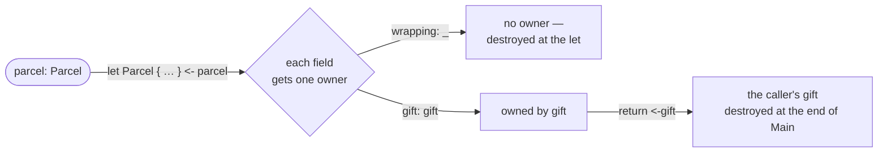

# Partial move

::note
<!-- sync:needs:start -->

**You'll need**: [Non-copyable types](/docs/learn/no-copy), [Destructure](/docs/learn/destructure), [Struct pattern](/docs/learn/struct-pattern)
<!-- sync:needs:end -->

::

A parcel is wrapping paper around a gift. It is tempting to move just the gift out and leave the rest where it is — but Rux refuses: a field cannot be moved out of a value on its own. What works instead is taking the **whole** value apart, so that every field gets exactly one new owner.

This lesson brings together three things from earlier: [move-only types](/docs/learn/no-copy), [destructors](/docs/learn/destructor), and the [struct pattern](/docs/learn/struct-pattern) you used to [destructure](/docs/learn/destructure) values in `let`.

## The parcel

`Item` is move-only and announces its own destruction. `Parcel` holds two of them and has no destructor of its own:

```rux
struct Item {
    name: char8[..];
}

extend Item {
    func =(self: &var Item, other: &Item);

    func ~Item(self: &var Item) {
        PrintLine("    {} destroyed", self.name);
    }
}

// No destructor of its own, so a moving pattern may take it apart.
struct Parcel {
    wrapping: Item;
    gift: Item;
}
```

Because both fields are move-only, `Parcel` is move-only too: copying a parcel would copy the items inside it.

## One field on its own is refused

The obvious way to get the gift out does not compile:

```rux
return <-parcel.gift;
```

```
error: cannot move field 'gift' out of droppable value 'parcel'
  note: partial moves would leave the aggregate with only some fields initialized
  help: move the complete aggregate or borrow or clone the component explicitly
```

Half a parcel would be a value that is partly alive. When `parcel`'s scope ended, the compiler could no longer say what to destroy: the wrapping, yes, but not the gift, which has moved on. Rather than track a value that is part here and part gone, Rux keeps the rule simple — a value is moved whole or not at all.

## Taking the whole value apart

A struct pattern with `<-` moves the parcel into the pattern, and every field gets exactly one owner again:

```rux
func Unwrap(parcel: Parcel) -> Item {
    let Parcel { wrapping: _, gift: gift } <- parcel;
    PrintLine("    unwrapped the {}", gift.name);
    return <-gift;
}
```

- A field bound to a name belongs to that binding. `gift` is a local `Item` now, and `return <-gift` hands it to the caller.
- A field bound to `_`, or left out of the pattern, belongs to nobody, so it is destroyed on the spot.

That is why the output reads "paper destroyed" _before_ "unwrapped the book": the wrapping is gone by the time the `let` finishes.



## Only a struct that is just its fields

A struct can be taken apart only when it has no destructor of its own. Give `Parcel` a `~Parcel`, and that destructor needs the whole parcel to run on — so the same pattern is refused:

```
error: cannot split 'Parcel' with a moving pattern, because it declares destructor '~Parcel'
  note: '~Parcel' runs on the whole value, so no part of it can be taken out on its own
  help: bind the whole value and read its fields, or match a value that stays with its owner
```

| You want                       | Write                                               | Allowed when                   |
| ------------------------------ | --------------------------------------------------- | ------------------------------ |
| one field, moved out           | `<-parcel.gift`                                     | never                          |
| every field, each to one owner | `let Parcel { wrapping: _, gift: gift } <- parcel;` | the struct has no destructor   |
| to look at a field             | `parcel.gift.name`                                  | always — reading moves nothing |

## The program

The whole lesson is one package in the [Examples repository](https://github.com/rux-lang/Examples/tree/main/Ownership/PartialMove). Its comments explain every step.

<!-- sync:program:start -->

```rux [Src/Main.rux]
// A parcel is wrapping paper around a gift. It is tempting to move just the gift out and leave the
// rest where it is, but Rux refuses: a field cannot be moved out of a value on its own.
//
//     return <-parcel.gift;
//
// error: cannot move field 'gift' out of droppable value 'parcel'
//   note: partial moves would leave the aggregate with only some fields initialized
//   help: move the complete aggregate or borrow or clone the component explicitly
//
// Half a parcel would be a value that is partly alive, and the compiler could no longer say what
// to destroy when its scope ends.
//
// What works is taking the whole value apart. A struct pattern with `<-` moves the parcel into
// the pattern, and every field gets exactly one owner again: a field bound to a name belongs to
// that binding, and a field bound to `_`, or left out of the pattern, belongs to nobody and is
// destroyed on the spot. So the gift moves on and the wrapping is gone before the next line runs.
//
// Only a struct that is nothing more than its fields can be taken apart. Give `Parcel` its own
// destructor and that destructor needs the whole parcel, so the same pattern is refused:
//
// error: cannot split 'Parcel' with a moving pattern, because it declares destructor '~Parcel'
//   note: '~Parcel' runs on the whole value, so no part of it can be taken out on its own
//   help: bind the whole value and read its fields, or match a value that stays with its owner
import Io::PrintLine;

struct Item {
    name: char8[..];
}

extend Item {
    func =(self: &var Item, other: &Item);

    func ~Item(self: &var Item) {
        PrintLine("    {} destroyed", self.name);
    }
}

// No destructor of its own, so a moving pattern may take it apart.
struct Parcel {
    wrapping: Item;
    gift: Item;
}

// The gift moves out to the caller. The wrapping is bound to `_`, so it is destroyed at the `let`.
func Unwrap(parcel: Parcel) -> Item {
    let Parcel { wrapping: _, gift: gift } <- parcel;
    PrintLine("    unwrapped the {}", gift.name);
    return <-gift;
}

func Main() -> int {
    PrintLine("unwrapping:");
    let gift = Unwrap(Parcel { wrapping: Item { name: "paper" }, gift: Item { name: "book" } });
    PrintLine("    reading the {}", gift.name);

    PrintLine("end of Main:");
    return 0;
}
```

<!-- sync:program:end -->

## Run it

```sh
cd Examples/Ownership/PartialMove
rux run
```

<!-- sync:output:start -->

```
unwrapping:
    paper destroyed
    unwrapped the book
    reading the book
end of Main:
    book destroyed
```

<!-- sync:output:end -->

## Common mistakes

::warning
**Moving a single field.**\
`return <-parcel.gift;` fails with `error: cannot move field 'gift' out of droppable value 'parcel'`. Take the parcel apart with a moving pattern instead, or read the field without moving it.
::

::warning
**Destructuring with `=` instead of `<-`.**\
`let Parcel { wrapping: _, gift: gift } = parcel;` fails with `error: move-only value 'parcel' requires an explicit '<-' in initialization`. A destructuring `let` owns what it takes apart, and a move-only parcel can only be handed over with the arrow.
::

::warning
**Splitting a struct that has its own destructor.**\
With `~Parcel` declared, the pattern fails with `error: cannot split 'Parcel' with a moving pattern, because it declares destructor '~Parcel'`. Bind the parcel whole and read its fields, or drop the destructor if the struct does not really need one.
::

## Try it yourself

1. Leave `wrapping` out of the pattern altogether: `let Parcel { gift: gift } <- parcel;`. Is the paper still destroyed at the `let`?
2. In `Main`, build a parcel and take it apart into two bindings, `wrapping: w, gift: g`. At the end of `Main`, which item is destroyed first?
3. Add `func ~Parcel(self: &var Parcel)` that prints "parcel opened", and read the error. Then change `Unwrap` so it only prints `parcel.gift.name` and returns nothing.

## Learn more

- [Struct pattern](/docs/learn/struct-pattern) and [Destructure](/docs/learn/destructure) — the patterns used here
- [Non-copyable types](/docs/learn/no-copy) — why `Item` and `Parcel` can only be moved
- [Initialization](/docs/learn/initialization) — the same "whole value" rule when a variable starts empty
