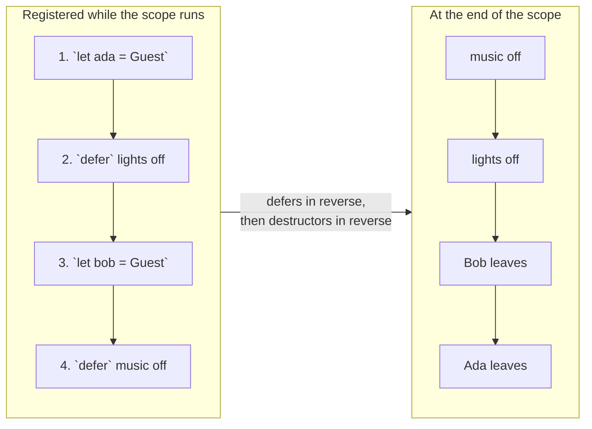

# Defer

::note
<!-- sync:needs:start -->

**You'll need**: [Method](/docs/learn/method), [Return](/docs/learn/return)
<!-- sync:needs:end -->

::

Some work has to be undone however a function ends. A valve that is opened must be closed — on the normal path, and on every early `return` as well. Writing the close before each exit is easy to get wrong, and the mistake is silent: the program runs, and the valve stays open.

`defer` registers a statement now and runs it when the enclosing scope ends, by whichever way it ends. So the cleanup is written **once**, on the line right after the work it undoes, where a reader can check that the two match.

## Cleanup next to the work

A `Valve` can be opened and closed; each method prints, so you can see the order:

```rux
struct Valve {
    name: char8[..];
}

extend Valve {
    func Open(self: &Valve) {
        PrintLine("    open {}", self.name);
    }

    func Close(self: &Valve) {
        PrintLine("    close {}", self.name);
    }
}
```

`Fill` opens two valves, and pairs each `Open` with a deferred `Close` on the very next line:

```rux
let supply = Valve { name: "supply" };
supply.Open();
defer supply.Close();

let drain = Valve { name: "drain" };
drain.Open();
defer drain.Close();
```

Nothing is closed yet. `defer` only remembers the statement; it runs later, when `Fill` ends.

## Every way out

`Fill` has two exits — an early `return false` for too much water, and the normal `return true`:

```rux
if litres > 100 {
    PrintLine("    {} litres is too much, stopping", litres);
    return false;
}

PrintLine("    filling {} litres", litres);
return true;
```

Neither `return` mentions a valve, yet both valves are closed on both paths. Add a third exit next year, and it will close them too — the cleanup belongs to the scope, not to any one `return`.

## Last registered, first run

Several defers run in **reverse** order: the last one registered runs first. The drain was opened last, so it is closed first:

```
fill 40:
    open supply
    open drain
    filling 40 litres
    close drain
    close supply
```

That is the order cleanup usually needs, because what was set up last tends to depend on what came before it. Values with [destructors](/docs/learn/destructor) follow the same rule, and when a scope has both, the deferred statements run first, newest first, and then the values are destroyed, newest first:



Here `Guest` is the type from [Destructor](/docs/learn/destructor), whose destructor prints "… leaves".

## A defer is registered when it is reached

`defer` is a statement like any other, and it counts only once execution reaches it. A `return` that comes before a `defer` line leaves without running it — which is exactly right, because the work it would undo has not been done yet either. Put a `return` between opening the supply and opening the drain, and only the supply is closed on that path.

A `defer` belongs to the scope it is written in. Inside a loop body, it runs at the end of every pass, not once after the loop.

## Defer or destructor?

|            | Destructor `~T`            | `defer`                           |
| ---------- | -------------------------- | --------------------------------- |
| Belongs to | a type — every value of it | one piece of work in one function |
| Written    | once, in `extend T`        | at the place the work starts      |
| Runs       | when a value's life ends   | when the enclosing scope ends     |

A destructor cleans up after a value. `defer` is for cleanup that belongs to a piece of work rather than to any one value's life — the valves here are ordinary values with no destructor, and opening one is something `Fill` does, not something every `Valve` needs undone.

## The program

The whole lesson is one package in the [Examples repository](https://github.com/rux-lang/Examples/tree/main/Ownership/Defer). Its comments explain every step.

<!-- sync:program:start -->

```rux [Src/Main.rux]
// Some work has to be undone however a function ends: a valve that is opened must be closed, on
// the normal path and on every early `return` as well. Writing the close before each exit is easy
// to get wrong, and the mistake is silent.
//
// `defer` registers a statement now and runs it when the enclosing scope ends, by whichever way
// it ends. So the cleanup is written once, on the line right after the work it undoes, where a
// reader can check that the two match.
//
// Several defers run in reverse order: the last one registered runs first. That is the order
// cleanup usually needs, because what was set up last tends to depend on what came before it.
//
// A destructor cleans up after a value. `defer` is for cleanup that belongs to a piece of work
// rather than to any one value's life.
import Io::PrintLine;

struct Valve {
    name: char8[..];
}

extend Valve {
    func Open(self: &Valve) {
        PrintLine("    open {}", self.name);
    }

    func Close(self: &Valve) {
        PrintLine("    close {}", self.name);
    }
}

func Fill(litres: int32) -> bool {
    let supply = Valve { name: "supply" };
    supply.Open();
    defer supply.Close();

    let drain = Valve { name: "drain" };
    drain.Open();
    defer drain.Close();

    // An early exit. Both valves are still closed, drain first.
    if litres > 100 {
        PrintLine("    {} litres is too much, stopping", litres);
        return false;
    }

    PrintLine("    filling {} litres", litres);
    return true;
}

func Main() -> int {
    PrintLine("fill 40:");
    let first = Fill(40);
    PrintLine("    filled: {}", first);

    PrintLine("fill 500:");
    let second = Fill(500);
    PrintLine("    filled: {}", second);
    return 0;
}
```

<!-- sync:program:end -->

## Run it

```sh
cd Examples/Ownership/Defer
rux run
```

<!-- sync:output:start -->

```
fill 40:
    open supply
    open drain
    filling 40 litres
    close drain
    close supply
    filled: true
fill 500:
    open supply
    open drain
    500 litres is too much, stopping
    close drain
    close supply
    filled: false
```

<!-- sync:output:end -->

## Common mistakes

::warning
**Deferring a block.**\
`defer { PrintLine("a"); PrintLine("b"); }` does not parse: `error: expected an expression before '{'`. A `defer` takes one statement. Write two defers — remembering they run in reverse — or put the steps in a method and defer the call.
::

::warning
**Registering the cleanup too late.**\
A `defer` written at the end of a function, or after an early `return`, does not run on the paths that leave before it. There is no error for this; it is the very mistake `defer` exists to prevent. Write it on the line right after the work it undoes.
::

::warning
**Expecting defers to run in the order written.**\
They run newest first. If the drain must close before the supply, register the supply's cleanup first — which is what opening them in that order already does.
::

## Try it yourself

1. Add a third valve, `vent`, opened after the drain. Predict the order of the three closes on both paths, then run it.
2. Add an early `return false` for `litres <= 0` between opening the supply and opening the drain. Which valves are closed when you call `Fill(0)`?
3. Write a `for` loop over `0..3` whose body defers a `PrintLine` of the pass number. Does each line print at the end of its own pass, or all after the loop?

## Learn more

- [Defer return](/docs/learn/defer-return) — what a deferred statement sees when a function returns a value
- [Destructor](/docs/learn/destructor) — cleanup that belongs to a value
- [Return](/docs/learn/return) — the early exits `defer` has to cover
