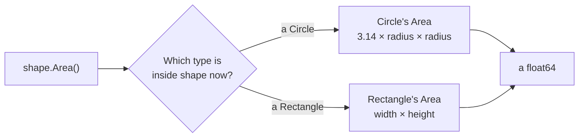

# Interface value

::note
<!-- sync:needs:start -->

**You'll need**: [Interface](/docs/learn/interface), [Copy](/docs/learn/copy)
<!-- sync:needs:end -->

::

In the [Interface](/docs/learn/interface) lesson, `wheel.Area()` could only ever mean Circle's `Area`: the compiler knew `wheel` was a `Circle`. An interface is also a **type** in its own right. A variable of type `Shape` can hold a circle now and a rectangle a moment later, and a call through it runs whichever `Area` belongs to the value inside. That is what lets values of different types share one variable, one array or one loop.

## Making an interface value

```rux
// The annotation is what turns a circle into a Shape.
var shape: Shape = wheel;
PrintLine("holding a {} with area {}", shape.Name(), shape.Area());
```

`shape` holds a copy of the circle, together with a note of which type that copy is. Without the annotation, `var shape = wheel;` would simply be another `Circle`.

## Dynamic dispatch

Now put a rectangle in the same variable:

```rux
// Same variable, different type inside, so the same calls now run Rectangle's code.
shape = door;
PrintLine("holding a {} with area {}", shape.Name(), shape.Area());
```

The call is written the same way both times, yet it runs different code. `shape.Area()` follows the note to the `Area` of whatever type is inside right now:



Choosing the function while the program runs, by the value inside rather than by anything written at the call, is called **dynamic dispatch**. Compare it with a call on a concrete type:

| Call           | Type of the receiver | Which `Area` runs is decided                   |
| -------------- | -------------------- | ---------------------------------------------- |
| `wheel.Area()` | `Circle`             | when the program is compiled — always Circle's |
| `shape.Area()` | `Shape`              | while it runs — by the value inside            |

## Many types in one array

An array needs one element type, so a circle and a rectangle cannot share one directly. Two `Shape`s can:

```rux
let shapes: Shape[2] = [wheel, door];
var total = 0.0;
for each in shapes {
    total += each.Area();
}
PrintLine("total area {}", total);
```

The annotation `Shape[2]` makes each element a `Shape`, exactly as `var shape: Shape` did. The loop then calls `Area` on every element without knowing, or caring, which shape it is: 12.56 + 2.0 = 14.56.

## A copy, not a view

```rux
// An interface value holds a copy. Changing the original afterwards leaves the copy alone.
var balloon = Circle { radius: 1.0 };
let photo: Shape = balloon;
balloon.radius = 2.0;
PrintLine("the balloon's area is {}, the photo's is {}", balloon.Area(), photo.Area());
```

The balloon grows to an area of 12.56, but the photo still shows the radius-1 circle it was given, 3.14. The [Copy](/docs/learn/copy) rules apply as they would to any assignment. The next lesson, [Interface parameter](/docs/learn/interface-parameter), shows how to _borrow_ a value through an interface instead.

## Only the promise is visible

Through a `Shape`, you can reach only what `Shape` promises. Even while a rectangle is inside, `shape.width` is rejected with `error: interface type 'Shape' has no member 'width'`, and a method of Rectangle's own, such as `IsSquare` from the previous lesson, is refused the same way. The variable might hold a circle the next time that line runs, and a circle has neither.

## The program

The whole lesson is one package in the [Examples repository](https://github.com/rux-lang/Examples/tree/main/Interfaces/InterfaceValue). Its comments explain every step.

<!-- sync:program:start -->

```rux [Src/Main.rux]
// A variable can have an interface as its type. `let shape: Shape = wheel;` makes an interface
// value: it holds a copy of the circle, together with a note of which type that copy is.
//
// A call such as `shape.Area()` follows the note to Circle's own `Area`. Put a rectangle in the
// same variable and the very same call runs Rectangle's `Area` instead. Which function runs is
// decided while the program runs, by the value inside, not by anything written at the call. That
// is called dynamic dispatch, and it is what lets values of different types share one variable,
// one array, or one loop.
import Io::PrintLine;

interface Shape {
    func Area() -> float64;
    func Name() -> char8[..];
}

struct Circle {
    radius: float64;
}

struct Rectangle {
    width: float64;
    height: float64;
}

extend Circle : Shape {
    func Area(self: &Circle) -> float64 {
        return 3.14 * self.radius * self.radius;
    }

    func Name(self: &Circle) -> char8[..] {
        return "circle";
    }
}

extend Rectangle : Shape {
    func Area(self: &Rectangle) -> float64 {
        return self.width * self.height;
    }

    func Name(self: &Rectangle) -> char8[..] {
        return "rectangle";
    }
}

func Main() -> int {
    let wheel = Circle { radius: 2.0 };
    let door = Rectangle { width: 1.0, height: 2.0 };

    // The annotation is what turns a circle into a Shape.
    var shape: Shape = wheel;
    PrintLine("holding a {} with area {}", shape.Name(), shape.Area());

    // Same variable, different type inside, so the same calls now run Rectangle's code.
    shape = door;
    PrintLine("holding a {} with area {}", shape.Name(), shape.Area());

    // A circle and a rectangle cannot share an array: `let shapes = [wheel, door];` is refused
    // with "array element 2 has type 'Rectangle', but element 1 established element type
    // 'Circle'". Two Shapes can, and the annotation makes each element a Shape, as it did above.
    let shapes: Shape[2] = [wheel, door];
    var total = 0.0;
    for each in shapes {
        total += each.Area();
    }
    PrintLine("total area {}", total);

    // An interface value holds a copy. Changing the original afterwards leaves the copy alone.
    var balloon = Circle { radius: 1.0 };
    let photo: Shape = balloon;
    balloon.radius = 2.0;
    PrintLine("the balloon's area is {}, the photo's is {}", balloon.Area(), photo.Area());

    // Only what Shape promises can be reached through it. `shape.width` is rejected even while a
    // rectangle is inside: "interface type 'Shape' has no member 'width'".
    return 0;
}
```

<!-- sync:program:end -->

## Run it

```sh
cd Examples/Interfaces/InterfaceValue
rux run
```

<!-- sync:output:start -->

```
holding a circle with area 12.56
holding a rectangle with area 2.0
total area 14.56
the balloon's area is 12.56, the photo's is 3.14
```

<!-- sync:output:end -->

## Common mistakes

::warning
**Leaving out the annotation.**\
`var shape = wheel;` makes `shape` a `Circle`, and `shape = door;` then fails with `error: cannot assign 'Rectangle' to 'Circle'`. Write `var shape: Shape = wheel;` to ask for an interface value.
::

::warning
**Mixing types in an unannotated array.**\
`let shapes = [wheel, door];` takes its element type from the first element and is refused with `error: array element 2 has type 'Rectangle', but element 1 established element type 'Circle'`. Annotate it as `Shape[2]`.
::

::warning
**Reaching past the interface.**\
`shape.width` fails with `error: interface type 'Shape' has no member 'width'`, and `shape.IsSquare()` with `error: interface type 'Shape' has no member 'IsSquare'`. If every shape needs it, add it to the interface; otherwise call it on a `Rectangle`.
::

::warning
**Expecting the interface value to follow the original.**\
An interface value holds a copy. Changing `balloon` afterwards does not change `photo`.
::

## Try it yourself

1. Add a `Triangle` that keeps the `Shape` promise, and put it in the array as a third element. What does the annotation become?
2. Loop over the array and print the name of the shape with the largest area.
3. In the balloon example, assign `balloon` to `photo` _after_ changing the radius. Predict the output, then run it.

## Learn more

- [Interface implementation](/docs/lang/interfaces/overview#implementing-an-interface) in the Rux Reference
- [Copy](/docs/learn/copy) — why an interface value is a separate copy
- [Interface parameter](/docs/learn/interface-parameter) — borrowing through an interface instead of copying
- [Sum type](/docs/learn/sum-type) — the other way to hold "one of several types", when the list of types is fixed
