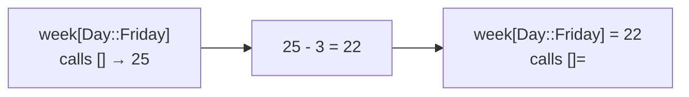

# Indexer

::note
<!-- sync:needs:start -->

**You'll need**: [Operator overload](/docs/learn/operator-overload), [Enum value](/docs/learn/enum-value), [Mutating method](/docs/learn/mutating-method)
<!-- sync:needs:end -->

::

Square brackets are an operator too. A type that declares `func []` can be read as `week[day]`, and one that also declares `func []=` can be written as `week[day] = 21`. They are declared in an `extend` block, just like `+` and `==` in [Operator overload](/docs/learn/operator-overload). The index need not be a number: here a week of temperatures is indexed by the day itself.

## The type underneath

```rux
// The highest temperature of each day, stored in an ordinary array.
struct Week {
    highs: int32[7];
}
```

A `Week` is an ordinary array in a struct. The indexer is what lets a reader write `week[Day::Friday]` instead of `week.highs[4]`, and lets the type decide which indexes exist.

## Reading and writing

```rux
// Reading: `week[day]` calls this and gives back a copy of the value.
func [](self: &Week, day: Day) -> int32 {
    return self.highs[day as uint];
}

// Writing: `week[day] = value` calls this. It changes the week, so it takes `&var` self.
func []=(self: &var Week, day: Day, value: int32) {
    self.highs[day as uint] = value;
}
```

`day as uint` turns the enum case into its position, 0 for `Monday` through 6 for `Sunday`, as in [Enum value](/docs/learn/enum-value). The two functions split the work like this:

| You write                | The compiler calls | Receiver          | Gets                     |
| ------------------------ | ------------------ | ----------------- | ------------------------ |
| `week[Day::Friday]`      | `[]`               | `self: &Week`     | the day                  |
| `week[Day::Friday] = 25` | `[]=`              | `self: &var Week` | the day and the value 25 |

Writing changes the week, so `[]=` takes a `&var` receiver, as a [mutating method](/docs/learn/mutating-method) does, and `week` must be declared with `var`.

```rux
var week = Week { highs: [0; 7] };

week[Day::Monday] = 18;
week[Day::Tuesday] = 21;
week[Day::Friday] = 25;
```

A day nobody wrote, such as Sunday, still holds the `0` it started with.

## An index that cannot be wrong

Because the index is a `Day`, an index the week does not have cannot even be written. `week[9]` is not an out-of-range day caught while the program runs — it is refused when the program is compiled, because a plain number is not a `Day`. The type of the index is part of the design.

## Two separate functions

```rux
// Reading and writing are two separate functions, so changing a value in place takes both.
week[Day::Friday] = week[Day::Friday] - 3;
```



The right-hand side reads through `[]`, and the assignment writes through `[]=`. Neither function both reads and writes, which is why the shorter `week[Day::Friday] -= 3` is refused (see below).

## The program

The whole lesson is one package in the [Examples repository](https://github.com/rux-lang/Examples/tree/main/Interfaces/Indexer). Its comments explain every step.

<!-- sync:program:start -->

```rux [Src/Main.rux]
// Square brackets are an operator too. A type that declares `func []` can be read as `week[day]`,
// and one that also declares `func []=` can be written as `week[day] = 21`. They are declared in
// an `extend` block like `+` and `==` were.
//
// The index need not be a number. Here a week of temperatures is indexed by day, so a reader sees
// `week[Day::Friday]`, and an index the week does not have, such as 9, cannot even be written:
// a plain number is not a `Day`.
import Io::PrintLine;

enum Day {
    Monday,
    Tuesday,
    Wednesday,
    Thursday,
    Friday,
    Saturday,
    Sunday
}

// The highest temperature of each day, stored in an ordinary array.
struct Week {
    highs: int32[7];
}

extend Week {
    // Reading: `week[day]` calls this and gives back a copy of the value.
    func [](self: &Week, day: Day) -> int32 {
        return self.highs[day as uint];
    }

    // Writing: `week[day] = value` calls this. It changes the week, so it takes `&var` self.
    func []=(self: &var Week, day: Day, value: int32) {
        self.highs[day as uint] = value;
    }
}

func Main() -> int {
    var week = Week { highs: [0; 7] };

    week[Day::Monday] = 18;
    week[Day::Tuesday] = 21;
    week[Day::Friday] = 25;
    PrintLine("Monday {}, Tuesday {}, Friday {}", week[Day::Monday], week[Day::Tuesday],
              week[Day::Friday]);

    // Reading and writing are two separate functions, so changing a value in place takes both.
    week[Day::Friday] = week[Day::Friday] - 3;
    PrintLine("Friday, corrected: {}", week[Day::Friday]);

    // A day nobody wrote still holds the zero it started with.
    PrintLine("Sunday {}", week[Day::Sunday]);

    // Writing `week[Day::Friday] -= 3` is refused, because no single function both reads and
    // writes: "operator '-=' cannot read and write through the '[]' operator on 'Week' at once".
    return 0;
}
```

<!-- sync:program:end -->

## Run it

```sh
cd Examples/Interfaces/Indexer
rux run
```

<!-- sync:output:start -->

```
Monday 18, Tuesday 21, Friday 25
Friday, corrected: 22
Sunday 0
```

<!-- sync:output:end -->

## Common mistakes

::warning
**A compound assignment through the brackets.**\
`week[Day::Friday] -= 3` fails with `error: operator '-=' cannot read and write through the '[]' operator on 'Week' at once`. Spell it out as `week[Day::Friday] = week[Day::Friday] - 3`.
::

::warning
**Indexing with the wrong type.**\
`week[9]` fails with `error: no '[]' on 'Week' accepts an index of type 'int'`. The indexer takes a `Day`, so write `week[Day::Sunday]`.
::

::warning
**Writing to a `let` value.**\
Declare `week` with `let` and every assignment fails with `error: cannot modify immutable variable 'week'`. `[]=` takes `&var self`, so the variable must be a `var`. Reading through `[]` still works on a `let`.
::

## Try it yourself

1. Add `func Warmest(self: &Week) -> int32` that returns the highest of the seven temperatures.
2. Make `[]=` refuse temperatures above 60 by leaving the old value in place.
3. Write a `Scores` type indexed by a `Player` enum of your own, with both `[]` and `[]=`.

## Learn more

- [Operator overload](/docs/learn/operator-overload) — the other operators a type can declare
- [Enum value](/docs/learn/enum-value) — `day as uint`
- [Array](/docs/learn/array) — indexing with a number
- [Array access](/docs/lang/arrays/access) in the Rux Reference
