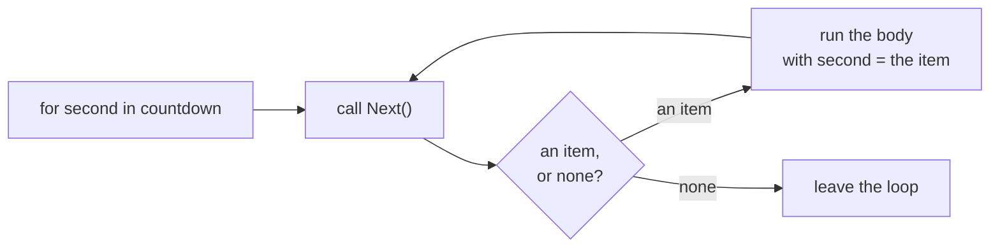

# Iterator

::note
<!-- sync:needs:start -->

**You'll need**: [Interface](/docs/learn/interface), [For](/docs/learn/for), [Optional](/docs/learn/optional), [Coalesce exit](/docs/learn/coalesce-exit)
<!-- sync:needs:end -->

::

`for` has walked ranges and arrays since the [For](/docs/learn/for) lesson. It can walk a type of your own too, once that type has one method, `Next`, which hands out one item per call and an [optional](/docs/learn/optional) `none` when there are no more. A type with such a method is called an **iterator**. This lesson builds one that counts down to liftoff.

## The Next method

```rux
// Counts down from a starting number to 1.
struct Countdown {
    remaining: int32;
}

extend Countdown : Iterator {
    // `&var`, because handing out an item moves the countdown along.
    func Next(self: &var Countdown) -> int32? {
        if self.remaining == 0 {
            return none;
        }
        let current = self.remaining;
        self.remaining -= 1;
        return current;
    }
}
```

Three things make this an iterator:

| Part                   | Why                                                                              |
| ---------------------- | -------------------------------------------------------------------------------- |
| the name `Next`        | `for` looks for a method with exactly this name                                  |
| `self: &var Countdown` | handing out an item moves the countdown along, so `Next` must write              |
| `-> int32?`            | an item, or `none` for "no more". The item type is whatever the optional carries |

## The role has a name

`extend Countdown : Iterator` uses the `Iterator` interface from Core, imported with `import Core::Iterator;`. But that interface lists no methods: an interface cannot spell out an item type that each iterator chooses for itself, so `for` goes by the shape of `Next` alone. Writing `: Iterator` names the role for a reader and records what the type is meant to be. Leave it out and the countdown still works with `for`.

## What for does

```rux
// `for` calls `Next` until it sees `none`. The parentheses keep the struct's braces apart
// from the loop body's.
Print("for:    ");
for second in (Countdown { remaining: 5 }) {
    Print(" {}", second);
}
PrintLine(" liftoff");
```



There is no magic in it. The same walk written by hand is a [`loop`](/docs/learn/loop) with [`?? break`](/docs/learn/coalesce-exit):

```rux
var countdown = Countdown { remaining: 5 };
Print("by hand:");
loop {
    let second = countdown.Next() ?? break;
    Print(" {}", second);
}
PrintLine(" liftoff");
```

Both print `5 4 3 2 1 liftoff`.

## Used up as it goes

```rux
// An iterator is used up as it goes. Once it has said `none`, it keeps saying `none`.
PrintLine("anything left? {}", countdown.Next() is int32);
```

After the hand-written loop, `countdown.remaining` is 0, so every further call answers `none`, and `is int32` reports `false`. An iterator is a position in a walk, not a collection: to count down again, you make a new `Countdown`. The next lesson, [Iterable](/docs/learn/iterable), is about collections that can hand out a fresh iterator whenever one is needed.

## The program

The whole lesson is one package in the [Examples repository](https://github.com/rux-lang/Examples/tree/main/Interfaces/Iterator). Its comments explain every step.

<!-- sync:program:start -->

```rux [Src/Main.rux]
// `for` has walked ranges and arrays since the Control flow part. It can walk a type of your own
// too, once that type has one method:
//     func Next(self: &var T) -> Item?
// Each call hands out the next item, or `none` when there are no more. `for` calls `Next` again
// and again, runs the loop body with every item it gets, and stops at the first `none`. The item
// type is whatever the optional carries: `int32` here.
//
// A type with such a `Next` is called an iterator. `extend Countdown : Iterator` names that role
// for a reader, but Core's `Iterator` interface lists no methods, because an interface cannot
// spell out an item type that each iterator chooses for itself. `for` goes by `Next` alone.
import Core::Iterator;
import Io::{ Print, PrintLine };

// Counts down from a starting number to 1.
struct Countdown {
    remaining: int32;
}

extend Countdown : Iterator {
    // `&var`, because handing out an item moves the countdown along.
    func Next(self: &var Countdown) -> int32? {
        if self.remaining == 0 {
            return none;
        }
        let current = self.remaining;
        self.remaining -= 1;
        return current;
    }
}

func Main() -> int {
    // `for` calls `Next` until it sees `none`. The parentheses keep the struct's braces apart
    // from the loop body's.
    Print("for:    ");
    for second in (Countdown { remaining: 5 }) {
        Print(" {}", second);
    }
    PrintLine(" liftoff");

    // The same walk by hand. This is all that `for` does.
    var countdown = Countdown { remaining: 5 };
    Print("by hand:");
    loop {
        let second = countdown.Next() ?? break;
        Print(" {}", second);
    }
    PrintLine(" liftoff");

    // An iterator is used up as it goes. Once it has said `none`, it keeps saying `none`.
    PrintLine("anything left? {}", countdown.Next() is int32);
    return 0;
}
```

Besides `Io`, its `Rux.toml` lists `Core` under `[Dependencies]`.
<!-- sync:program:end -->

## Run it

```sh
cd Examples/Interfaces/Iterator
rux run
```

<!-- sync:output:start -->

```
for:     5 4 3 2 1 liftoff
by hand: 5 4 3 2 1 liftoff
anything left? false
```

<!-- sync:output:end -->

## Common mistakes

::warning
**A read-only `Next`.**\
`func Next(self: &Countdown)` is refused: `error: iterator method 'Next' on 'Countdown' must take a mutable receiver`, with the note "advancing an iterator writes it, so 'Next' cannot borrow its receiver read-only".
::

::warning
**Returning the item without an optional.**\
With `-> int32` instead of `-> int32?`, there is no way to say "no more", and `for` refuses the type: `error: cannot iterate over 'Countdown'`, with the note "type 'Countdown' declares 'Next', but not as 'func Next(self: &var Countdown) -> T?' returning a native optional".
::

::warning
**Leaving out the parentheses.**\
`for second in Countdown { remaining: 5 } {` takes the struct's `{` for the start of the loop body, and the parser stops with `error: expected ';' after expression, but found ':'`. Wrap a struct literal in parentheses after `in`.
::

::warning
**A different method name.**\
`for` looks for `Next` by name. Call it `Step` and the loop fails with `error: cannot iterate over 'Countdown'`, and the help "iterate an array, a slice, a range, or a type declaring 'Next' or 'Iterate'".
::

## Try it yourself

1. Write an `Evens` iterator with `next` and `limit` fields that hands out 0, 2, 4, … up to `limit`.
2. Change `Countdown` so that it hands out 0 as its last item before `none`.
3. Declare `var countdown = Countdown { remaining: 3 };`, walk it with `for`, and then print `countdown.remaining`. Was the variable itself used up?

## Learn more

- [Iterable](/docs/learn/iterable) — a collection that hands out fresh iterators
- [For](/docs/learn/for) — the loop that drives `Next`
- [Coalesce exit](/docs/learn/coalesce-exit) — the `?? break` in the hand-written loop
- [For loops](/docs/lang/statements/for) in the Rux Reference
