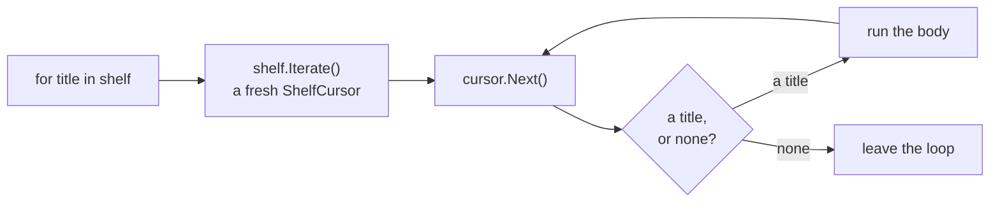

# Iterable

::note
<!-- sync:needs:start -->

**You'll need**: [Iterator](/docs/learn/iterator), [Slice](/docs/learn/slice)
<!-- sync:needs:end -->

::

The [Iterator](/docs/learn/iterator) lesson walked a countdown, which is used up as it goes. A collection is different: a shelf of books can be looked through any number of times, and looking does not use up the books. So a collection does not walk itself. It hands out a **fresh iterator** every time one is wanted, and the iterator keeps the position.

## Two types, two jobs

```rux
struct Shelf {
    titles: char8[..][4];
}

// The iterator: a view of the shelf's titles, and how far along it has got.
struct ShelfCursor {
    titles: char8[..][..];
    index: uint;
}
```

`Shelf` holds four titles. `ShelfCursor` holds a [slice](/docs/learn/slice) that views them, and an index saying how far it has got. The cursor is an iterator exactly like `Countdown`:

```rux
extend ShelfCursor : Iterator {
    func Next(self: &var ShelfCursor) -> char8[..]? {
        if self.index == self.titles.length {
            return none;
        }
        let title = self.titles[self.index];
        self.index += 1;
        return title;
    }
}
```

## The Iterate method

```rux
extend Shelf : Iterable {
    func Iterate(self: &Shelf) -> ShelfCursor {
        return ShelfCursor { titles: self.titles[..], index: 0 };
    }
}
```

`Iterate` borrows the shelf read-only and returns a new cursor that starts at the first book. As with `Iterator`, Core's `Iterable` lists no methods and only names the role; `for` goes by the method named `Iterate`.

|                   | Iterator (`ShelfCursor`)                     | Iterable (`Shelf`)                         |
| ----------------- | -------------------------------------------- | ------------------------------------------ |
| Its method        | `Next(self: &var ShelfCursor) -> char8[..]?` | `Iterate(self: &Shelf) -> ShelfCursor`     |
| Borrows itself as | `&var` — every call moves it along           | `&` — handing out a cursor changes nothing |
| After a full walk | used up                                      | unchanged, ready for another loop          |

## What for does with a collection



`for` calls `Iterate` once at the top of the loop, then drives that cursor with `Next` exactly as in the previous lesson. So a second loop over the same shelf gets a second cursor and starts from the first book again:

```rux
Print("on the shelf:");
for title in shelf {
    Print(" {}", title);
}
PrintLine();

// A second loop gets a second iterator, so it starts from the first book again.
var letters: uint = 0;
for title in shelf {
    letters += title.length;
}
```

4 + 4 + 7 + 7 gives 22 letters in all.

## Separate positions

You can also call `Iterate` yourself. Each call gives an independent cursor:

```rux
// Two iterators from one shelf keep separate positions.
var reader = shelf.Iterate();
var browser = shelf.Iterate();
reader.Next();
reader.Next();
PrintLine("one reader is at {}, the other at {}", reader.Next() ?? "", browser.Next() ?? "");
```

`reader` has moved past two books and is at _Ulysses_; `browser` has not moved and is at _Dune_. The shelf itself never changed — the position lives in the iterator.

A cursor borrows the shelf it views, so the shelf must outlive it, and must not be changed while a cursor over it is in use.

## The program

The whole lesson is one package in the [Examples repository](https://github.com/rux-lang/Examples/tree/main/Interfaces/Iterable). Its comments explain every step.

<!-- sync:program:start -->

```rux [Src/Main.rux]
// The Iterator lesson walked a countdown, which is used up as it goes. A collection is different:
// a shelf of books can be looked through any number of times, and looking does not use up the
// books.
//
// So a collection does not walk itself. It provides one method,
//     func Iterate(self: &T) -> SomeIterator
// which hands out a fresh iterator, starting at the beginning, every time it is called. `for`
// calls it once at the top of each loop and then drives that iterator with `Next`. The collection
// is only borrowed, so it is unchanged afterwards; the position lives in the iterator.
//
// As with `Iterator`, Core's `Iterable` interface lists no methods and only names the role.
import Core::{ Iterable, Iterator };
import Io::{ Print, PrintLine };

struct Shelf {
    titles: char8[..][4];
}

// The iterator: a view of the shelf's titles, and how far along it has got.
struct ShelfCursor {
    titles: char8[..][..];
    index: uint;
}

extend ShelfCursor : Iterator {
    func Next(self: &var ShelfCursor) -> char8[..]? {
        if self.index == self.titles.length {
            return none;
        }
        let title = self.titles[self.index];
        self.index += 1;
        return title;
    }
}

extend Shelf : Iterable {
    func Iterate(self: &Shelf) -> ShelfCursor {
        return ShelfCursor { titles: self.titles[..], index: 0 };
    }
}

func Main() -> int {
    let shelf = Shelf { titles: ["Dune", "Emma", "Ulysses", "Beloved"] };

    Print("on the shelf:");
    for title in shelf {
        Print(" {}", title);
    }
    PrintLine();

    // A second loop gets a second iterator, so it starts from the first book again.
    var letters: uint = 0;
    for title in shelf {
        letters += title.length;
    }
    PrintLine("letters in all titles: {}", letters);

    // Two iterators from one shelf keep separate positions.
    var reader = shelf.Iterate();
    var browser = shelf.Iterate();
    reader.Next();
    reader.Next();
    PrintLine("one reader is at {}, the other at {}", reader.Next() ?? "", browser.Next() ?? "");
    return 0;
}
```

Besides `Io`, its `Rux.toml` lists `Core` under `[Dependencies]`.
<!-- sync:program:end -->

## Run it

```sh
cd Examples/Interfaces/Iterable
rux run
```

<!-- sync:output:start -->

```
on the shelf: Dune Emma Ulysses Beloved
letters in all titles: 22
one reader is at Ulysses, the other at Dune
```

<!-- sync:output:end -->

## Common mistakes

::warning
**A collection with neither `Next` nor `Iterate`.**\
Rename `Iterate` to `Cursor` and both loops fail with `error: cannot iterate over 'Shelf'`, and the help "iterate an array, a slice, a range, or a type declaring 'Next' or 'Iterate'". Keep the name `Iterate`.
::

::warning
**Taking `&var self` in `Iterate`.**\
Handing out a cursor does not change the collection, so `Iterate` borrows read-only. Declare it with `self: &var Shelf` and each `shelf.Iterate()` on the `let` shelf fails with `error: cannot call 'Iterate' on immutable 'shelf'`.
::

::warning
**Expecting a used cursor to start again.**\
A cursor is an iterator, and an iterator is used up: once `reader` has handed out _Beloved_, every further `reader.Next()` answers `none`. To walk the shelf again, ask it for a fresh cursor with `shelf.Iterate()` — which is exactly what each `for` loop does.
::

## Try it yourself

1. Count the titles longer than four letters with a `for` loop over `shelf`.
2. Add a method `Backwards(self: &Shelf)` that returns a cursor walking the titles from last to first, and loop over `shelf.Backwards()`.
3. Make three cursors from one shelf, advance each a different number of times, and print where each one is.

## Learn more

- [Iterator](/docs/learn/iterator) — the `Next` half of the protocol
- [Slice](/docs/learn/slice) — the view the cursor holds
- [Tree map](/docs/learn/tree-map) — a standard collection that `for` walks the same way
- [For loops](/docs/lang/statements/loops#for) in the Rux Reference
