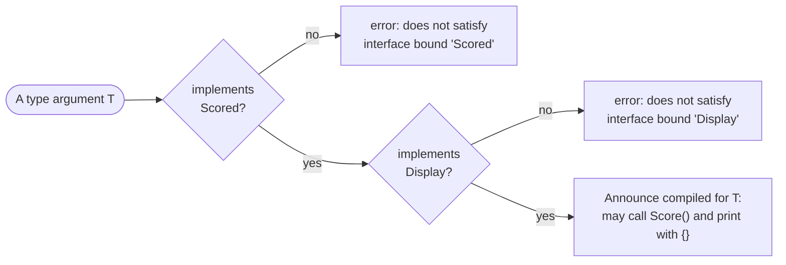

# Multiple bounds

::note
<!-- sync:needs:start -->

**You'll need**: [Generic bound](/docs/learn/generic-bound), [Display](/docs/learn/display)
<!-- sync:needs:end -->

::

One bound gives a generic one set of methods. Often it needs two: `Scored` to decide who wins, and [Display](/docs/learn/display) to print the winner with `{}`. Bounds are joined with `+`. `<T: Scored + Display>` accepts only a type that implements **both** interfaces, and the body may use everything either one provides.

## Joining bounds with +

```rux
func Announce<T: Scored + Display>(first: T, second: T) {
    if second.Score() > first.Score() {
        PrintLine("{} beats {}", second, first);
    } else {
        PrintLine("{} holds off {}", first, second);
    }
}
```

`Score()` is allowed because of `Scored`. Passing `first` and `second` to `{}` is allowed because of `Display`. Inside the body a `T` is exactly what its bounds say it is, and nothing more — with only `<T: Scored>`, each `PrintLine` here is rejected, as the [Generic](/docs/learn/generic) lesson warned it would be.



## Each type meets each bound its own way

`Player` needs both implementations. `Scored` is the one from [Generic bound](/docs/learn/generic-bound); `Display` comes from the Text package, and a player prints as their name:

```rux
// A player prints as their name.
extend Player : Display {
    func WriteDisplay(self: &Player, writer: &var TextWriter, spec: FormatSpec) -> ! FormatError {
        return writer.Write(self.name);
    }
}
```

`int32` is already `Display` — the standard packages give every number that implementation, which is why numbers have always printed with `{}`. So it needs only `Scored`:

```rux
// `int32` already implements `Display` in the standard packages, so it needs only `Scored`.
extend int32 : Scored {
    func Score(self: &int32) -> int32 {
        return self;
    }
}
```

| Type      | `Scored`                 | `Display`                  | `Announce` accepts it? |
| --------- | ------------------------ | -------------------------- | ---------------------- |
| `Player`  | `extend Player : Scored` | `extend Player : Display`  | yes                    |
| `int32`   | `extend int32 : Scored`  | from the standard packages | yes                    |
| `float64` | none                     | from the standard packages | no — not `Scored`      |
| `int`     | none                     | from the standard packages | no — not `Scored`      |

That last row is why `Main` declares its numbers as `int32` before passing them:

```rux
let low: int32 = 3;
let high: int32 = 9;
Announce(high, low);
```

## Every bound is checked on its own

The compiler checks each bound separately and reports the one that fails. `Announce(2.5, 1.5)` is rejected because `float64` is `Display` but not `Scored`. Delete the `extend Player : Display` block and `Announce(ana, bo)` is rejected the other way round — `Player` is `Scored` but cannot print. There is no partial credit: a type that meets one bound out of two is as unwelcome as one that meets none.

## The program

The whole lesson is one package in the [Examples repository](https://github.com/rux-lang/Examples/tree/main/Generics/MultipleBounds). Its comments explain every step.

<!-- sync:program:start -->

```rux [Src/Main.rux]
// One bound gives a generic one set of methods. When it needs two, the bounds are joined with
// `+`: `<T: Scored + Display>` accepts only a type that implements both interfaces, and the
// body may use everything either one provides.
//
// Here `Scored` decides who wins and `Display` lets the body print a `T` with `{}`. With only
// `<T: Scored>`, each `PrintLine` below is rejected: "argument 2 to 'PrintLine' has type 'T',
// but variadic parameter 'args' requires 'Display'". A placeholder needs `Display`, and a
// `T` is only what its bounds say it is.
import Io::PrintLine;
import Text::{ Display, FormatError, FormatSpec, TextWriter };

interface Scored {
    func Score() -> int32;
}

struct Player {
    name: char8[..];
    points: int32;
}

extend Player : Scored {
    func Score(self: &Player) -> int32 {
        return self.points;
    }
}

// A player prints as their name.
extend Player : Display {
    func WriteDisplay(self: &Player, writer: &var TextWriter, spec: FormatSpec) -> ! FormatError {
        return writer.Write(self.name);
    }
}

// `int32` already implements `Display` in the standard packages, so it needs only `Scored`.
extend int32 : Scored {
    func Score(self: &int32) -> int32 {
        return self;
    }
}

func Announce<T: Scored + Display>(first: T, second: T) {
    if second.Score() > first.Score() {
        PrintLine("{} beats {}", second, first);
    } else {
        PrintLine("{} holds off {}", first, second);
    }
}

func Main() -> int {
    let ana = Player { name: "Ana", points: 12 };
    let bo = Player { name: "Bo", points: 17 };
    Announce(ana, bo);

    let low: int32 = 3;
    let high: int32 = 9;
    Announce(high, low);

    // Each bound is checked on its own. `Announce(2.5, 1.5)` is rejected because `float64`
    // is `Display` but not `Scored`; a type that is `Scored` but cannot print is rejected too.
    return 0;
}
```

Besides `Io`, its `Rux.toml` lists `Text` under `[Dependencies]`.
<!-- sync:program:end -->

## Run it

```sh
cd Examples/Generics/MultipleBounds
rux run
```

<!-- sync:output:start -->

```
Bo beats Ana
9 holds off 3
```

<!-- sync:output:end -->

## Common mistakes

::warning
**Writing a comma instead of `+`.**\
`<T: Scored, Display>` does not mean "both". The comma starts a _second type parameter_, here confusingly named `Display`, so `T` is bound by `Scored` alone. Every `PrintLine` in the body then fails with `error: argument 2 to 'PrintLine' has type 'T', but variadic parameter 'args' requires 'Display'`, and every call with `error: function 'Announce' requires 2 type arguments, but 0 were provided`.
::

::warning
**Leaving out the bound the body uses.**\
With only `<T: Scored>`, printing a `T` fails with `has type 'T', but variadic parameter 'args' requires 'Display'`. Everything the body does with a `T` has to come from some bound.
::

::warning
**A type that meets only one bound.**\
Without `extend Player : Display`, `Announce(ana, bo)` fails with `error: type argument 'Player' does not satisfy interface bound 'Display' on type parameter 'T'`, with the note `interface 'Display' requires method 'WriteDisplay', which type 'Player' does not implement`.
::

## Try it yourself

1. Swap `ana` and `bo` in the call to `Announce`. Which line is printed now?
2. Make a player print as `Bo (17)` by calling `WriteFormat` inside `WriteDisplay`, as `Money` did in [Display](/docs/learn/display). It comes from the Format package, so add `Format` to `[Dependencies]` too.
3. Add a `struct Team` that is `Scored` but not `Display`, and read the error when you pass two teams to `Announce`. Then give it a `Display` implementation.

## Learn more

- [Interfaces](/docs/lang/interfaces/overview) and [Generic functions](/docs/lang/generics/overview) in the Rux Reference
- [Generic bound](/docs/learn/generic-bound) — one bound, and how it is checked
- [Display](/docs/learn/display) — implementing `WriteDisplay`
- [Format](/docs/learn/format) — what the `spec` passed to `WriteDisplay` describes
