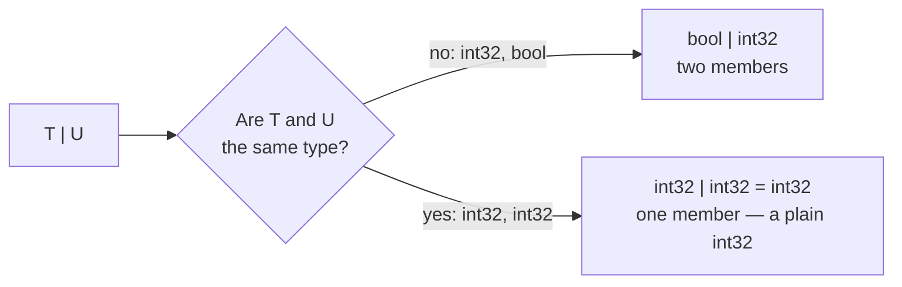

# Generic sum

::note
<!-- sync:needs:start -->

**You'll need**: [Generic](/docs/learn/generic), [Sum type](/docs/learn/sum-type), [Typed pattern](/docs/learn/typed-pattern)
<!-- sync:needs:end -->

::

A [sum type](/docs/learn/sum-type) can be built from type parameters: `T | U` is "a `T` or a `U`", whatever they turn out to be. That raises a question the Sum type lesson already answered for ordinary types. A sum is a **set** of types, so when `T` and `U` are the same type, `T | U` has only one member — and collapses to that type. This lesson shows the collapse, and the one habit it asks of every generic `match`: end it in `else`.

## A sum of type parameters

`Choose` hands back one of two values of possibly different types:

```rux
func Choose<T, U>(takeFirst: bool, first: T, second: U) -> T | U {
    if takeFirst {
        return first;
    }
    return second;
}
```

With two different types, the result keeps whichever member it was given. `port` holds the `int32` 8080; `flag` holds the `bool` `true`:

```rux
let port = Choose<int32, bool>(true, 8080, false);
let flag = Choose<int32, bool>(false, 8080, true);
```

## When T and U are the same type

With the same type twice, `int32 | int32` is just `int32`. The result is an ordinary number, ready for arithmetic, and no `match` is needed to get at it:

```rux
let count: int32 = Choose<int32, int32>(false, 3, 4);
PrintLine("int32 | int32   {}", count + 1);
```



| Instantiation          | `T \| U` becomes | Members |
| ---------------------- | ---------------- | ------- |
| `Choose<int32, bool>`  | `bool \| int32`  | 2       |
| `Choose<int32, int32>` | `int32`          | 1       |

## Why the match ends in else

`Side` reports which member a `T | U` holds. The natural way to write it would be one typed arm per member — but its second arm is `else`:

```rux
func Side<T, U>(value: T | U) -> char8[..] {
    return match value {
        first: T => "first",
        else => "second"
    };
}
```

Consider `Side<int32, int32>`. The sum has collapsed to `int32`, so the first arm, `first: int32 =>`, matches **every** value. A second arm `second: U =>` would be `second: int32 =>`, coming after an arm that already took everything — an unreachable arm, which the compiler rejects. It rejects it for that instantiation only, and the note names the call responsible:

```
error: match arm is unreachable because an earlier pattern matches every value
  note: in 'Side' instantiated with T = int32, U = int32 by the call at …
```

An `else` arm is never reported as unreachable. So a `match` over `T | U` ends in `else`, and stays valid for every pair of type arguments — including the pair where `else` is never used:

```rux
PrintLine("collapsed side  {}", Side<int32, int32>(count));
```

That call prints `first`. A collapsed sum has nothing to tell apart.

## The program

The whole lesson is one package in the [Examples repository](https://github.com/rux-lang/Examples/tree/main/Generics/GenericSum). Its comments explain every step.

<!-- sync:program:start -->

```rux [Src/Main.rux]
// A sum can be built from type parameters: `T | U` is "a T or a U", whatever they turn out to be.
// That raises a question the SumType lesson already answered. A sum is a set of types, so when
// `T` and `U` are the same type, `T | U` has only one member and collapses to that type.
// `Choose<int32, int32>` returns a plain `int32`, ready for arithmetic.
//
// The collapse matters to a generic `match`. `Side` cannot write a second arm `second: U =>`:
// at `Side<int32, int32>` that arm would come after `first: int32 =>`, which already matched
// everything, and the instantiation is rejected — "match arm is unreachable because an earlier
// pattern matches every value", with a note "in 'Side' instantiated with T = int32, U = int32
// by the call at ..." that points at the call in `Main` responsible. An `else` arm is never
// reported as unreachable, so a match over `T | U` ends in `else` and stays valid for every pair
// of type arguments.
import Io::PrintLine;

// Hands back one of two values of possibly different types.
func Choose<T, U>(takeFirst: bool, first: T, second: U) -> T | U {
    if takeFirst {
        return first;
    }
    return second;
}

// Which member a `T | U` holds. When the sum has collapsed, the first arm takes every value.
func Side<T, U>(value: T | U) -> char8[..] {
    return match value {
        first: T => "first",
        else => "second"
    };
}

func Main() -> int {
    // Two different types: the result keeps whichever member it was given.
    let port = Choose<int32, bool>(true, 8080, false);
    let flag = Choose<int32, bool>(false, 8080, true);
    PrintLine("int32 | bool    {} {}", Side<int32, bool>(port), Side<int32, bool>(flag));

    // The same type twice: `int32 | int32` is `int32`, so the result is an ordinary number.
    let count: int32 = Choose<int32, int32>(false, 3, 4);
    PrintLine("int32 | int32   {}", count + 1);

    // A collapsed sum has nothing to tell apart. The `else` arm is still there, unused.
    PrintLine("collapsed side  {}", Side<int32, int32>(count));
    return 0;
}
```

<!-- sync:program:end -->

## Run it

```sh
cd Examples/Generics/GenericSum
rux run
```

<!-- sync:output:start -->

```
int32 | bool    first second
int32 | int32   5
collapsed side  first
```

<!-- sync:output:end -->

## Common mistakes

::warning
**One typed arm per type parameter.**\
Writing `second: U =>` as the last arm of `Side` builds for `Side<int32, bool>` but fails for `Side<int32, int32>` with `error: match arm is unreachable because an earlier pattern matches every value`, plus a note naming the instantiation and the call. End a generic `match` over a sum in `else`.
::

::warning
**Expecting T and U to be inferred from a sum.**\
`Side(port)` fails with `error: argument 1 to 'Side' has type 'bool8 | int32', but parameter 'value' requires 'T | U'` (`bool8` is the full name of `bool`). A sum is a set of types, and the compiler does not split one back into a `T` and a `U`. Write the type arguments: `Side<int32, bool>(port)`.
::

::warning
**Leaving the arguments to choose the types.**\
`Choose(true, 8080, false)` compiles, but the bare literal makes `T` an `int`, and the result is a `bool8 | int` — a different type from the `bool8 | int32` that `Side<int32, bool>` expects. The error says exactly that. Write `Choose<int32, bool>(…)`, or pass `int32` variables.
::

## Try it yourself

1. Call `Choose<char8[..], int32>` and `Side` on its result. What does `Side` print for each member?
2. Call `Choose<bool, bool>(true, false, true)` and use the result directly in an `if`. Why is no `match` needed?
3. Write `FirstOr<T, U>(value: T | U, fallback: T) -> T`, which returns the `T` member or the fallback, with a `first: T` arm and `else`. Try it with `<int32, bool>` and with `<int32, int32>`.

## Learn more

- [Sum type](/docs/learn/sum-type) and [Typed pattern](/docs/learn/typed-pattern) — sums and their arms
- [Exhaustive](/docs/learn/exhaustive) — why the compiler checks every arm
- [Generic outcome](/docs/learn/generic-outcome) — generic helpers over the other native forms
- [`match`](/docs/lang/patterns/match) in the Rux Reference
