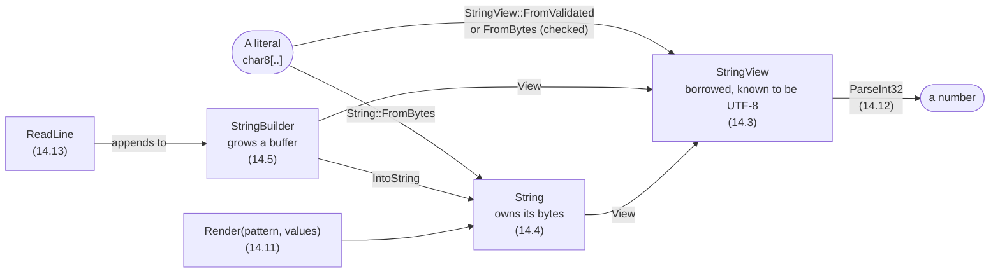

# Part 14: Text

Text has been in every program since Hello, World, and so far it has been simple: a literal in quotes, printed with `{}`. This part looks underneath. A literal turns out to be a slice of UTF-8 bytes, which is why its length can surprise you; the Text package adds views that promise their bytes are text, Strings that own their bytes, and builders that grow them. Then the part turns outwards — Unicode's three ways of counting characters, laying out columns of numbers, rendering text you keep, parsing numbers back out of it, and reading lines a person types.

## What you will learn

- What a string literal is — a read-only `char8[..]` of UTF-8 bytes — and the escapes it can hold.
- The three encodings, `c8`, `c16` and `c32`, and why lengths count code units rather than characters.
- Borrowing text with `StringView`, owning it with `String`, and building it with `StringBuilder`.
- Checking and decoding UTF-8, and telling bytes, scalars and graphemes apart.
- Changing case correctly beyond ASCII, where one letter can become two.
- Placeholder specs for width, alignment, precision, bases, zeros and signs.
- Rendering into a `String` with `Render`, parsing numbers with `ParseInt32`, and reading lines with `ReadLine`.

## The text types at a glance



| You have…                     | And want to…                       | Use                                   |
| ----------------------------- | ---------------------------------- | ------------------------------------- |
| bytes that might not be text  | be sure they are UTF-8             | `StringView::FromBytes` or `Validate` |
| text someone else owns        | trim, search, split it             | `StringView`                          |
| text a function made          | hand it back, keep it              | `String`                              |
| pieces arriving one at a time | join them without copying them all | `StringBuilder`                       |
| values and a pattern          | text you keep                      | `Render`                              |
| text that should be a number  | the number, or why not             | `ParseInt32` and friends              |

## Lessons

<!-- sync:lessons:start -->

|       | Lesson                                       | What you will learn                                                   |
| ----- | -------------------------------------------- | --------------------------------------------------------------------- |
| 14.1  | [String literal](/docs/learn/string-literal) | what a string literal is: read-only `char8` code units                |
| 14.2  | [Encoding](/docs/learn/encoding)             | `c8`, `c16` and `c32` literals, and code units versus characters      |
| 14.3  | [String view](/docs/learn/string-view)       | borrow text without copying it                                        |
| 14.4  | [String](/docs/learn/string)                 | own text that lives as long as you need it                            |
| 14.5  | [String builder](/docs/learn/string-builder) | build text a piece at a time                                          |
| 14.6  | [UTF-8](/docs/learn/utf8)                    | check and decode UTF-8 bytes                                          |
| 14.7  | [Unicode](/docs/learn/unicode)               | bytes, code points and grapheme clusters, and why their counts differ |
| 14.8  | [Unicode case](/docs/learn/unicode-case)     | change case beyond ASCII, where one letter can become two             |
| 14.9  | [Format](/docs/learn/format)                 | control width and alignment when formatting values                    |
| 14.10 | [Format number](/docs/learn/format-number)   | control precision and number base when formatting numbers             |
| 14.11 | [Render](/docs/learn/render)                 | format values into a `String` instead of the console                  |
| 14.12 | [Parse](/docs/learn/parse)                   | turn text into a number, and handle text that is not one              |
| 14.13 | [Input](/docs/learn/input)                   | read a line typed by the user, and notice when input ends             |

<!-- sync:lessons:end -->

## Before you start

Finish [Part 13: Generics](/docs/learn/generics). Text leans on almost everything before it: slices from [Part 5](/docs/learn/sequences), optionals and fallibles from [Part 8](/docs/learn/optionals) and [Part 9](/docs/learn/errors) — nearly every text operation can fail — [Destructor](/docs/learn/destructor) from Part 11 for the memory a `String` gives back, and [Display](/docs/learn/display) and [Iterator](/docs/learn/iterator) from Part 12. Each lesson's package is in the Examples repository's `Text/` folder:

```sh
cd Examples/Text/StringLiteral
rux run
```

Several lessons pass an `Allocator` around without explaining it yet. For now it is simply where a `String`'s bytes come from; [Part 15: Memory](/docs/learn/memory) opens it up.

## After this part

[Part 15: Memory](/docs/learn/memory) explains the allocators and pointers this part used without looking inside — the `@written` of [Unicode case](/docs/learn/unicode-case) and the `Allocator` every `String` was given. [Part 16: Numbers](/docs/learn/numbers) then ends with the checkpoint projects [Circle](/docs/learn/circle) and [Quadratic](/docs/learn/quadratic), which read numbers typed by the user with this part's `ReadLine` and the Format package's parsers.

For the language rules behind literals, see [String literals](/docs/lang/types/text), [Literals](/docs/lang/lexical/literals) and the [character types](/docs/lang/types/characters) in the Rux Reference, and the [Text](/docs/api/text), [Format](/docs/api/format) and [Io](/docs/api/io) packages in the API reference.
