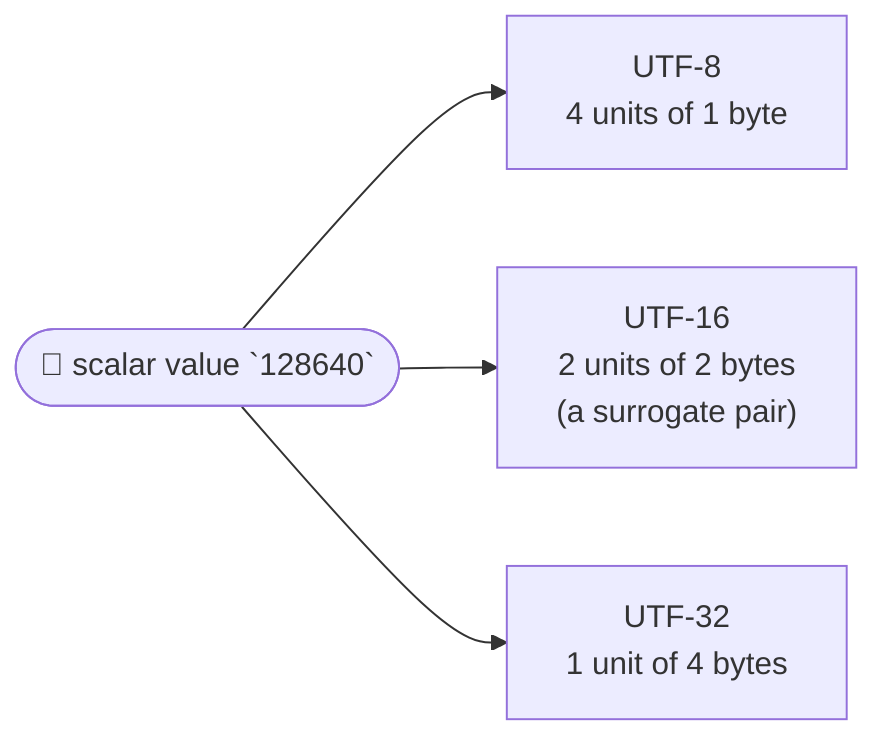

# Encoding

::note
<!-- sync:needs:start -->

**You'll need**: [String literal](/docs/learn/string-literal), [Function](/docs/learn/function), [Convert](/docs/learn/convert)
<!-- sync:needs:end -->

::

Every character has a number, its **scalar value**: `A` is 65, `€` is 8364, the rocket emoji 🚀 is 128640. An **encoding** decides how that number is stored as a run of fixed-size _code units_. Rux can write a literal in three encodings, and the same text takes a different number of units in each. That is why [String literal](/docs/learn/string-literal) found the euro sign to be three "long": `.length` counts code units, not characters.

## Three encodings, three literal types

A prefix on the literal picks the encoding, and with it the element type of the slice:

| Literal     | Type         | Encoding           | Code unit |
| ----------- | ------------ | ------------------ | --------- |
| `"text"`    | `char8[..]`  | UTF-8              | 1 byte    |
| `c8"text"`  | `char8[..]`  | UTF-8, spelled out | 1 byte    |
| `c16"text"` | `char16[..]` | UTF-16             | 2 bytes   |
| `c32"text"` | `char32[..]` | UTF-32             | 4 bytes   |

The same prefixes pick a character literal's width: `c8'A'` is one `char8` code unit, as in the previous lesson.

The program's `Show` takes all three slice types, so the same text can be measured in each encoding side by side:

```rux
func Show(eight: char8[..], sixteen: char16[..], thirtyTwo: char32[..]) {
    PrintLine("{}  UTF-8 {}, UTF-16 {}, UTF-32 {}",
        thirtyTwo, eight.length, sixteen.length, thirtyTwo.length);
}
```

## How the counts drift apart

| Text   | Scalar values  | UTF-8 units | UTF-16 units | UTF-32 units |
| ------ | -------------- | ----------- | ------------ | ------------ |
| `Rux`  | 82, 117, 120   | 3           | 3            | 3            |
| `café` | …, 233 for `é` | 5           | 4            | 4            |
| `€`    | 8364           | 3           | 1            | 1            |
| `🚀`   | 128640         | 4           | 2            | 1            |

- **ASCII** — every encoding uses one unit per character, and the counts agree. That is why the difference is so easy to miss.
- **`é`** — two UTF-8 bytes, but one unit in the wider encodings.
- **`€`** — three UTF-8 bytes, still one UTF-16 unit.
- **The rocket** lies beyond the 65,536 values one UTF-16 unit can hold, so UTF-16 splits it into two units called a **surrogate pair**. Only UTF-32 holds it whole.



A UTF-32 unit is wide enough for any scalar, so in a `char32[..]` the count of units _is_ the count of scalars. The narrower encodings spend several units on one scalar once the text leaves plain ASCII.

## Indexing returns a code unit

`[i]` gives the `i`-th code unit of the slice's own encoding — not the `i`-th character:

```rux
let rocket16 = c16"🚀";
let rocket32 = c32"🚀";
PrintLine("rocket16[0] is {}", rocket16[0] as uint32);
PrintLine("rocket32[0] is {}", rocket32[0] as uint32);
```

`rocket32[0]` is the whole rocket, 128640. `rocket16[0]` is 55357: the first half of a surrogate pair, a number but no character at all on its own. The `as uint32` [conversion](/docs/learn/convert) prints the units as numbers, which is the honest way to look at half a character.

Which encoding to use? UTF-8 is the default for a reason: it is what files, terminals and the network speak, and the Text package works in it. The wider literals exist for the places that need them — Windows APIs take UTF-16, and the Unicode package works on `char32[..]`, where one unit is one scalar.

## The program

The whole lesson is one package in the [Examples repository](https://github.com/rux-lang/Examples/tree/main/Text/Encoding). Its comments explain every step.

<!-- sync:program:start -->

```rux [Src/Main.rux]
// A character has a number, its scalar value: `A` is 65, `€` is 8364, the rocket emoji is 128640.
// An encoding decides how that number is stored as a run of fixed-size code units, and Rux
// literals can be written in three of them:
//
//     "text"      char8[..]    UTF-8, one-byte units — the default
//     c8"text"    char8[..]    the same, with the encoding spelled out
//     c16"text"   char16[..]   UTF-16, two-byte units
//     c32"text"   char32[..]   UTF-32, four-byte units
//
// The same prefixes pick a character literal's width: `c8'A'` is one `char8` code unit.
//
// `.length` and indexing always count code units of the slice's own encoding. A UTF-32 unit is
// wide enough for any scalar, so there the count of units is the count of scalars. The narrower
// encodings spend several units on one scalar once the text leaves plain ASCII.
import Io::PrintLine;

// The three parameter types are the three literal types, so this function shows the same text
// in each encoding side by side.
func Show(eight: char8[..], sixteen: char16[..], thirtyTwo: char32[..]) {
    PrintLine("{}  UTF-8 {}, UTF-16 {}, UTF-32 {}",
        thirtyTwo, eight.length, sixteen.length, thirtyTwo.length);
}

func Main() -> int {
    // ASCII: every encoding uses one unit per character, and the counts agree.
    Show("Rux", c16"Rux", c32"Rux");

    // `é` takes two UTF-8 bytes but one unit in the wider encodings.
    Show("café", c16"café", c32"café");

    // The euro sign takes three UTF-8 bytes.
    Show("€", c16"€", c32"€");

    // The rocket lies beyond the 65,536 values one UTF-16 unit can hold, so UTF-16 splits it
    // into two units called a surrogate pair. Only UTF-32 holds it whole.
    Show("🚀", c16"🚀", c32"🚀");

    // Indexing returns a code unit, not a character. The first unit of the UTF-16 rocket is
    // half a surrogate pair: a number, but no character at all on its own.
    let rocket16 = c16"🚀";
    let rocket32 = c32"🚀";
    PrintLine("rocket16[0] is {}", rocket16[0] as uint32);
    PrintLine("rocket32[0] is {}", rocket32[0] as uint32);
    return 0;
}
```

<!-- sync:program:end -->

## Run it

```sh
cd Examples/Text/Encoding
rux run
```

<!-- sync:output:start -->

```
Rux  UTF-8 3, UTF-16 3, UTF-32 3
café  UTF-8 5, UTF-16 4, UTF-32 4
€  UTF-8 3, UTF-16 1, UTF-32 1
🚀  UTF-8 4, UTF-16 2, UTF-32 1
rocket16[0] is 55357
rocket32[0] is 128640
```

<!-- sync:output:end -->

## Common mistakes

::mistake
**Passing one encoding where another is expected.**\
The three slice types are different types, and nothing converts between them silently. `Show("Rux", "Rux", c32"Rux")` fails with:

```text
error: argument 2 to 'Show' has type 'char8[..]', but parameter 'sixteen' requires 'char16[..]'
```

Write the prefix: `c16"Rux"`.
::

::mistake
**A character literal too wide for its unit.**\
`c8'€'` fails with:

```text
error: character '€' (U+20AC) does not fit one 'char8' code unit
```

`c16'🚀'` fails likewise for `char16`. The help suggests a string literal instead, such as `c8"€"`, which may use several units.
::

::mistake
**Printing half a surrogate pair.**\
Without `as uint32`, `rocket16[0]` prints as `�`, a replacement mark: half a pair is not a character, so there is nothing real to show.
::

## Try it yourself

1. Call `Show` with `naïve`, `日本` and `Ελλάδα`. Which encoding is shortest for each?
2. Print every unit of `c16"🚀"` as a number with a `for` loop.
3. Find a character other than an emoji that needs a surrogate pair in UTF-16. Hint: its scalar value must be above 65,535.

## Learn more

- [`char8`](/docs/lang/types/characters), [`char16`](/docs/lang/types/characters) and [`char32`](/docs/lang/types/characters) in the Rux Reference
- [Character](/docs/learn/character) — the character types from Part 1
- [UTF-8](/docs/learn/utf8) — checking and decoding UTF-8 bytes one scalar at a time
- [Unicode](/docs/learn/unicode) — a third way to count, the one a reader means
