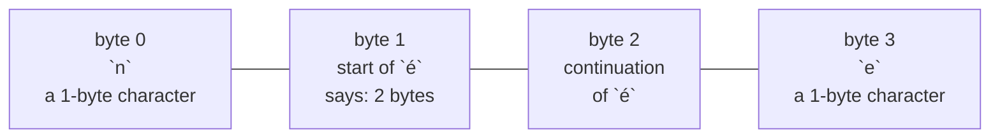

# UTF-8

::note
<!-- sync:needs:start -->

**You'll need**: [Encoding](/docs/learn/encoding), [Outcome](/docs/learn/outcome), [Catch](/docs/learn/catch)
<!-- sync:needs:end -->

::

UTF-8 stores each character as one to four bytes, and the bytes follow strict rules: the first byte of a character says how many bytes follow, and every byte after it is a _continuation byte_ of a particular shape. Not every run of bytes obeys them. Text cut in the wrong place, or bytes that were never text, break the rules. The Text package has the two tools that sit underneath every [view](/docs/learn/string-view) and [String](/docs/learn/string): one that checks, and one that decodes.

## The bytes of née

`"née"` is four bytes: `n`, then two for `é`, then `e`.



`word[..2]` takes bytes 0 and 1, so it ends with a character whose second byte is missing. `word[2..]` starts with byte 2, a continuation byte with nothing before it. Both are perfectly good `char8[..]` slices, and neither is valid UTF-8.

## Decoding one character at a time

```rux
DecodeAt(bytes, index) -> DecodedScalar ! Utf8Error
```

`DecodeAt` reads the character that starts at `index` and returns a `DecodedScalar` with two fields: `scalar`, the character as a `char32`, and `width`, how many bytes it took. Stepping `index` by each character's width walks the text one character at a time:

```rux
var index: uint = 0;
while index < word.length {
    let decoded = DecodeAt(word, index) catch { else => return 1 };
    PrintLine("byte {}  {}  {} byte(s)", index, decoded.scalar, decoded.width);
    index += decoded.width;
}
```

The result is fallible, because `index` might not be the start of a character at all. Here a failure cannot happen — the literal is valid and the loop only ever lands on starts — so [`catch`](/docs/learn/catch) simply ends the program with status 1 if it somehow did.

## Checking the whole text

```rux
Validate(bytes) -> ! Utf8Failure
```

`Validate` checks every byte. On success there is nothing to return; on failure, a `Utf8Failure` says what was wrong and where:

| Field    | Type        | Meaning                                |
| -------- | ----------- | -------------------------------------- |
| `reason` | `Utf8Error` | what was wrong                         |
| `index`  | `uint`      | the byte where the bad sequence starts |

`Check` takes the outcome apart with a [`match`](/docs/learn/outcome) on `.Success` and `.Failure`:

```rux
func Check(label: char8[..], bytes: char8[..]) {
    match Validate(bytes) {
        .Success(_) => PrintLine("{}  valid", label),
        .Failure(failure) => PrintLine("{}  {} at byte {}", label, failure.reason, failure.index)
    }
}
```

`Utf8Error` has three cases, and each prints its own description:

| Case                  | Means                                                                    | Printed as                        |
| --------------------- | ------------------------------------------------------------------------ | --------------------------------- |
| `Truncated`           | a character starts, but the bytes run out before it ends                 | `truncated UTF-8 sequence`        |
| `InvalidStart`        | a byte that cannot start a character, such as a stray continuation byte  | `invalid UTF-8 start byte`        |
| `InvalidContinuation` | a byte where a continuation byte was required, or one of the wrong shape | `invalid UTF-8 continuation byte` |

`word[..2]` fails as `Truncated` at byte 1, where `é` starts and never finishes. `word[2..]` fails as `InvalidStart` at byte 0 — which is byte 2 of the original word.

`Truncated` is worth telling apart from the others. It is what the end of a buffer looks like when more bytes are still to come, so a program reading in chunks may just need to read more. The other two mean the bytes are not UTF-8, and no amount of reading will change that.

## The program

The whole lesson is one package in the [Examples repository](https://github.com/rux-lang/Examples/tree/main/Text/Utf8). Its comments explain every step.

<!-- sync:program:start -->

```rux [Src/Main.rux]
// UTF-8 stores each character as one to four bytes, and not every run of bytes is valid UTF-8.
// Text cut in the wrong place, or bytes that were never text, break its rules. The Text package
// has the two tools underneath every view and String:
//
//     Validate(bytes) -> ! Utf8Failure                  is all of it UTF-8, and if not, where?
//     DecodeAt(bytes, index) -> DecodedScalar ! Utf8Error   which character starts here?
//
// A `Utf8Failure` carries two fields: `reason`, a `Utf8Error` saying what was wrong, and `index`,
// the byte where the trouble starts. A `DecodedScalar` carries the character and its width.
import Io::PrintLine;
import Text::{ DecodeAt, Validate };

func Check(label: char8[..], bytes: char8[..]) {
    match Validate(bytes) {
        .Success(_) => PrintLine("{}  valid", label),
        .Failure(failure) => PrintLine("{}  {} at byte {}", label, failure.reason, failure.index)
    }
}

func Main() -> int {
    // "née" is four bytes: `n`, then two for `é`, then `e`.
    let word = "née";

    // Decoding walks the text one character at a time, stepping by each character's width.
    var index: uint = 0;
    while index < word.length {
        let decoded = DecodeAt(word, index) catch { else => return 1 };
        PrintLine("byte {}  {}  {} byte(s)", index, decoded.scalar, decoded.width);
        index += decoded.width;
    }

    // A slice of a literal counts bytes, so a careless range can cut `é` in half. Validation
    // finds both kinds of damage: a character whose bytes run out, and a stray byte from the
    // middle of a character with nothing before it.
    Check("whole     ", word);
    Check("word[..2] ", word[..2]);
    Check("word[2..] ", word[2..]);
    return 0;
}
```

Besides `Io`, its `Rux.toml` lists `Text` under `[Dependencies]`.
<!-- sync:program:end -->

## Run it

```sh
cd Examples/Text/Utf8
rux run
```

<!-- sync:output:start -->

```
byte 0  n  1 byte(s)
byte 1  é  2 byte(s)
byte 3  e  1 byte(s)
whole       valid
word[..2]   truncated UTF-8 sequence at byte 1
word[2..]   invalid UTF-8 start byte at byte 0
```

<!-- sync:output:end -->

## Common mistakes

::warning
**Using a decode result as the character.**\
`DecodeAt` is fallible. Without `catch`, `decoded.scalar` fails with `error: type 'DecodedScalar ! Utf8Error' has no field 'scalar'`.
::

::warning
**Stepping one byte at a time.**\
With `index += 1` instead of `index += decoded.width`, the loop lands on byte 2 — the middle of `é` — and `DecodeAt` fails there. Always step by the width you were given.
::

::warning
**Trusting a slice of text to be text.**\
A range of a literal counts bytes, so a careless `word[..2]` cuts a character in half without any complaint. Ranges on a `char8[..]` are byte operations; a view's `Part` refuses such a cut, and `Validate` finds the damage afterwards.
::

## Try it yourself

1. Count the characters in `"née"` with `CountScalars` from the Text package, and check it against your decoding loop.
2. Run `Check` on `word[1..3]` and on `word[3..]`. Which ones are valid, and why?
3. Change the decoding loop to print each character's scalar value as a number, with `decoded.scalar as uint32`.
4. Decode `"🚀"`. What width does `DecodeAt` report?

## Learn more

- [Text](/docs/api/text) in the API reference
- [Encoding](/docs/learn/encoding) — scalar values and code units
- [Outcome](/docs/learn/outcome) and [Catch](/docs/learn/catch) — the two ways this program opens a fallible
- [Unicode](/docs/learn/unicode) — when one character is several scalars
