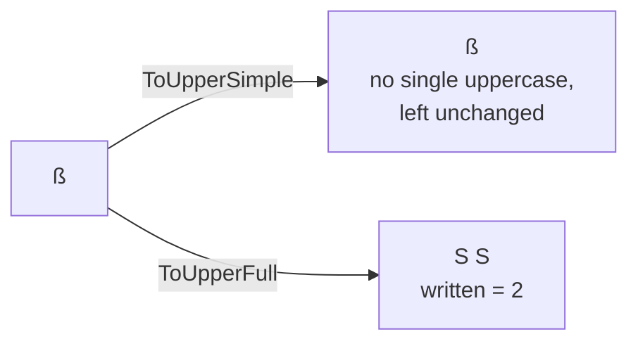

# Unicode case

::note
<!-- sync:needs:start -->

**You'll need**: [Unicode](/docs/learn/unicode), [Writable slice](/docs/learn/writable-slice)
<!-- sync:needs:end -->

::

Changing case looks like a job for one character at a time: `a` becomes `A`, `é` becomes `É`. For most letters that is true. A few break the pattern. The German `ß` has no single uppercase letter — it becomes `SS`. The ligature `fi` becomes `FI`. A function that returns one character has nowhere to put the second letter, so the Unicode package offers two kinds of mapping: a **simple** one, one scalar in and one out, and a **full** one that may write several.

## The simple mapping

`ToUpperSimple` takes a `char32` and returns a `char32`. It is easy to use — print each result as it comes:

```rux
func UpperSimple(text: char32[..]) {
    for c in text {
        Print("{}", ToUpperSimple(c));
    }
    PrintLine("");
}
```

For a character whose uppercase form is more than one letter, there is no right single answer, so the simple mapping leaves it unchanged: `Straße` becomes `STRAßE`.

## The full mapping writes into a buffer

`ToUpperFull` writes its answer — up to three scalars — into a buffer you provide, and reports how many it wrote:

```rux
ToUpperFull(scalar: char32, into: var char32[..], written: *var uint) -> bool
```

```rux
var mapped: char32[3];
var written: uint = 0;
var total: uint = 0;
for c in text {
    if ToUpperFull(c, mapped[..], @written) {
        for i in 0..written {
            Print("{}", mapped[i]);
        }
        total += written;
    }
}
```

Three parts of that call deserve a closer look:

- **`mapped[..]`** is a [writable slice](/docs/learn/writable-slice) of the buffer, for `ToUpperFull` to fill. Three scalars is the most any character maps to.
- **`@written`** hands over _where_ `written` lives, so the function can store the count there. That is a pointer — the subject of [Pointer](/docs/learn/pointer) and [Out parameter](/docs/learn/out-parameter) in the Memory part. For now, read it as "put the count in `written`".
- **The `bool` result** is `false` only if the buffer is too small for the answer.

## Where simple and full disagree

| Text           | Simple         | Full           | Scalars    |
| -------------- | -------------- | -------------- | ---------- |
| `crème brûlée` | `CRÈME BRÛLÉE` | `CRÈME BRÛLÉE` | 12 from 12 |
| `Straße`       | `STRAßE`       | `STRASSE`      | 7 from 6   |
| `fix`           | `fiX`           | `FIX`          | 3 from 2   |



Ordinary letters, accented or not, map one to one either way. Only the special cases separate the two — and when they do, the uppercase text is **longer** than the text it came from.

So uppercasing text is a text-to-text operation, not a loop that swaps each character in place. Code that converts a fixed-size buffer in place, character by character, is quietly wrong for German, and for a handful of other languages too.

Lowercase has its own pair, `ToLowerSimple` and `ToLowerFull`. It has special cases of its own: the Turkish capital `İ`, a dotted I, lowercases in full to `i` followed by a combining dot — two scalars.

## The program

The whole lesson is one package in the [Examples repository](https://github.com/rux-lang/Examples/tree/main/Text/UnicodeCase). Its comments explain every step.

<!-- sync:program:start -->

```rux [Src/Main.rux]
// Changing case looks like a job for one character at a time: `a` becomes `A`, `é` becomes `É`.
// For most letters that is true, and the Unicode package's "simple" mappings do exactly that,
// one scalar in and one scalar out.
//
// A few characters break the pattern. The German `ß` has no single uppercase letter; it becomes
// "SS". The ligature `fi` becomes "FI". A function that returns one `char32` has nowhere to put
// the second letter, so the simple mapping leaves such a character unchanged. The "full" mapping
// writes up to three scalars into a buffer instead, and so uppercase text can be longer than the
// text it came from.
import Io::{ Print, PrintLine };
import Unicode::{ ToUpperFull, ToUpperSimple };

func UpperSimple(text: char32[..]) {
    for c in text {
        Print("{}", ToUpperSimple(c));
    }
    PrintLine("");
}

func UpperFull(text: char32[..]) {
    // Three scalars is the most any character maps to. `mapped[..]` is a writable view of the
    // buffer for `ToUpperFull` to fill, and it stores how many scalars it wrote in `written`.
    // The `@` hands over where `written` lives so the function can write there; that is a
    // pointer, the subject of the Memory part. The call returns false only if the buffer is
    // too small.
    var mapped: char32[3];
    var written: uint = 0;
    var total: uint = 0;
    for c in text {
        if ToUpperFull(c, mapped[..], @written) {
            for i in 0..written {
                Print("{}", mapped[i]);
            }
            total += written;
        }
    }
    PrintLine("   ({} scalars from {})", total, text.length);
}

func Main() -> int {
    // Ordinary letters, accented or not, map one to one either way.
    UpperSimple(c32"crème brûlée");
    UpperFull(c32"crème brûlée");
    PrintLine("");

    // Here the two disagree. The simple mapping keeps `ß` and `fi` as they were; the full
    // mapping spells them out, and the text grows.
    UpperSimple(c32"Straße");
    UpperFull(c32"Straße");
    UpperSimple(c32"fix");
    UpperFull(c32"fix");

    // So uppercasing text is a text-to-text operation, not a loop that swaps each character
    // in place. Lowercase has its own pair, `ToLowerSimple` and `ToLowerFull`.
    return 0;
}
```

Besides `Io`, its `Rux.toml` lists `Unicode` under `[Dependencies]`.
<!-- sync:program:end -->

## Run it

```sh
cd Examples/Text/UnicodeCase
rux run
```

<!-- sync:output:start -->

```
CRÈME BRÛLÉE
CRÈME BRÛLÉE   (12 scalars from 12)

STRAßE
STRASSE   (7 scalars from 6)
fiX
FIX   (3 scalars from 2)
```

<!-- sync:output:end -->

## Common mistakes

::warning
**A buffer too small for the answer.**\
`ToUpperFull('ß', small[..], @written)` with `var small: char32[1];` returns `false` and writes nothing usable — `SS` needs two scalars. Use a buffer of three, which fits every character.
::

::warning
**Expecting case changes to undo each other.**\
Uppercasing `Straße` gives `STRASSE`, and lowercasing that gives `strasse`, not `straße`. The full mappings lose information, so a round trip does not bring back the original.
::

::warning
**Ignoring the result.**\
If `ToUpperFull` returns `false`, `written` says nothing about this character. The program checks the result with `if` before reading the buffer; do the same.
::

## Try it yourself

1. Write `LowerFull` in the same shape as `UpperFull`, and lowercase `c32"İSTANBUL"`. How many scalars come out of eight?
2. Lowercase `c32"STRASSE"` with it. Do you get `straße` back?
3. Uppercase `c32"floor"` both ways. (`fl` is another ligature.)
4. Change `UpperFull` to count how many characters had no single-scalar answer, that is, how many times `written` was greater than 1.

## Learn more

- [Unicode](/docs/learn/unicode) — scalars and graphemes
- [Writable slice](/docs/learn/writable-slice) — the `mapped[..]` the function fills
- [Out parameter](/docs/learn/out-parameter) — what `@written` is, properly explained
- [String builder](/docs/learn/string-builder) — `AppendScalar` collects the mapped scalars into text
