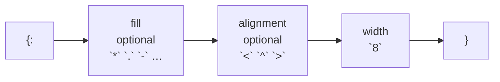

# Format

::note
<!-- sync:needs:start -->

**You'll need**: [Console](/docs/learn/console), [Unicode](/docs/learn/unicode)
<!-- sync:needs:end -->

::

Every lesson so far has used `{}` to drop a value into a line. A placeholder can also say how much room the value gets and where in that room it sits — which is how output lines up in columns. The instructions go after a colon inside the braces, and are called the placeholder's **spec**. The spec belongs to the placeholder, not to the value, so the same value can be laid out differently in different places without being changed.

## The spec

| Placeholder | Means                            | `"Rux"` becomes |
| ----------- | -------------------------------- | --------------- |
| `{}`        | the value as it is               | `Rux`           |
| `{:8}`      | at least 8 characters wide       | `Rux     `      |
| `{:<8}`     | … with the value on the left     | `Rux     `      |
| `{:^8}`     | … in the middle                  | `  Rux   `      |
| `{:>8}`     | … on the right                   | `     Rux`      |
| `{:*^8}`    | … in the middle, padded with `*` | `**Rux***`      |

The parts always come in the same order: an optional fill character, an optional alignment (`<`, `^` or `>`), then the width.



## Width is a minimum

A shorter value is padded up to the width. Numbers go to the right by default and text to the left, which is what a column of each usually wants:

```rux
PrintLine("number   [{:8}]", count);
PrintLine("text     [{:8}]", word);
```

Width never cuts. A value wider than its field is printed whole and pushes past it, so `{:2}` with `123456` prints all six digits:

```rux
PrintLine("narrow   [{:2}]", 123456);
```

## Alignment and fill

An alignment overrides the default, for numbers and text alike:

```rux
PrintLine("left     [{:<8}] [{:<8}]", count, word);
PrintLine("centre   [{:^8}] [{:^8}]", count, word);
PrintLine("right    [{:>8}] [{:>8}]", count, word);
```

When the padding does not split evenly, centring puts the extra space on the right: `Rux` in eight is two spaces, `Rux`, three spaces.

A fill character goes before the alignment and replaces the spaces:

```rux
PrintLine("dots     [{:.<8}] [{:.>8}]", word, count);
PrintLine("stars    [{:*^8}]", word);
```

## Width counts characters, not bytes

`née` is four bytes but three characters, and the width counts characters — Unicode scalars — so accented text lines up with plain text:

```rux
PrintLine("accent   [{:8}] [{:8}]", "née", "nee");
```

That is what makes a table work, whatever is in it. Each row uses the same three placeholders, and the columns line up even though `crêpes` has a two-byte `ê`:

```rux
PrintLine("{:<10}{:>6}{:>8}", "item", "count", "price");
PrintLine("{:<10}{:>6}{:>8}", "widgets", 12, 450);
PrintLine("{:<10}{:>6}{:>8}", "sprockets", 5, 1975);
PrintLine("{:<10}{:>6}{:>8}", "crêpes", 1440, 25);
```

The name column is left-aligned in 10, and the two number columns are right-aligned in 6 and 8 — the usual choice for figures, so their units line up.

## The program

The whole lesson is one package in the [Examples repository](https://github.com/rux-lang/Examples/tree/main/Text/Format). Its comments explain every step.

<!-- sync:program:start -->

```rux [Src/Main.rux]
// Every lesson has used `{}` to drop a value into a line. A placeholder can also say how much
// room the value gets and where in that room it sits, which is how output lines up in columns.
// The part after a colon is the placeholder's spec:
//
//     {:8}      at least 8 characters wide
//     {:<8}     ... with the value on the left
//     {:^8}     ... in the middle
//     {:>8}     ... on the right
//     {:*^8}    ... in the middle, padded with `*` instead of spaces
//
// The spec belongs to the placeholder, not to the value, so the same value can be laid out
// differently in different places without being changed.
import Io::PrintLine;

func Main() -> int {
    let count = 42;
    let word = "Rux";

    // Width is a minimum. Shorter values are padded; numbers go to the right by default and
    // text to the left, which is what a column of each usually wants.
    PrintLine("number   [{:8}]", count);
    PrintLine("text     [{:8}]", word);

    // Width never cuts. A value wider than its field is printed whole and pushes past it.
    PrintLine("narrow   [{:2}]", 123456);

    // Alignment overrides the default, for numbers and text alike.
    PrintLine("left     [{:<8}] [{:<8}]", count, word);
    PrintLine("centre   [{:^8}] [{:^8}]", count, word);
    PrintLine("right    [{:>8}] [{:>8}]", count, word);

    // A fill character before the alignment replaces the spaces.
    PrintLine("dots     [{:.<8}] [{:.>8}]", word, count);
    PrintLine("stars    [{:*^8}]", word);

    // Width counts characters, not bytes, so accented text lines up with plain text.
    PrintLine("accent   [{:8}] [{:8}]", "née", "nee");

    // What all of this is for: a table whose columns line up whatever is in them.
    PrintLine("");
    PrintLine("{:<10}{:>6}{:>8}", "item", "count", "price");
    PrintLine("{:<10}{:>6}{:>8}", "widgets", 12, 450);
    PrintLine("{:<10}{:>6}{:>8}", "sprockets", 5, 1975);
    PrintLine("{:<10}{:>6}{:>8}", "crêpes", 1440, 25);
    return 0;
}
```

<!-- sync:program:end -->

## Run it

```sh
cd Examples/Text/Format
rux run
```

<!-- sync:output:start -->

```
number   [      42]
text     [Rux     ]
narrow   [123456]
left     [42      ] [Rux     ]
centre   [   42   ] [  Rux   ]
right    [      42] [     Rux]
dots     [Rux.....] [......42]
stars    [**Rux***]
accent   [née     ] [nee     ]

item       count   price
widgets       12     450
sprockets      5    1975
crêpes      1440      25
```

<!-- sync:output:end -->

## Common mistakes

::warning
**More placeholders than values, or fewer.**\
The compiler counts the placeholders of a pattern written in the call. `PrintLine("{} and {}", 1)` fails with `error: format string has 2 placeholders, but 1 argument was provided`, and `PrintLine("{}", 1, 2)` with `format string has 1 placeholder, but 2 arguments were provided`.
::

::warning
**A spec the value does not understand.**\
The compiler counts placeholders but does not check what each spec asks for. An integer has no `z` style, so `PrintLine("[{:z}]", 1)` prints only `[`, with no line end, and the rest of the line is lost — `PrintLine` stops at the placeholder it cannot honour and returns an `IoError`, which an ignored result never shows. [Render](/docs/learn/render) reports such a pattern properly.
::

::warning
**Expecting width to count what you see.**\
Width counts scalars, not [graphemes](/docs/learn/unicode). A `café` spelled with a combining accent is five scalars, so `{:8}` pads it with three spaces and it looks one column short. Wide characters such as emoji take two columns on most terminals but count as one.
::

## Try it yourself

1. Add a fourth column, `total`, that is `count * price`, right-aligned in 10.
2. Print a title centred in 24 characters between rows of `=`, using a fill character for both.
3. Make the item column dotted — `widgets...` — so the eye can follow each row.
4. Put a name longer than 10 characters in the table. What happens to the columns?

## Learn more

- [Console](/docs/learn/console) — `{}` placeholders from Part 1
- [Format number](/docs/learn/format-number) — precision, bases, zeros and signs
- [Display](/docs/learn/display) — how your own type receives the spec
- [Render](/docs/learn/render) — the same patterns, formatted into a `String`
