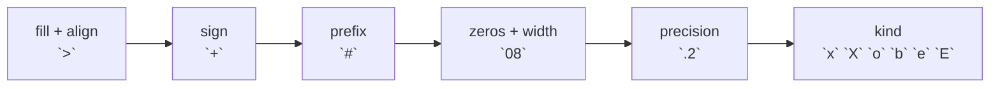

# Format number

::note
<!-- sync:needs:start -->

**You'll need**: [Format](/docs/learn/format), [Float](/docs/learn/float), [Literal](/docs/learn/literal)
<!-- sync:needs:end -->

::

[Format](/docs/learn/format) gave a value room and a place in it. Numbers have a few more choices of their own: how many digits after the point, which base, whether to pad with zeros and whether to show a `+`. They are written in the same spec after the colon, and none of them changes the number — they only decide how it is spelled.

## The number spec

| Spec    | Means                                            | Example         | Prints           |
| ------- | ------------------------------------------------ | --------------- | ---------------- |
| `{:.2}` | two digits after the decimal point               | `3.14159…`      | `3.14`           |
| `{:e}`  | scientific notation; `E` for a capital mark      | `6.02214076e23` | `6.02214076e+23` |
| `{:x}`  | hexadecimal; `X` capitals, `o` octal, `b` binary | `255`           | `ff`             |
| `{:#x}` | … with the prefix that names the base            | `255`           | `0xff`           |
| `{:06}` | padded to 6 with zeros instead of spaces         | `42`            | `000042`         |
| `{:+}`  | a sign even when the number is positive          | `7`             | `+7`             |

They combine with the width and alignment from the Format lesson, in a fixed order: fill and alignment, then `+`, then `#`, then `0` and the width, then the precision, then the letter for the base or notation. So `{:>10.2}` is "right-aligned in 10, two digits after the point".



## Digits after the point

With no precision, a float prints with as few digits as it takes to read back as the same value — which is why `0.1` prints as `0.1` and not as the long binary approximation. A precision fixes the number of digits instead, rounding the rest:

```rux
PrintLine("pi          {}", pi);
PrintLine("pi .2       {:.2}", pi);
PrintLine("pi .0       {:.0}", pi);
PrintLine("0.1         {}", 0.1);
```

Rounding can carry all the way up: 9.99 to one digit is `10.0`, not `9.10`. And exact halves round to the **even** digit, so `0.125` becomes `0.12` while `0.375` becomes `0.38`:

```rux
PrintLine("9.99 .1     {:.1}", 9.99);
PrintLine("halves .2   {:.2} {:.2}", 0.125, 0.375);
```

Rounding halves to even, rather than always up, keeps a long column of rounded figures from drifting upwards as a whole.

A precision combines with a width, which is how money lines up:

```rux
PrintLine("money       [{:>10.2}]", 1234.5);
```

## Scientific notation

Scientific notation puts one digit before the point and moves the rest into the exponent. It is the readable way to print very large or very small values, and it takes a precision too:

```rux
PrintLine("scientific  {:e} {:E} {:.2e}", 6.02214076e23, 0.00025, 1234.5678);
```

`6.02214076e+23` means 6.02214076 × 10²³, and `2.5E-04` means 2.5 × 10⁻⁴.

## Bases, prefixes, zeros and signs

The same 255 in four spellings, then with the prefixes that name each base — the same prefixes a [literal](/docs/learn/literal) uses:

```rux
PrintLine("bases       {} {:x} {:X} {:o} {:b}", value, value, value, value, value);
PrintLine("prefixed    {:#x} {:#o} {:#b}", value, value, value);
```

Zeros pad **between** the sign or prefix and the digits, where spaces would look wrong — so `-42` padded to six is `-00042`, not `000-42`:

```rux
PrintLine("zeros       {:06} {:06} {:#06x}", 42, -42, value);
```

And `+` keeps a column of mixed signs aligned, because every number then starts with a sign:

```rux
PrintLine("signs       {:+} {:+} {:+.1}", 7, -7, 0.25);
```

Note `0.25` to one digit with `+`: `+0.2`, the even neighbour again.

## The program

The whole lesson is one package in the [Examples repository](https://github.com/rux-lang/Examples/tree/main/Text/FormatNumber). Its comments explain every step.

<!-- sync:program:start -->

```rux [Src/Main.rux]
// The Format lesson gave a value room and a place in it. Numbers have a few more choices of
// their own, written in the same spec after the colon:
//
//     {:.2}     two digits after the decimal point
//     {:x}      hexadecimal; `X` for capitals, `o` octal, `b` binary
//     {:#x}     ... with the prefix that names the base: 0x, 0o, 0b
//     {:08}     padded to 8 with zeros instead of spaces
//     {:+}      a sign even when the number is positive
//     {:e}      scientific notation, 1.5e+03; `E` for a capital mark
//
// None of this changes the number. It only decides how the number is spelled.
import Io::PrintLine;

func Main() -> int {
    let pi = 3.14159265358979;

    // A float prints with as few digits as it takes to read back as the same value. A
    // precision fixes the number of digits after the point instead, rounding the rest.
    PrintLine("pi          {}", pi);
    PrintLine("pi .2       {:.2}", pi);
    PrintLine("pi .0       {:.0}", pi);
    PrintLine("0.1         {}", 0.1);

    // Rounding can carry all the way up: 9.99 to one digit is 10.0, not 9.10.
    PrintLine("9.99 .1     {:.1}", 9.99);

    // Exact halves round to the even digit, so 0.125 becomes 0.12 and 0.375 becomes 0.38.
    PrintLine("halves .2   {:.2} {:.2}", 0.125, 0.375);

    // Precision combines with the width and alignment from the Format lesson.
    PrintLine("money       [{:>10.2}]", 1234.5);

    // Scientific notation puts one digit before the point and moves the rest into the exponent.
    // It is the readable way to print very large or very small values, and takes a precision too.
    PrintLine("scientific  {:e} {:E} {:.2e}", 6.02214076e23, 0.00025, 1234.5678);

    // Bases. The same 255 in four spellings, then with their prefixes.
    let value = 255;
    PrintLine("bases       {} {:x} {:X} {:o} {:b}", value, value, value, value, value);
    PrintLine("prefixed    {:#x} {:#o} {:#b}", value, value, value);

    // Zeros pad between the sign or prefix and the digits, where spaces would look wrong.
    PrintLine("zeros       {:06} {:06} {:#06x}", 42, -42, value);

    // `+` keeps a column of mixed signs aligned.
    PrintLine("signs       {:+} {:+} {:+.1}", 7, -7, 0.25);
    return 0;
}
```

<!-- sync:program:end -->

## Run it

```sh
cd Examples/Text/FormatNumber
rux run
```

<!-- sync:output:start -->

```
pi          3.14159265358979
pi .2       3.14
pi .0       3
0.1         0.1
9.99 .1     10.0
halves .2   0.12 0.38
money       [   1234.50]
scientific  6.02214076e+23 2.5E-04 1.23e+03
bases       255 ff FF 377 11111111
prefixed    0xff 0o377 0b11111111
zeros       000042 -00042 0x00ff
signs       +7 -7 +0.2
```

<!-- sync:output:end -->

## Common mistakes

::warning
**Expecting a decimal half to round up.**\
`{:.2}` of `2.675` prints `2.67`, and `{:.1}` of `0.35` prints `0.3`. A float cannot hold most decimal fractions exactly: the stored value is a hair below the half, so it rounds down. If amounts must round exactly, keep them as whole cents in an integer, as `Money` did in [Display](/docs/learn/display).
::

::warning
**Expecting hexadecimal to show a negative number's bits.**\
`{:x}` of `-1` prints `-1`: a sign and the magnitude, not two's complement. To see the bits, convert first — `{:x}` of `-1 as uint8` prints `ff`.
::

::warning
**A spec the value cannot honour.**\
`PrintLine("[{:x}]", 2.5)` compiles, but a float has no hexadecimal spelling: it prints only `[`, with no line end, and `PrintLine` returns an `IoError`. [Render](/docs/learn/render) reports the same request as `FormatError::UnsupportedRequest`.
::

## Try it yourself

1. Print `pi` with 0, 2, 4 and 8 digits after the point, in a right-aligned column of width 12.
2. Print the numbers 0 to 15 as two-digit hexadecimal: `00`, `01`, … `0f`.
3. Print `42` as an 8-bit binary number with its prefix: `0b00101010`.
4. Print the speed of light, `2.998e8`, and the charge of an electron, `1.6e-19`, in scientific notation with two digits after the point.

## Learn more

- [Format](/docs/learn/format) — width, alignment and fill
- [Literal](/docs/learn/literal) — the same bases, written in source
- [Float](/docs/learn/float) — why `0.1 + 0.2` is not `0.3`, and why `2.675` rounds down
- [Parse](/docs/learn/parse) — reading these spellings back into numbers
