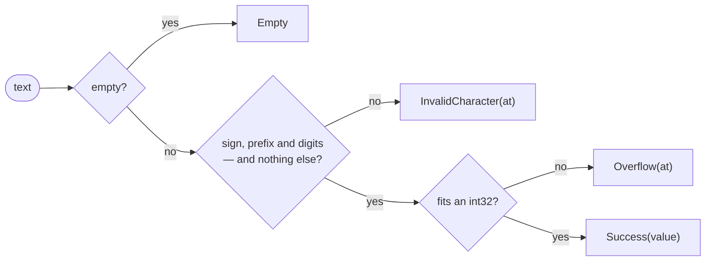

# Parse

::note
<!-- sync:needs:start -->

**You'll need**: [Format number](/docs/learn/format-number), [Outcome](/docs/learn/outcome), [Variant match](/docs/learn/variant-match), [Catch fallback](/docs/learn/catch-fallback)
<!-- sync:needs:end -->

::

Parsing is formatting in reverse: text in, value out. Unlike formatting, it fails all the time, because the text usually comes from a person or a file and may not spell a number at all — `"seven"`, `"12abc"`, or nothing. So every parser in the Format package returns a [fallible](/docs/learn/fallible), and the failure says what was wrong and where:

```rux
ParseInt32(text) -> int32 ! ParseError
```

## What can go wrong

`ParseError` is a variant, and every case but the first carries the byte position where the trouble was found:

| Case                   | Means                                                           |
| ---------------------- | --------------------------------------------------------------- |
| `Empty`                | there was no text at all                                        |
| `InvalidCharacter(at)` | the byte at `at` is not part of a number                        |
| `Overflow(at)`         | a well-formed number too large for the type, usually at its end |
| `OutOfMemory(at)`      | only the very widest number types can hit this one              |

`Describe` names each case. A `match` on a variant must be [exhaustive](/docs/learn/exhaustive), so even the case an `int32` can never hit gets an arm:

```rux
func Describe(error: ParseError) {
    match error {
        .Empty => PrintLine("empty text"),
        .InvalidCharacter(at) => PrintLine("not a digit at byte {}", at),
        .Overflow(at) => PrintLine("too large for an int32, at byte {}", at),
        .OutOfMemory(_) => PrintLine("out of memory")
    }
}
```

`Read` then opens the outcome with `.Success` and `.Failure`, as in [Outcome](/docs/learn/outcome):

```rux
func Read(text: char8[..]) {
    match ParseInt32(text) {
        .Success(value) => PrintLine("[{}]  {}", text, value),
        .Failure(error) => {
            Print("[{}]  refused, ", text);
            Describe(error);
        }
    }
}
```

## What counts as a number

A sign is understood, and so is a base prefix of the kind `{:#x}` writes, so `"0x1F"` reads as 31. Everything else must be digits. The parser does not skip spaces or stop at the first non-digit: the **whole** text must be a number, or the answer is a failure saying which byte is wrong.

| Text            | Result                | Why                                       |
| --------------- | --------------------- | ----------------------------------------- |
| `"42"`          | `42`                  |                                           |
| `"-17"`         | `-17`                 | a sign                                    |
| `"0x1F"`        | `31`                  | a base prefix, as `{:#x}` writes          |
| `""`            | `Empty`               | nothing to read                           |
| `" 42"`         | `InvalidCharacter(0)` | a space is not a digit, even at the start |
| `"12abc"`       | `InvalidCharacter(2)` | `a` is the first byte that is not a digit |
| `"2147483647"`  | `2147483647`          | the largest `int32`                       |
| `"2147483648"`  | `Overflow(10)`        | one more does not fit                     |
| `"-2147483648"` | `-2147483648`         | the negative side holds one more          |



An `int32` holds −2147483648 to 2147483647. The negative side holds one more than the positive, so `-2147483648` parses even though `2147483648` does not.

## A fallback in one expression

Often a failure just means "use a default". With `catch`, as in [Catch fallback](/docs/learn/catch-fallback), that takes one expression:

```rux
let fallback = ParseInt32("seven") catch { else => 0 };
```

## The program

The whole lesson is one package in the [Examples repository](https://github.com/rux-lang/Examples/tree/main/Text/Parse). Its comments explain every step.

<!-- sync:program:start -->

```rux [Src/Main.rux]
// Parsing is formatting in reverse: text in, value out. Unlike formatting, it fails all the time,
// because the text usually comes from a person or a file and may not spell a number at all.
// So every parser in the Format package returns a fallible:
//
//     ParseInt32(text) -> int32 ! ParseError
//
// `ParseError` is a variant, and every case says where in the text the trouble was found:
//
//     Empty                  there was no text at all
//     InvalidCharacter(at)   the byte at `at` is not part of a number
//     Overflow(at)           a well-formed number too large for an `int32`, usually at its end
//     OutOfMemory(at)        only the very widest number types can hit this one
import Format::{ ParseError, ParseInt32 };
import Io::{ Print, PrintLine };

func Describe(error: ParseError) {
    match error {
        .Empty => PrintLine("empty text"),
        .InvalidCharacter(at) => PrintLine("not a digit at byte {}", at),
        .Overflow(at) => PrintLine("too large for an int32, at byte {}", at),
        .OutOfMemory(_) => PrintLine("out of memory")
    }
}

func Read(text: char8[..]) {
    match ParseInt32(text) {
        .Success(value) => PrintLine("[{}]  {}", text, value),
        .Failure(error) => {
            Print("[{}]  refused, ", text);
            Describe(error);
        }
    }
}

func Main() -> int {
    // A sign, and a base prefix of the kind `{:#x}` writes, are both understood.
    Read("42");
    Read("-17");
    Read("0x1F");

    // Malformed text. The parser does not skip spaces or stop at the first non-digit: the
    // whole text must be a number, or the answer is a failure saying which byte is wrong.
    Read("");
    Read(" 42");
    Read("12abc");

    // Well-formed but too large. An `int32` holds -2147483648 to 2147483647, and the
    // negative side holds one more than the positive.
    Read("2147483647");
    Read("2147483648");
    Read("-2147483648");

    // With `catch`, a failure can become a fallback value in one expression.
    let fallback = ParseInt32("seven") catch { else => 0 };
    PrintLine("[seven] with a fallback  {}", fallback);
    return 0;
}
```

Besides `Io`, its `Rux.toml` lists `Format` under `[Dependencies]`.
<!-- sync:program:end -->

## Run it

```sh
cd Examples/Text/Parse
rux run
```

<!-- sync:output:start -->

```
[42]  42
[-17]  -17
[0x1F]  31
[]  refused, empty text
[ 42]  refused, not a digit at byte 0
[12abc]  refused, not a digit at byte 2
[2147483647]  2147483647
[2147483648]  refused, too large for an int32, at byte 10
[-2147483648]  -2147483648
[seven] with a fallback  0
```

<!-- sync:output:end -->

## Common mistakes

::warning
**Using the result as a number.**\
`ParseInt32("41") + 1` fails with `error: operator '+' cannot combine left operand 'int32 ! ParseError' with right operand 'int'`. Open the outcome first — with `match`, `catch`, or `?` in a fallible function.
::

::warning
**Expecting spaces to be ignored.**\
`" 42"` fails at byte 0 and `"42 "` at byte 2. Text read from a person or a file often has spaces or a line end around it: trim it first with a [string view](/docs/learn/string-view) — `ParseInt32` accepts a `StringView` as well as a `char8[..]`.
::

::warning
**Writing digit separators.**\
`1_000` is a fine [literal](/docs/learn/literal) in source, but `ParseInt32("1_000")` fails with `InvalidCharacter(1)`. The parser reads numbers as people type them, not as Rux source spells them.
::

## Try it yourself

1. Parse `"0b101"` and `"0o17"`. Which other prefixes does the parser understand?
2. Parse `"300"` and `"-1"` with `ParseUint8`. What does each report?
3. Trim `"  42\n"` with `StringView::FromValidated(…).Trim()` and parse the view. You will need `Text` in `[Dependencies]` and `import Text::StringView;`.
4. Parse `"3.75"` with `ParseFloat64`, then try `"3,75"`.

## Learn more

- [Format](/docs/api/format) in the API reference
- [Format number](/docs/learn/format-number) — the spellings `ParseInt32` reads back
- [Outcome](/docs/learn/outcome) and [Catch fallback](/docs/learn/catch-fallback) — opening the result
- [Input](/docs/learn/input) — text typed by a person, the usual thing to parse
