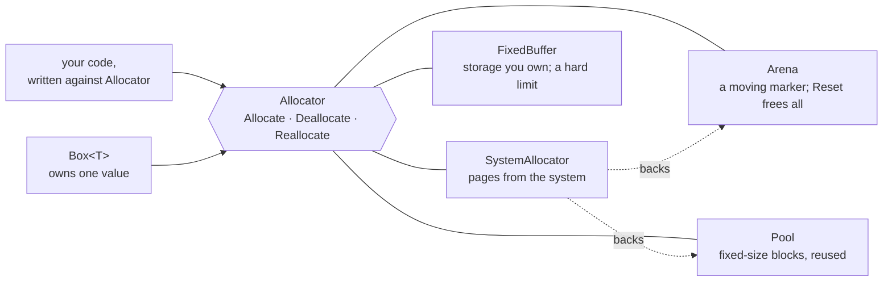

# Part 15: Memory

Until now every value had a size the compiler knew and a home it chose. This part opens the box underneath: pointers that hold addresses, memory you ask for while the program runs, and the layout of the bytes themselves. It starts with the rawest tools, where every rule is yours to keep, and ends with allocators that keep most of those rules for you — so by the end you know both what they do and why they exist.

## What you will learn

- Taking an address with `@`, reaching through it with `*`, and the difference between `*T` and `*var T`.
- Returning extra answers through an out-parameter, and why a fallible is usually better.
- Asking for memory with `Alloc`, clearing it with `Zero` and returning it with `Free`.
- Pointer arithmetic, and turning a pointer and a count into an ordinary slice with `p[..n]`.
- Optional pointers `(*T)?` versus pointers to optionals `*T?`, and why `null` is not `none`.
- How big a type is and how it is aligned, and the padding a struct carries.
- Unions, which lay several members over the same bytes.
- The `Allocator` interface, and four ways to stand behind it: `SystemAllocator`, `Arena`, `FixedBuffer` and `Pool` — plus `Box<T>`, which owns one allocated value.
- Wiping a secret with `Zeroize`, a clear the compiler never removes.

## The allocator family



Code that takes an `Allocator` works with any of the four. `SystemAllocator` asks the operating system and is usually the one an arena or a pool draws its large blocks from; `FixedBuffer` draws on nothing but the storage you give it.

## Lessons

<!-- sync:lessons:start -->

|       | Lesson                                               | What you will learn                                                            |
| ----- | ---------------------------------------------------- | ------------------------------------------------------------------------------ |
| 15.1  | [Pointer](/docs/learn/pointer)                       | the difference between `*T` and `*var T`, and taking an address with `@`       |
| 15.2  | [Out parameter](/docs/learn/out-parameter)           | return extra information through a pointer parameter                           |
| 15.3  | [Raw memory](/docs/learn/raw-memory)                 | allocate, use and free memory by hand (`Alloc`, `Zero`, `Free`)                |
| 15.4  | [Pointer arithmetic](/docs/learn/pointer-arithmetic) | step a pointer through memory one element at a time                            |
| 15.5  | [Pointer slice](/docs/learn/pointer-slice)           | turn a pointer and a length into a slice                                       |
| 15.6  | [Optional pointer](/docs/learn/optional-pointer)     | `*T?` and `(*T)?`: a pointer to an optional, or an optional pointer            |
| 15.7  | [Layout](/docs/learn/layout)                         | how big a type is and how it is aligned: `sizeof` and `alignof`                |
| 15.8  | [Union](/docs/learn/union)                           | overlay one piece of storage with several types, and why that needs care       |
| 15.9  | [Allocator](/docs/learn/allocator)                   | allocate through the `Allocator` interface instead of straight from the system |
| 15.10 | [Box](/docs/learn/box)                               | own one value allocated on the heap                                            |
| 15.11 | [Arena](/docs/learn/arena)                           | allocate many values and free them all at once                                 |
| 15.12 | [Fixed buffer](/docs/learn/fixed-buffer)             | allocate from a buffer you provide                                             |
| 15.13 | [Pool](/docs/learn/pool)                             | reuse fixed-size blocks instead of allocating new ones                         |
| 15.14 | [Zeroize](/docs/learn/zeroize)                       | clear sensitive memory explicitly                                              |

<!-- sync:lessons:end -->

## Before you start

This part leans on much of what came before. Pointers build on [Reference](/docs/learn/reference) from Part 6; allocators report failure with the fallibles of [Part 9: Errors](/docs/learn/errors); cleaning up relies on [Destructor](/docs/learn/destructor), [Move](/docs/learn/move) and [Defer](/docs/learn/defer) from [Part 11: Ownership](/docs/learn/ownership); and `Allocator` is used as in [Interface value](/docs/learn/interface-value) from [Part 12: Interfaces](/docs/learn/interfaces). Each lesson's package is in the Examples repository's `Memory/` folder:

```sh
cd Examples/Memory/Pointer
rux run
```

## After this part

[Part 16: Numbers](/docs/learn/numbers) looks at numbers in depth — wide integers, limits, bit operations, checked and wrapping arithmetic. After Part 16 you are ready for the checkpoint projects [Circle](/docs/learn/circle) and [Quadratic](/docs/learn/quadratic). Then [Part 17: Collections](/docs/learn/collections) puts this part to work: its containers take an `Allocator` and grow by asking it for memory.

For the full rules, see [Pointers](/docs/lang/pointers/overview), [Pointer arithmetic](/docs/lang/pointers/arithmetic), [Slices and pointers](/docs/lang/slices/overview#members) and [Unions](/docs/lang/unions/overview) in the Rux Reference, and the [Memory](/docs/api/memory) package in the API reference.
