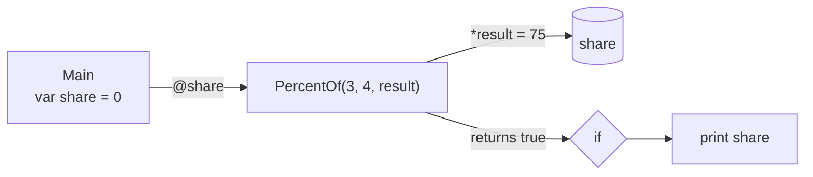

# Out parameter

::note
<!-- sync:needs:start -->

**You'll need**: [Pointer](/docs/learn/pointer), [Fallible](/docs/learn/fallible), [Catch fallback](/docs/learn/catch-fallback)
<!-- sync:needs:end -->

::

A function returns one value. Sometimes you want two things back: the answer, and whether the answer is any good. One long-standing way to get both is the **out-parameter** — the caller hands over a pointer to its own variable, the function writes the answer through it, and the return value is left free to say something else.

You will meet out-parameters in older code, in the standard library and in C libraries, so it pays to read them fluently. This lesson also shows their weak spots, and why a fallible `T ! E` is usually the better choice for code you write yourself.

## The shape of an out-parameter

The answer travels through `result`, a `*var int`. The `bool` that comes back says whether to trust it:

```rux
func PercentOf(part: int, whole: int, result: *var int) -> bool {
    if whole == 0 {
        return false;
    }
    *result = part * 100 / whole;
    return true;
}
```

The caller prepares a variable first and passes its address with `@`:

```rux
var share: int = 0;
if PercentOf(3, 4, @share) {
    PrintLine("3 of 4 is {}%", share);
}
```



The variable must be a `var`, because the function writes into it through a `*var int`.

## The flag nobody has to read

Here is the weak spot. Nothing forces the caller to look at the `bool`:

```rux
PercentOf(1, 0, @share);
PrintLine("1 of 0, flag ignored: {}%", share);
```

The whole is zero, so `PercentOf` returns `false` and writes nothing. The flag is dropped, and `share` still holds 75 from the call before. The program prints a confident `75%` for a question that has no answer, and the compiler has no reason to object.

## Reading someone else's flag

The standard library uses out-parameters too. `ConvertChecked` writes the converted value through its second argument and returns a `bool`:

```rux
var narrowed: int8 = 0;
let lost = ConvertChecked<int, int8>(300, @narrowed);
```

| Function         | `true` means                                 |
| ---------------- | -------------------------------------------- |
| `PercentOf`      | the answer is good                           |
| `ConvertChecked` | something was lost — the answer is not exact |

The two read in opposite directions. With a bare `bool`, only the documentation tells you which way round it is. Here 300 does not fit in an `int8`, so `lost` is `true` and `narrowed` holds the wrapped value 44.

## The fallible alternative

The same question as a fallible puts the answer and the failure on separate channels:

```rux
func Percent(part: int, whole: int) -> int ! ZeroWhole {
    if whole == 0 {
        fail ZeroWhole {};
    }
    return part * 100 / whole;
}
```

```rux
let good = Percent(3, 4) catch { else => -1 };
let bad = Percent(1, 0) catch { else => -1 };
```

|                                   | Out-parameter                         | Fallible `T ! E`                     |
| --------------------------------- | ------------------------------------- | ------------------------------------ |
| Where the answer goes             | a variable the caller prepared first  | the return value                     |
| How a failure is reported         | a `bool`, read whichever way it reads | a typed error on the failure channel |
| A caller that ignores the failure | compiles, and keeps a stale value     | is rejected by the compiler          |
| An answer on failure              | whatever the variable held before     | none — there is nothing to misuse    |

For new code, prefer the fallible. Reach for an out-parameter when an existing API asks for one.

## The program

The whole lesson is one package in the [Examples repository](https://github.com/rux-lang/Examples/tree/main/Memory/OutParameter). Its comments explain every step.

<!-- sync:program:start -->

```rux [Src/Main.rux]
// An out-parameter is a pointer the caller hands over so a function can write its answer into
// the caller's own variable. The caller passes `@share`; the function writes `*result = ...`.
// The return value is then free to say something else, usually whether the answer is good.
//
// Older code and some of the standard library work this way, so it is worth reading fluently.
// But it has two weak spots. The caller must have a variable ready before the call, and nothing
// forces anyone to look at the flag: ignore it, and the variable quietly keeps a stale value.
//
// A fallible `T ! E` closes both gaps. The answer only exists on success, and a result that is
// left unhandled is a compile error. For new code, prefer it; reach for an out-parameter when
// an existing API asks for one.
import Core::ConvertChecked;
import Io::PrintLine;

// Out-parameter style: the answer goes through `result`, and the `bool` says whether to trust it.
func PercentOf(part: int, whole: int, result: *var int) -> bool {
    if whole == 0 {
        return false;
    }
    *result = part * 100 / whole;
    return true;
}

struct ZeroWhole {}

// The same question as a fallible. The answer and the failure travel on separate channels.
func Percent(part: int, whole: int) -> int ! ZeroWhole {
    if whole == 0 {
        fail ZeroWhole {};
    }
    return part * 100 / whole;
}

func Main() -> int {
    var share: int = 0;
    if PercentOf(3, 4, @share) {
        PrintLine("3 of 4 is {}%", share);
    }

    // The mistake the compiler cannot see: the flag is dropped, nothing was written, and `share`
    // still says 75 from the call before.
    PercentOf(1, 0, @share);
    PrintLine("1 of 0, flag ignored: {}%", share);

    // The standard library uses out-parameters too. `ConvertChecked` writes the converted value
    // and returns `true` when something was lost, which is the opposite of `PercentOf` above.
    // With a bare `bool`, only the documentation tells you which way round it reads.
    var narrowed: int8 = 0;
    let lost = ConvertChecked<int, int8>(300, @narrowed);
    PrintLine("300 into int8: lost {}, wrote {}", lost, narrowed);

    // The fallible needs no variable prepared in advance, and it cannot be ignored: a bare
    // `Percent(1, 0);` is rejected. The failure has to be dealt with, here by `catch`.
    let good = Percent(3, 4) catch { else => -1 };
    let bad = Percent(1, 0) catch { else => -1 };
    PrintLine("fallible: {}% and {}%", good, bad);
    return 0;
}
```

Besides `Io`, its `Rux.toml` lists `Core` under `[Dependencies]`.
<!-- sync:program:end -->

## Run it

```sh
cd Examples/Memory/OutParameter
rux run
```

<!-- sync:output:start -->

```
3 of 4 is 75%
1 of 0, flag ignored: 75%
300 into int8: lost true, wrote 44
fallible: 75% and -1%
```

<!-- sync:output:end -->

## Common mistakes

::warning
**Passing the value instead of its address.**\
`PercentOf(3, 4, share)` hands over 0, not the variable, and fails with `error: argument 3 to 'PercentOf' has type 'int', but parameter 'result' requires '*var int'`. Write `@share`.
::

::warning
**An out-parameter declared with `let`.**\
With `let share: int = 0;`, the address `@share` is a read-only `*int`, so the call fails with `error: argument 3 to 'PercentOf' has type '*int', but parameter 'result' requires '*var int'`. The function has to write into it: declare it with `var`.
::

::warning
**Ignoring the flag.**\
`PercentOf(1, 0, @share);` compiles, and `share` silently keeps the 75 from before. Always test the `bool` — or use a function that reports failure as a fallible.
::

::warning
**Ignoring a fallible instead.**\
The fallible version refuses to be ignored: a bare `Percent(1, 0);` fails with `error: fallible result of type 'int ! ZeroWhole' is discarded`, and the help line suggests `?`, `catch` or a `match`.
::

## Try it yourself

1. Write `func Divide(a: int, b: int, quotient: *var int, remainder: *var int) -> bool` that hands back two answers at once, and call it with `@q` and `@r`.
2. Change `PercentOf` to write `0` into `*result` before it returns `false`. Does that cure the stale `75%`? What does the caller still not know?
3. Convert 100 into an `int8` with `ConvertChecked` and check that `lost` is `false`.

## Learn more

- [Fallible](/docs/learn/fallible) and [Catch fallback](/docs/learn/catch-fallback) — the alternative this lesson recommends
- [Checked convert](/docs/learn/checked-convert) — `ConvertChecked` and its relatives in full
- [Pointer types](/docs/lang/pointers/types) in the Rux Reference
