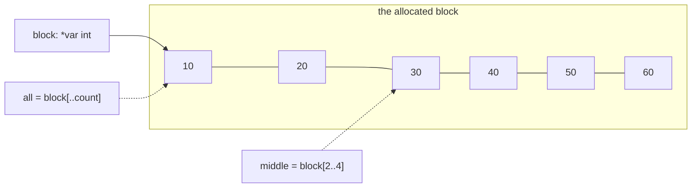

# Pointer slice

::note
<!-- sync:needs:start -->

**You'll need**: [Raw memory](/docs/learn/raw-memory), [Pointer arithmetic](/docs/learn/pointer-arithmetic), [Writable slice](/docs/learn/writable-slice)
<!-- sync:needs:end -->

::

A pointer knows where its storage starts, but not how long it is. A [slice](/docs/learn/slice) knows both. Indexing a pointer with a **range** joins the two, and that is how raw storage meets the rest of the language: a block from `Alloc` becomes an ordinary `int[..]`, so `for`, `.length` and every function that takes a slice work on it.

## `p[..n]` and `p[a..b]`

After the usual allocation, the program builds a view of the whole block:

```rux
let all = block[..count];
```

`block[..count]` is a slice of the `count` elements starting at `block`. With two bounds, `block[a..b]` is the elements from `a` up to, but not including, `b`:

| Expression       | Elements                        | Length |
| ---------------- | ------------------------------- | ------ |
| `block[..count]` | 0 to 5                          | 6      |
| `block[2..4]`    | 2 and 3                         | 2      |
| `block[4..=5]`   | 4 and 5                         | 2      |
| `block[..]`      | rejected — a pointer has no end | —      |

The last row is the important one. An array or a slice can be sliced with `[..]` because it knows its own length; a pointer does not, so the range must always say where to stop.

## The view goes wherever a slice goes

From here on the program works with the view, which carries the count with it. These two functions know nothing about pointers or `Alloc`:

```rux
func Fill(values: var int[..]) {
    for i in 0..values.length {
        values[i] = (i as int + 1) * 10;
    }
}
```

```rux
Fill(all);
Show("all:   ", all);
PrintLine("length: {}", all.length);
```

A view of a `*var int` is writable, just as a view of a `var` array is, so `all` can be passed where a `var int[..]` is wanted. A view of a read-only `*int` would be a read-only `int[..]`.

## Views share the storage

A narrower view of the same block copies nothing. Both views look at the same memory, so a write through one shows up in the other:

```rux
let middle = block[2..4];
Show("middle:", middle);
middle[0] = 0;
Show("after: ", all);
```



`middle[0]` is the third element of the block, so the `30` in `all` becomes `0`.

## Checked index, trusted length

Indexing a view is checked against its length, as for any slice. `all[6]` would stop the program with `Panic: index out of range`.

But the length itself is yours to get right. A pointer cannot say how big its block is, so `n` in `block[..n]` is taken on trust: a view longer than the block is accepted, and its extra elements are someone else's memory. The rule that follows is simple — build the view once, from the count you allocated, and pass the view around instead of the pointer.

## The program

The whole lesson is one package in the [Examples repository](https://github.com/rux-lang/Examples/tree/main/Memory/PointerSlice). Its comments explain every step.

<!-- sync:program:start -->

```rux [Src/Main.rux]
// A pointer knows where its storage starts but not how long it is. A slice knows both. Indexing
// a pointer with a range joins the two: `p[..n]` is a slice of the `n` elements starting at `p`,
// and `p[a..b]` the elements from `a` up to, not including, `b`.
//
// That is how raw storage meets the rest of the language. A block from `Alloc` becomes an
// ordinary `int[..]`, so `for`, `.length` and every function that takes a slice work on it.
// A view of a `*var int` is writable, just as a view of a `var` array is.
//
// Indexing a view is checked against its length, as for any slice: `all[6]` below would stop the
// program with `Panic: index out of range`. But the length itself is yours to get right. A pointer
// cannot say how big its block is, so `n` is taken on trust: a view longer than the block is
// accepted, and its extra elements are someone else's memory. Build the view once, from the count
// you allocated, and pass the view around instead of the pointer.
import Io::{ Print, PrintLine };
import Memory::{ Alloc, Free };

func Fill(values: var int[..]) {
    for i in 0..values.length {
        values[i] = (i as int + 1) * 10;
    }
}

func Show(label: char8[..], values: int[..]) {
    Print("{}", label);
    for value in values {
        Print(" {}", value);
    }
    PrintLine();
}

func Main() -> int {
    let count: uint = 6;
    let block = Alloc(count * sizeof(int)) as *var int;
    if block == null {
        PrintLine("out of memory");
        return 1;
    }
    defer Free(block);

    // From here on the program works with the view, which carries the count with it.
    let all = block[..count];
    Fill(all);
    Show("all:   ", all);
    PrintLine("length: {}", all.length);

    // A narrower view of the same block. Nothing is copied: both views share the storage.
    let middle = block[2..4];
    Show("middle:", middle);
    middle[0] = 0;
    Show("after: ", all);
    return 0;
}
```

Besides `Io`, its `Rux.toml` lists `Memory` under `[Dependencies]`.
<!-- sync:program:end -->

## Run it

```sh
cd Examples/Memory/PointerSlice
rux run
```

<!-- sync:output:start -->

```
all:    10 20 30 40 50 60
length: 6
middle: 30 40
after:  10 20 0 40 50 60
```

<!-- sync:output:end -->

## Common mistakes

::warning
**Slicing a pointer with no end.**\
`block[..]` and `block[2..]` fail with `error: cannot slice pointer '*var int' without an end bound`, and the help line says what to write instead: `p[..n]` or `p[a..b]`.
::

::warning
**Asking a pointer for its length.**\
`block.length` fails with `error: type '*var int' has no field 'length'`. Only the view knows its length: `all.length`.
::

::warning
**A read-only view for a writing function.**\
Cast the block to `*int` instead of `*var int`, and `Fill(block[..count])` fails with `error: argument 1 to 'Fill' has type 'int[..]', but parameter 'values' requires 'var int[..]'`. The view inherits the pointer's writability.
::

::warning
**A view longer than the block.**\
`block[..100]` on a six-element block compiles, and its indexes are checked against 100, not 6. Build every view from the count you passed to `Alloc`.
::

## Try it yourself

1. Add `all[6]` to a `PrintLine` and read the panic, including the line it points to.
2. Write `func Sum(values: int[..]) -> int` and call it with `all` and with `middle`.
3. Change `middle[0] = 0` to `middle[1] = 0`. Predict the `after:` line before you run.
4. Print the last two elements with an inclusive range, `block[4..=5]`.

## Learn more

- [Slices and pointers](/docs/lang/slices/overview#members) in the Rux Reference
- [Slice](/docs/learn/slice) and [Writable slice](/docs/learn/writable-slice) — the views this lesson produces
- [Allocator](/docs/learn/allocator) — where this pattern is used with a better way of asking for memory
