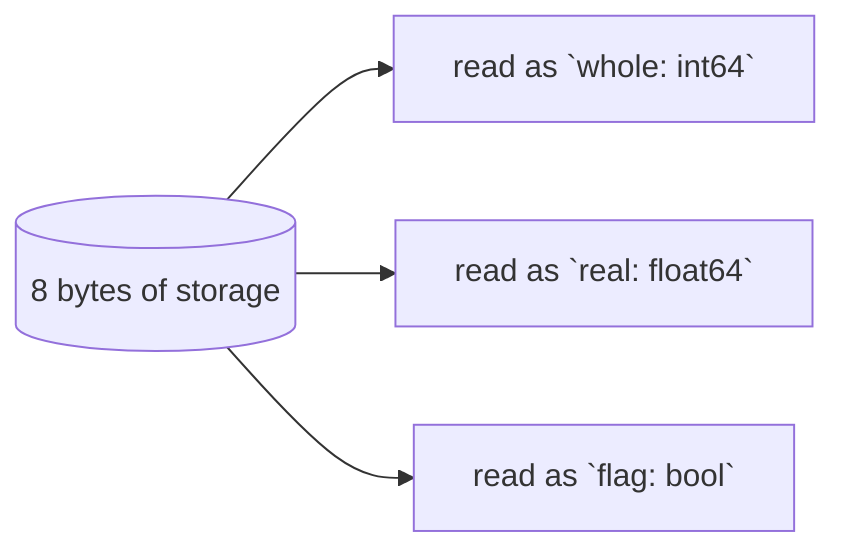

# Union

::note
<!-- sync:needs:start -->

**You'll need**: [Layout](/docs/learn/layout), [Enum](/docs/learn/enum), [Variant](/docs/learn/variant), [Match](/docs/learn/match)
<!-- sync:needs:end -->

::

A struct lays its fields side by side. A **union** lays its members over the _same_ bytes: it is as large as its largest member, not the sum of them, because only one member is meant to be in use at a time.

That saves space, and it gives exact control over layout. What a union does not do is remember which member is in use. This lesson shows what follows from that, and why a [variant](/docs/learn/variant) is usually the better tool.

## Declaring a union

A union looks like a struct, except that its members are separated by commas rather than ended with semicolons:

```rux
union Payload {
    whole: int64,
    real: float64,
    flag: bool
}
```

The program compares it with a struct of the same three fields:

| Type       | Holds                    | Size on this build |
| ---------- | ------------------------ | ------------------ |
| `AllThree` | all three values at once | 24 bytes           |
| `Payload`  | one of them at a time    | 8 bytes            |



A union literal names exactly one member — the one that becomes active:

```rux
Payload { whole: 42 }
```

## A union does not remember

A `variant` keeps a hidden tag and will only hand out the case that was stored. A union keeps nothing. Reading a member other than the one last written is not a conversion: it hands back the same bytes reinterpreted as another type. Write `real = 2.25` and then read `whole`, and on this machine you get 4612248968380809216 — the bit pattern of 2.25 read as an integer. A `bool` read that way may not even be `true` or `false`. The compiler will not stop such a read.

|                           | `struct`          | `variant`               | `union`                  |
| ------------------------- | ----------------- | ----------------------- | ------------------------ |
| Holds                     | every field       | one case                | one member               |
| Size                      | sum, plus padding | largest case plus a tag | largest member           |
| Knows which one is in use | —                 | yes                     | no                       |
| Reading the wrong one     | —                 | impossible              | compiles, gives nonsense |

## Keeping the tag yourself

So keeping track is the program's job, usually with an explicit tag beside the union. That is what `Setting` does:

```rux
struct Setting {
    kind: Kind;
    payload: Payload;
}
```

Every reader checks the tag first, and only then touches the member it names:

```rux
func Describe(setting: Setting) {
    match setting.kind {
        .Whole => PrintLine("whole number {}", setting.payload.whole),
        .Real => PrintLine("real number  {}", setting.payload.real),
        .Flag => PrintLine("flag         {}", setting.payload.flag)
    }
}
```

## Switching members

Switching to another member means writing the new member and the tag together:

```rux
var setting = Setting { kind: Kind::Whole, payload: Payload { whole: 7 } };
setting.payload.real = 2.25;
setting.kind = Kind::Real;
```

After this, `whole` is no longer meaningful: its bytes now belong to `real`. Forget the tag on the last line, and `Describe` would print 4612248968380809216 as a "whole number".

## When a union is the right tool

Prefer a `variant` whenever it will do — it is the tagged union, with the tag kept for you and checked on every read. Reach for a plain union when the exact layout is the point: a fixed format shared with other code, such as a C library, or saving space where the tag is already known from somewhere else.

## The program

The whole lesson is one package in the [Examples repository](https://github.com/rux-lang/Examples/tree/main/Memory/Union). Its comments explain every step.

<!-- sync:program:start -->

```rux [Src/Main.rux]
// A union lays several members over the same bytes. It is as large as its largest member, not
// the sum of them, because only one member is meant to be in use at a time.
//
// What a union does not do is remember which one that is. A `variant` keeps a hidden tag and
// will only hand out the case that was stored; a union keeps nothing. Keeping track is the
// program's job, usually with an explicit tag beside it, as `Setting` does below.
//
// That job matters because reading a member other than the one last written is not a
// conversion. It hands back the same bytes reinterpreted as another type: what comes out depends
// on how the target lays out numbers, and it may not even be a valid value of that type, such
// as a `bool` that is neither `true` nor `false`. The compiler will not stop such a read.
//
// So prefer a `variant` whenever it will do. Reach for a union when the exact layout is the
// point: a fixed format shared with other code, or saving space where the tag is already known.
import Io::PrintLine;

// Members are separated by commas, not ended with semicolons as struct fields are.
union Payload {
    whole: int64,
    real: float64,
    flag: bool
}

// For comparison: the same three values side by side.
struct AllThree {
    whole: int64;
    real: float64;
    flag: bool;
}

enum Kind {
    Whole,
    Real,
    Flag
}

// The tag says which member of `payload` holds a value. Every function that builds a `Setting`
// must set both together, and every reader must check the tag first.
struct Setting {
    kind: Kind;
    payload: Payload;
}

func Describe(setting: Setting) {
    match setting.kind {
        .Whole => PrintLine("whole number {}", setting.payload.whole),
        .Real => PrintLine("real number  {}", setting.payload.real),
        .Flag => PrintLine("flag         {}", setting.payload.flag)
    }
}

func Main() -> int {
    PrintLine("sizeof(Payload)  {}", sizeof(Payload));
    PrintLine("sizeof(AllThree) {}", sizeof(AllThree));

    // A union literal names exactly one member: the one that becomes active.
    Describe(Setting { kind: Kind::Whole, payload: Payload { whole: 42 } });
    Describe(Setting { kind: Kind::Real, payload: Payload { real: 0.5 } });
    Describe(Setting { kind: Kind::Flag, payload: Payload { flag: true } });

    // Switching members means writing the new member and the tag together. After this, `whole`
    // is no longer meaningful: its bytes now belong to `real`.
    var setting = Setting { kind: Kind::Whole, payload: Payload { whole: 7 } };
    setting.payload.real = 2.25;
    setting.kind = Kind::Real;
    Describe(setting);
    return 0;
}
```

<!-- sync:program:end -->

## Run it

```sh
cd Examples/Memory/Union
rux run
```

<!-- sync:output:start -->

```
sizeof(Payload)  8
sizeof(AllThree) 24
whole number 42
real number  0.5
flag         true
real number  2.25
```

<!-- sync:output:end -->

## Common mistakes

::mistake
**Ending union members with semicolons.**\
Struct habits die hard. `whole: int64;` inside a union fails with:

```text
error: expected ',' between union fields before ';'
```

The help line says to separate the members with commas.
::

::mistake
**Naming more than one member in a literal.**\
`Payload { whole: 1, real: 2.0 }` fails with:

```text
error: union initializer for 'Payload' must select exactly one field, but 2 were provided
```

An empty `Payload {}` fails the same way with `but 0 were provided`.
::

::mistake
**Changing the member without the tag.**\
`setting.payload.real = 2.25;` on its own compiles, and the next `Describe` reads those bytes as a whole number. Change the member and the tag together, and keep that in one function if you can.
::

## Try it yourself

1. Read `whole` from `Payload { real: 1.0 }` and print it. Can you see why a float and an integer that look alike in source are nothing alike in memory?
2. Add a fourth member, `text: char8[..]`, to `Payload`, with a matching `Kind::Text` and a `Describe` arm. What is `sizeof(Payload)` now?
3. Rewrite `Setting` as a `variant` with `Whole`, `Real` and `Flag` cases, and compare its `sizeof` with `Setting`'s.

## Learn more

- [Unions](/docs/lang/unions/overview) in the Rux Reference
- [Variant](/docs/learn/variant) — the tagged union that keeps the tag for you
- [Layout](/docs/learn/layout) — sizes and alignment, which decide how big a union is
