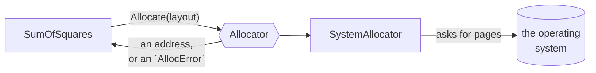

# Allocator

::note
<!-- sync:needs:start -->

**You'll need**: [Pointer slice](/docs/learn/pointer-slice), [Interface value](/docs/learn/interface-value), [Propagate](/docs/learn/propagate), [Absence to error](/docs/learn/absence-to-error), [Defer](/docs/learn/defer)
<!-- sync:needs:end -->

::

`Alloc` and `Free` always go to the same place, and they report failure with a `null` that is easy to forget. An **allocator** fixes both. It turns "where memory comes from" into a value you can pass around, and it reports failure as a real error that has to be handled before there is any address to misuse.

This lesson uses the simplest allocator, `SystemAllocator`. Later lessons in this part swap in others — an arena, a fixed buffer, a pool — without changing how they are called.

## The `Allocator` interface

`Allocator`, from the `Allocator` package, is an [interface](/docs/learn/interface). It promises three operations, and any type that keeps those promises can stand behind it:

| Operation                                 | Does                                  | Returns                      |
| ----------------------------------------- | ------------------------------------- | ---------------------------- |
| `Allocate(layout)`                        | takes storage that matches the layout | `(*var opaque) ! AllocError` |
| `Deallocate(block, layout)`               | gives the storage back                | `! AllocError`               |
| `Reallocate(block, oldLayout, newLayout)` | grows or shrinks a block              | `(*var opaque) ! AllocError` |

A function written against the interface works with whichever allocator its caller passes in:

```rux
func SumOfSquares(allocator: Allocator, count: uint) -> int64 ! AllocError {
```



## A request is a `Layout`

`Alloc` took a byte count. `Allocate` takes a `Layout`: a size and an alignment together, so the two always travel as a pair. `Layout::ForArray<T>(count)` builds one for `count` values of `T`:

```rux
let layout = Layout::ForArray<int64>(count) ?? fail AllocError::Unsupported;
```

It returns `Layout?` — `none` when `count` elements could not even be described, because the size would overflow. Here `??` turns that into an `AllocError`, as in [Absence to error](/docs/learn/absence-to-error). `Layout::ForValue<T>()` describes a single value and cannot fail; you will meet it in the next lessons.

## Failure is an error, not a `null`

`Allocate` returns a fallible, so the address only exists once the failure has been dealt with. Here `?` passes a refusal on to the caller:

```rux
let block = allocator.Allocate(layout)?;
```

Past this line, `block` is real storage. The release is registered at once, with the same layout the block was asked for with:

```rux
defer allocator.Deallocate(block, layout) catch { else => {} };
```

`Deallocate` is fallible too. A refused release here could only be the allocator's own bug, and there is nobody to report it to, so `catch { else => {} }` discards it on purpose.

The failure itself says why it happened:

| `AllocError`   | Means                                                                      |
| -------------- | -------------------------------------------------------------------------- |
| `Unsupported`  | this allocator cannot serve the request at all; asking again will not help |
| `OutOfMemory`  | there is no storage left right now                                         |
| `InvalidBlock` | a release named a block or a layout this allocator did not hand out        |

## Getting an `Allocator`

`Main` builds the concrete allocator, then names it at the interface type:

```rux
var system = SystemAllocator();
let allocator: Allocator = system;
```

`SystemAllocator` carries no state of its own: it asks the operating system for whole pages every time. That is fine for a few large requests like these, and wasteful for many small ones — which is what the arena and the pool, later in this part, are for.

## The refused request

The last call asks for a billion billion `int64`s. `ForArray` can still describe that many, but no machine can provide them, so the allocator refuses and `Try` prints the reason. Which reason you see depends on how the operating system answers, which is why the output note says it may differ.

## The program

The whole lesson is one package in the [Examples repository](https://github.com/rux-lang/Examples/tree/main/Memory/Allocator). Its comments explain every step.

<!-- sync:program:start -->

```rux [Src/Main.rux]
// `Alloc` and `Free` always go to the same place. An allocator turns "where memory comes from"
// into a value: the `Allocator` interface promises three operations, and any type that keeps
// those promises can stand behind it. A function written against the interface works with
// whichever allocator its caller passes in.
//
// This lesson uses `SystemAllocator`, which asks the operating system. The next lessons swap in
// others without changing how they are called.
//
// Two things differ from `Alloc`. A request is a `Layout`, a size and an alignment together,
// built here by `Layout::ForArray<T>(count)`. And failure is a real error, not a `null`:
// `Allocate` returns `(*var opaque) ! AllocError`, so there is no address to misuse until the
// failure has been handled. A block must go back through `Deallocate` with the same layout it
// was asked for with.
import Allocator::{ AllocError, Allocator, Layout, SystemAllocator };
import Io::PrintLine;

// Borrows `count` numbers' worth of memory, uses it, and gives it back.
func SumOfSquares(allocator: Allocator, count: uint) -> int64 ! AllocError {
    // `ForArray` is `none` when `count` elements could not even be described.
    let layout = Layout::ForArray<int64>(count) ?? fail AllocError::Unsupported;

    // `?` passes a refusal on to the caller. Past this line, `block` is real storage.
    let block = allocator.Allocate(layout)?;

    // Registered at once, so every path out returns the block with its layout. A refused release
    // here would be the allocator's own bug, and there is nobody to report it to.
    defer allocator.Deallocate(block, layout) catch { else => {} };

    let numbers = (block as *var int64)[..count];
    var total: int64 = 0;
    for i in 0..count {
        numbers[i] = (i * i) as int64;
        total += numbers[i];
    }
    return total;
}

func Reason(error: AllocError) -> char8[..] {
    return match error {
        .Unsupported => "the request cannot be served",
        .OutOfMemory => "there is not enough memory",
        .InvalidBlock => "the block was not from this allocator"
    };
}

func Try(allocator: Allocator, count: uint) {
    match SumOfSquares(allocator, count) {
        .Success(total) => PrintLine("{} squares add up to {}", count, total),
        .Failure(error) => PrintLine("{} squares: refused, {}", count, Reason(error))
    }
}

func Main() -> int {
    // Build the concrete allocator, then name it at the interface type to get an `Allocator`.
    var system = SystemAllocator();
    let allocator: Allocator = system;

    Try(allocator, 10);
    Try(allocator, 1000);

    // Eight bytes times this count is far more memory than any machine has.
    Try(allocator, 1000000000000000000);
    return 0;
}
```

Besides `Io`, its `Rux.toml` lists `Allocator` under `[Dependencies]`.
<!-- sync:program:end -->

## Run it

```sh
cd Examples/Memory/Allocator
rux run
```

<!-- sync:output:start -->

```
10 squares add up to 285
1000 squares add up to 332833500
1000000000000000000 squares: refused, the request cannot be served
```

The reason given on the last line comes from the operating system's answer, so it can differ between systems.
<!-- sync:output:end -->

## Common mistakes

::warning
**Using the block before handling the failure.**\
`let block = allocator.Allocate(layout);` without `?` holds a fallible, not an address, so `block as *var int64` fails with `error: cannot cast value of type '*var opaque ! AllocError' to '*var int64'`. Unwrap it first: `?`, `catch` or a `match`.
::

::warning
**Passing the optional layout.**\
Leave out the `?? fail …` and `layout` is a `Layout?`. `Allocate(layout)` then fails with `error: argument 1 to 'Allocate' has type 'Layout?', but parameter 'layout' requires 'Layout'`.
::

::warning
**A bare deferred release.**\
`defer allocator.Deallocate(block, layout);` fails with `error: fallible result of type '! AllocError' is discarded`. Decide what a refused release means, or discard it on purpose with `catch { else => {} }`.
::

::warning
**Releasing with a different layout.**\
A block must go back with the layout it was asked for with. `SystemAllocator` notices a mismatch and refuses with `AllocError::InvalidBlock`; other allocators may not be able to tell, and quietly go wrong instead.
::

## Try it yourself

1. Add `Try(allocator, 0);`. What does a zero-element request give back, and does it still need releasing?
2. Make `Try` also print `error.IsTransient()`, which is `true` only for `OutOfMemory` — the one failure that might go away if you ask again later.
3. Write `SumOfCubes` against the same interface and call it with the same allocator.

## Learn more

- [Interface value](/docs/learn/interface-value) — how a concrete value stands behind an interface type
- [Propagate](/docs/learn/propagate) and [Absence to error](/docs/learn/absence-to-error) — the `?` and `?? fail` used here
- [Box](/docs/learn/box) — the next lesson, which stops you from having to call `Deallocate` at all
