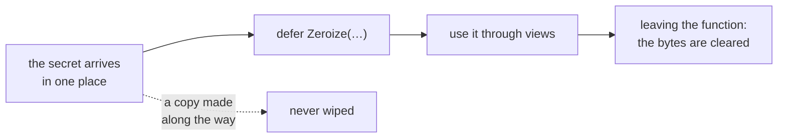

# Zeroize

::note
<!-- sync:needs:start -->

**You'll need**: [Raw memory](/docs/learn/raw-memory), [Pointer](/docs/learn/pointer), [Layout](/docs/learn/layout), [Copy](/docs/learn/copy)
<!-- sync:needs:end -->

::

When a program is done with a secret — a password, a key, a PIN — it should wipe the memory that held it. Otherwise the secret can turn up later where nobody expected it: in a crash dump, or in memory that is reused by some other part of the program. This last lesson of the part shows the one tool for the job, and why the obvious tool is not it.

## Why an ordinary clear can vanish

An optimizing compiler looks for work whose result nobody uses, and deletes it. Writing zeros into an array that is never read again is exactly such work. So a clear at the end of a function — with `Zero` from [Raw memory](/docs/learn/raw-memory), or with a loop — may simply not be there in the optimized program, while the secret stays in memory.

`Zeroize`, from `Core`, is the version the compiler promises to keep, however unread the bytes are afterwards:

| Function                   | Clears the bytes | May the optimizer remove it? | Use it for                   |
| -------------------------- | ---------------- | ---------------------------- | ---------------------------- |
| `Zero(p, n)`               | yes              | yes, if nothing reads them   | making fresh memory definite |
| `Zeroize(address, length)` | yes              | never                        | wiping secrets               |

## Wiping the PIN

`Zeroize` takes a `*var uint8` — the address of the first byte — and how many bytes to clear:

```rux
Zeroize(@pin[0], sizeof(uint8[4]));
```

`sizeof(uint8[4])` is the size of the whole array, so all four bytes go. After the call, the PIN prints as zeros.

## A copy is not wiped

`Zeroize` clears the bytes it is given and nothing else. The program makes a careless copy before the wipe:

```rux
let copy = pin;
```

An array is copied by value, so `copy` is separate storage with its own four bytes, and it still holds `4 7 1 9` after the wipe. The same goes for any copy the program made along the way — passed by value, returned, stored in a struct. So keep a secret in one place from the start, pass it on as a view such as `pin[..]` rather than as a copy, and wipe that one place when you are done.



## Wipe with `defer`

A wipe that is skipped on an early `return` does not help, so register it with [defer](/docs/learn/defer) right after the secret arrives. A secret that is not stored as bytes needs its address cast to `*var uint8`:

```rux
var key: uint32[4] = [1, 2, 3, 4];
defer Zeroize(@key[0] as *var uint8, sizeof(uint32[4]));
```

Whatever path the function leaves by, the key is cleared on the way out.

## The program

The whole lesson is one package in the [Examples repository](https://github.com/rux-lang/Examples/tree/main/Memory/Zeroize). Its comments explain every step.

<!-- sync:program:start -->

```rux [Src/Main.rux]
// When a program is done with a secret, such as a password, a key or a PIN, it should wipe the
// memory that held it, so the secret cannot turn up later in a crash dump or in memory that is
// reused by something else.
//
// The surprise is that an ordinary clear may not happen. Writing zeros that nothing reads
// afterwards looks pointless to an optimizing compiler, and it is allowed to delete such writes.
// `Zero` from the RawMemory lesson is exactly that kind of write. `Zeroize(address, length)`
// is the version the compiler promises to keep, however unread the bytes are afterwards.
//
// It clears the bytes it is given and nothing else. A copy made earlier still holds the secret,
// so keep a secret in one place from the start, and wipe that place when you are done. A
// `defer` right after the secret arrives is a good way to make sure the wipe always happens.
import Core::Zeroize;
import Io::{ Print, PrintLine };

func Show(label: char8[..], bytes: uint8[..]) {
    Print("{}", label);
    for value in bytes {
        Print(" {}", value);
    }
    PrintLine();
}

func Matches(entered: uint8[..], secret: uint8[..]) -> bool {
    for i in 0..secret.length {
        if entered[i] != secret[i] {
            return false;
        }
    }
    return true;
}

func Main() -> int {
    var pin: uint8[4] = [4, 7, 1, 9];
    let entered: uint8[4] = [4, 7, 1, 9];
    PrintLine("pin accepted: {}", Matches(entered[..], pin[..]));

    // A careless copy, made before the wipe. It is separate storage with its own bytes.
    let copy = pin;

    // Done with the PIN: wipe its four bytes, starting at the address of the first one.
    Zeroize(@pin[0], sizeof(uint8[4]));

    Show("pin after Zeroize:", pin[..]);
    Show("the earlier copy: ", copy[..]);
    return 0;
}
```

Besides `Io`, its `Rux.toml` lists `Core` under `[Dependencies]`.
<!-- sync:program:end -->

## Run it

```sh
cd Examples/Memory/Zeroize
rux run
```

<!-- sync:output:start -->

```
pin accepted: true
pin after Zeroize: 0 0 0 0
the earlier copy:  4 7 1 9
```

<!-- sync:output:end -->

## Common mistakes

::mistake
**Wiping a secret with `Zero`.**\
It looks the same in the source, and in an optimized build it may not happen at all. For secrets, always `Zeroize`.
::

::mistake
**A secret held in a `let`.**\
`let pin: uint8[4] = …` makes `@pin[0]` a read-only `*uint8`, and `Zeroize(@pin[0], …)` fails with:

```text
error: argument 1 to 'Zeroize' has type '*uint8', but parameter 'memory' requires '*var uint8'
```

A secret you will wipe must be a `var`.
::

::mistake
**A secret that is not bytes.**\
For `var key: uint32[4]`, `Zeroize(@key[0], …)` fails with:

```text
error: argument 1 to 'Zeroize' has type '*var uint32', but parameter 'memory' requires '*var uint8'
```

Cast the address, `@key[0] as *var uint8`, and give the length in bytes.
::

::mistake
**The wrong length.**\
`Zeroize(@pin[0], sizeof(uint8))` clears one byte and leaves `7 1 9` behind. Measure the whole storage: `sizeof(uint8[4])`.
::

## Try it yourself

1. Wipe `copy` as well, and check that both lines print zeros. What did you have to change about `copy` first?
2. Replace the `Zeroize` call with a `defer Zeroize(…)` placed right after `pin` is declared. What does the `pin after Zeroize` line print now, and why?
3. Write `func Check(entered: uint8[..]) -> bool` that keeps the stored PIN in its own `var` array, registers a `defer Zeroize(…)` for it straight away, and returns `Matches(entered, pin[..])`.

## Learn more

- [Raw memory](/docs/learn/raw-memory) — `Zero`, and where clearing memory first came up
- [Copy](/docs/learn/copy) — when a value is copied, and so when a secret can multiply
- [Defer](/docs/learn/defer) — making the wipe happen on every path out
