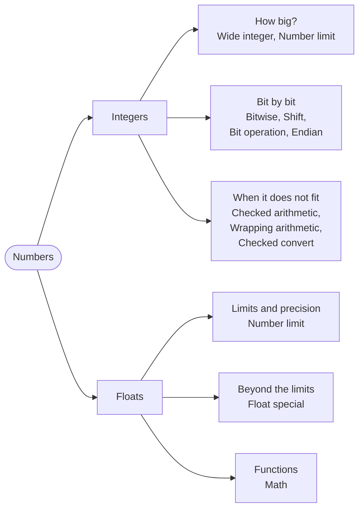

# Part 16: Numbers

Part 1 introduced the number types; this part takes them apart. You will count past 64 bits, ask any type for its limits, meet the float values that are not numbers at all, and work on integers one bit at a time. Above all, you will learn what happens at the edges — when a result does not fit — and how to choose, on purpose, between reporting it, wrapping round and stopping at the limit.

## What you will learn

- The wide integers `int128` to `uint512`, and the constants every number type carries: `Min`, `Max`, `Bits`, `Epsilon` and the rest.
- Infinity and NaN — where they come from, and why `NaN == NaN` is `false`.
- Working with bits: `& | ^ ~`, the shifts `<<`, `>>` and `>>>`, and `Core`'s counting and rotating functions.
- Overflow handled on purpose: checked, wrapping and saturating arithmetic, and conversions that report a value that does not fit.
- Writing a number's bytes in a chosen order, for files and network protocols.
- Roots, powers, logarithms, trigonometry and the four kinds of rounding from the `Math` package.

## The part at a glance



## Lessons

<!-- sync:lessons:start -->

|       | Lesson                                                 | What you will learn                                                                                            |
| ----- | ------------------------------------------------------ | -------------------------------------------------------------------------------------------------------------- |
| 16.1  | [Wide integer](/docs/learn/wide-integer)               | 128-, 256- and 512-bit integers                                                                                |
| 16.2  | [Number limit](/docs/learn/number-limit)               | the smallest and largest value each number type can hold                                                       |
| 16.3  | [Float special](/docs/learn/float-special)             | infinity and NaN, and how they compare                                                                         |
| 16.4  | [Bitwise](/docs/learn/bitwise)                         | Work on individual bits with `& \| ^ ~`, and use masks to set, clear, flip and test flags packed into one byte |
| 16.5  | [Shift](/docs/learn/shift)                             | move bits left and right with `<<`, `>>` and `>>>`                                                             |
| 16.6  | [Checked arithmetic](/docs/learn/checked-arithmetic)   | detect overflow instead of getting a wrong answer                                                              |
| 16.7  | [Wrapping arithmetic](/docs/learn/wrapping-arithmetic) | arithmetic that wraps around or saturates on purpose                                                           |
| 16.8  | [Checked convert](/docs/learn/checked-convert)         | convert between number types and detect values that do not fit                                                 |
| 16.9  | [Bit operation](/docs/learn/bit-operation)             | count, find and rotate bits                                                                                    |
| 16.10 | [Endian](/docs/learn/endian)                           | write a number's bytes in a chosen byte order                                                                  |
| 16.11 | [Math](/docs/learn/math)                               | roots, powers, logarithms, trigonometry, and rounding                                                          |

<!-- sync:lessons:end -->

## Before you start

This part draws on almost everything before it. Lessons hand back answers through [out-parameters](/docs/learn/out-parameter) and [pointers](/docs/learn/pointer) from [Part 15: Memory](/docs/learn/memory), report results as [optionals](/docs/learn/optionals) from Part 8, and use the [generic](/docs/learn/generic) functions of `Core`. Each lesson's package is in the Examples repository's `Numbers/` folder:

```sh
cd Examples/Numbers/WideInteger
rux run
```

## After this part

[Part 17: Collections](/docs/learn/collections) moves from single values to containers of them — vectors, maps, sets and queues. Before moving on, try the checkpoint projects [Circle](/docs/learn/circle) and [Quadratic](/docs/learn/quadratic): both put the `Math` package to work and have to deal with the special values a float calculation can produce.

For the rules behind this part, see [Arithmetic](/docs/lang/operations/arithmetic), [Bitwise](/docs/lang/operations/bitwise) and [Shift](/docs/lang/operations/shift) operations, [Type casts](/docs/lang/operations/type-cast) and the [primitive types](/docs/lang/appendix/primitives) in the Rux Reference, and the [Math API](/docs/api/math).
