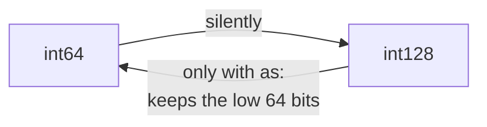

# Wide integer

::note
<!-- sync:needs:start -->

**You'll need**: [Integer](/docs/learn/integer), [Literal](/docs/learn/literal), [Convert](/docs/learn/convert), [For](/docs/learn/for)
<!-- sync:needs:end -->

::

Sixty-four bits go a long way — about eighteen quintillion — but not all the way. A factorial outgrows them by 21!, a 128-bit identifier needs twice the room, and the arithmetic inside cryptography works on numbers hundreds of bits long. For those, Rux has integers wider than any machine register: `int128`, `int256` and `int512`, and their unsigned twins `uint128`, `uint256` and `uint512`.

The compiler spreads each wide integer over several machine words and carries between them, so a wide integer is slower than an `int64` — but every bit as exact. Everything else you know about integers still holds.

## Six more widths

| Type      | Bytes | Largest value, roughly | Digits |
| --------- | ----- | ---------------------- | ------ |
| `int64`   | 8     | 9.2 × 10¹⁸             | 19     |
| `int128`  | 16    | 1.7 × 10³⁸             | 39     |
| `uint128` | 16    | 3.4 × 10³⁸             | 39     |
| `int256`  | 32    | 5.8 × 10⁷⁶             | 77     |
| `uint256` | 32    | 1.2 × 10⁷⁷             | 78     |
| `int512`  | 64    | 6.7 × 10¹⁵³            | 154    |
| `uint512` | 64    | 1.3 × 10¹⁵⁴            | 155    |

The signed types reach as far below zero as above it, plus one, exactly like `int8` or `int32`. The limits come from `Core`, the same `Min` and `Max` you use for any other integer — the program imports each type it asks about:

```rux
import Core::{ int128, int64, uint128, uint256, uint512, uint64 };
```

## Wide literals

2⁶⁴ is one more than the largest `uint64`, so it needs a wider home. Give the binding a wide type and the literal takes it:

```rux
let next: uint128 = 18446744073709551616;
```

Hex digits and `_` separators work at any width, exactly as they do for narrow integers:

```rux
let avogadro: uint128 = 602214076000000000000000;
let mask: uint128 = 0xFFFF_FFFF_FFFF_FFFF_FFFF_FFFF_FFFF_FFFF;
```

Thirty-two `F`s are 128 set bits, so `mask == uint128::Max` prints `true`.

## Counting past 64 bits

A `uint64` can hold 20! but not 21!. A `uint128` reaches 34!:

```rux
var factorial: uint128 = 1;
let first: uint128 = 1;
for n in first..=34 {
    factorial *= n;
}
```

The range starts at a `uint128`, so `n` counts in `uint128` as well, and `factorial *= n` multiplies two values of the same type. Had the range been the plain `1..=34`, `n` would be an `int`, and the multiplication would be refused.

A shift needs the same care. The **left** side of a shift decides its type, so the width goes on the literal there, as a suffix:

```rux
let power = 1u256 << 200;
```

A plain `1 << 200` is an `int`, which has no bit 200 — it quietly prints `256` instead of a 61-digit number.

## Widening and narrowing

Wide integers follow the conversion rules of [Convert](/docs/learn/convert). Widening loses nothing, so it needs nothing written; an unsuffixed literal grows to the width of the value beside it:

```rux
let balance: int64 = -42;
let wide: int128 = balance;
let large = wide * 1_000_000_000_000_000_000_000;
```

`1_000_000_000_000_000_000_000` is far too large for an `int64`, but it sits next to `wide`, so it is an `int128` and the product is exact: −42 × 10²¹.

Narrowing can lose bits, so it is never silent. You ask for it with `as`, which keeps the low 64 bits — whatever they happen to mean:

```rux
PrintLine("narrowed     {}", large as int64);
```

−42 × 10²¹ does not fit in 64 bits, and what is left is the unrelated `3236255836649029632`.



## The edges

One past the maximum wraps to the minimum, as it does for every other integer:

```rux
PrintLine("max + 1      {}", int128::Max + 1);
```

A wider type moves the edge further away; it does not remove it. [Checked arithmetic](/docs/learn/checked-arithmetic) shows how to find out when you cross it.

## The program

The whole lesson is one package in the [Examples repository](https://github.com/rux-lang/Examples/tree/main/Numbers/WideInteger). Its comments explain every step.

<!-- sync:program:start -->

```rux [Src/Main.rux]
// `int128`, `int256` and `int512`, and their unsigned twins `uint128` to `uint512`, are integers
// wider than any machine register. The compiler spreads each one over several machine words and
// carries between them, so a wide integer is slower than an `int64` but every bit as exact. Use
// one when a number really can outgrow 64 bits: a large factorial, a 128-bit identifier, the
// arithmetic inside cryptography.
//
// Everything you know about integers still applies: the same operators, the same `Min` and `Max`,
// the same wrap-around at the edges, and the same widening. An `int64` becomes an `int128` as
// silently as an `int32` becomes an `int64`, and an unsuffixed literal takes the type of the other
// operand, however wide. Only the way back, from wide to narrow, has to be written with `as`.
import Core::{ int128, int64, uint128, uint256, uint512, uint64 };
import Io::PrintLine;

func Main() -> int {
    // 2^64 is one more than the largest `uint64`, so it needs a wider home.
    PrintLine("uint64 max   {}", uint64::Max);
    let next: uint128 = 18446744073709551616;
    PrintLine("one more     {}", next);

    // Hex digits and `_` separators work at any width.
    let avogadro: uint128 = 602214076000000000000000;
    let mask: uint128 = 0xFFFF_FFFF_FFFF_FFFF_FFFF_FFFF_FFFF_FFFF;
    PrintLine("avogadro     {}", avogadro);
    PrintLine("mask is max  {}", mask == uint128::Max);

    // A `uint64` can hold 20! but not 21!. A `uint128` reaches 34!. The range starts at a
    // `uint128`, so `n` counts in `uint128` as well.
    var factorial: uint128 = 1;
    let first: uint128 = 1;
    for n in first..=34 {
        factorial *= n;
    }
    PrintLine("34!          {}", factorial);

    // The left side of a shift decides its type, so it carries the suffix. A plain `1 << 200`
    // would be an `int`, which has no bit 200: it prints 256.
    let power = 1u256 << 200;
    PrintLine("2^200        {}", power);

    // Widening needs nothing written, and the literal grows to the width of `wide`.
    let balance: int64 = -42;
    let wide: int128 = balance;
    let large = wide * 1_000_000_000_000_000_000_000;
    PrintLine("widened      {}", large);

    // Narrowing can lose bits, so it is never silent: `let back: int64 = large;` is refused with
    // "cannot assign 'int128' to 'int64'". `as` keeps the low 64 bits, whatever they mean.
    PrintLine("narrowed     {}", large as int64);

    // The edges behave like every other integer's: one past the maximum wraps to the minimum.
    PrintLine("int128 max   {}", int128::Max);
    PrintLine("max + 1      {}", int128::Max + 1);
    PrintLine("uint512 max  {}", uint512::Max);
    return 0;
}
```

Besides `Io`, its `Rux.toml` lists `Core` under `[Dependencies]`.
<!-- sync:program:end -->

## Run it

```sh
cd Examples/Numbers/WideInteger
rux run
```

<!-- sync:output:start -->

```
uint64 max   18446744073709551615
one more     18446744073709551616
avogadro     602214076000000000000000
mask is max  true
34!          295232799039604140847618609643520000000
2^200        1606938044258990275541962092341162602522202993782792835301376
widened      -42000000000000000000000
narrowed     3236255836649029632
int128 max   170141183460469231731687303715884105727
max + 1      -170141183460469231731687303715884105728
uint512 max  13407807929942597099574024998205846127479365820592393377723561443721764030073546976801874298166903427690031858186486050853753882811946569946433649006084095
```

<!-- sync:output:end -->

## Common mistakes

::warning
**A huge literal with no type to take.**\
A literal standing alone is an `int`, and `let x = 18446744073709551616;` fails with `error: integer literal is out of range for type 'int'`. Annotate the binding — `let x: uint128 = …` — or add a suffix such as `u128`.
::

::warning
**A loop counter of the wrong type.**\
With `for n in 1..=34`, `n` is an `int`, and `factorial *= n` fails with `error: operator '*=' cannot combine left operand 'uint128' with right operand 'int'`. Start the range at a `uint128`, as the program does with `first`.
::

::warning
**Narrowing without `as`.**\
`let back: int64 = large;` is refused with `error: cannot assign 'int128' to 'int64'`, because 64 bits cannot hold every `int128`. Write `large as int64` when losing the high bits is what you want — and check the value first when it is not.
::

::warning
**A shift that stays an `int`.**\
`1 << 200` compiles, but the `1` is an `int`, and the result is `256`, not 2²⁰⁰. Put the width on the left operand: `1u256 << 200`.
::

::warning
**Asking for a limit without importing the type.**\
`Max` and `Min` are declared in `Core`. Without `int128` in the `import Core::{ … }` list, `int128::Max` fails with `error: 'Max' not found in extend for type 'int128'`.
::

## Try it yourself

1. Change the loop to run to 35. What does `factorial` print now, and why?
2. Compute 21! in a `uint64` and compare it with the `uint128` answer. Does the program warn you?
3. Import `int256` and `uint256` from `Core` and print their `Max`. Count the digits.
4. Write `let x = 18446744073709551616;` and read the error. Then fix it two ways: with a type annotation, and with a suffix.

## Learn more

- [int128](/docs/lang/signed/int128), [uint128](/docs/lang/unsigned/uint128) and the [primitive types](/docs/lang/appendix/primitives) in the Rux Reference
- [Integer](/docs/learn/integer) and [Literal](/docs/learn/literal) — the narrow integers and how literals get their types
- [Number limit](/docs/learn/number-limit) — the constants every number type carries
- [Checked arithmetic](/docs/learn/checked-arithmetic) — noticing when a result does not fit
