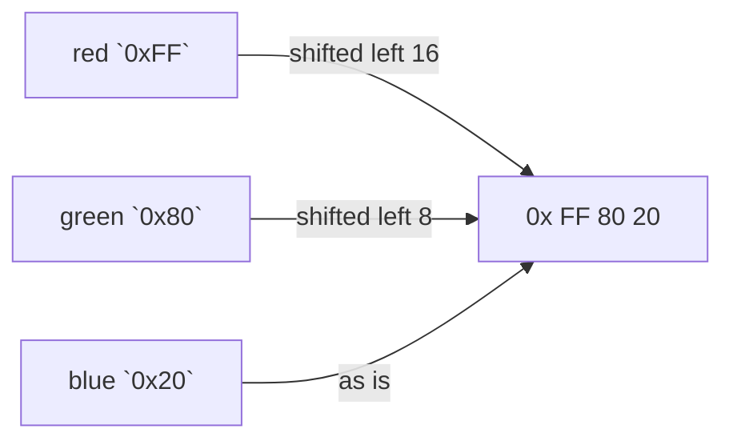

# Shift

::note
<!-- sync:needs:start -->

**You'll need**: [Bitwise](/docs/learn/bitwise), [Convert](/docs/learn/convert)
<!-- sync:needs:end -->

::

A **shift** slides every bit of an integer along by a number of places. Bits that move past the end are dropped, and new bits come in at the other end. Because each place is a power of two, shifting is also a fast way to multiply and divide by 2, 4, 8 and so on — but its everyday use is building masks and packing several small fields into one number.

## Left shifts multiply

`x << n` moves the bits towards the high end and brings zeros in at the bottom. As long as nothing falls off the top, that multiplies by 2ⁿ:

```rux
let one: uint32 = 1;
PrintLine("1 << 4     {}", one << 4);
PrintLine("5 << 3     {}", 5 << 3);
```

`1 << 4` is 16, and `5 << 3` is 5 × 8 = 40. `1 << n` is also how a mask for bit `n` is made — the single-bit masks of [Bitwise](/docs/learn/bitwise) could be written `1 << 0`, `1 << 1` and `1 << 2`.

The result has the type of the **left** operand, and bits pushed past its width are gone. A `uint8` holding 200 shifted left by one is not 400 but `144` — the top bit fell off.

## Right shifts divide

Shifting the other way divides by 2ⁿ and drops the remainder:

```rux
let value: int32 = 100;
PrintLine("100 >> 2   {}", value >> 2);
```

100 / 4 = 25. For a negative number, `>>` rounds **down**, towards minus infinity, where `/` rounds towards zero: `-7 >> 1` is `-4`, while `-7 / 2` is `-3`.

## Two right shifts

Shifting right empties the top bits, and something has to fill them. For a signed number there are two sensible answers, so Rux has two operators:

| Operator | Name       | Fills the top with     | On a negative number |
| -------- | ---------- | ---------------------- | -------------------- |
| `>>`     | arithmetic | copies of the sign bit | stays negative       |
| `>>>`    | logical    | zeros, always          | becomes positive     |

The program shows both on −16. `{:b}` would print a signed value with a minus sign, so each one is shown through `as uint32` to see the bits themselves:

```rux
let negative: int32 = -16;
let arithmetic = negative >> 2;
let logical = negative >>> 2;
PrintLine("-16        {:032b}", negative as uint32);
PrintLine("-16 >> 2   {:032b}  {}", arithmetic as uint32, arithmetic);
PrintLine("-16 >>> 2  {:032b}  {}", logical as uint32, logical);
```

```
-16        11111111111111111111111111110000
-16 >> 2   11111111111111111111111111111100  -4
-16 >>> 2  00111111111111111111111111111100  1073741820
```

`>>` kept the sign and divided: −16 / 4 = −4. `>>>` treated the value as plain bits, and the two zeros it brought in made a large positive number.

An unsigned type has no sign bit to copy, so its `>>` already brings in zeros. That is why `>>>` exists only for signed types: on a `uint8` or `uint32`, use `>>`.

## Packing fields into one integer

Shifts and masks together store several small fields in one number. A colour is the classic case: one byte each of red, green and blue. Each channel is shifted into its own byte, then the three are combined with `|`:

```rux
let red: uint32 = 0xFF;
let green: uint32 = 0x80;
let blue: uint32 = 0x20;
let color = (red << 16) | (green << 8) | blue;
```



Unpacking runs the other way: shift the field down to the bottom, then mask away everything above it with `& 0xFF`:

```rux
PrintLine("red        {:#x}", (color >> 16) & 0xFF);
PrintLine("green      {:#x}", (color >> 8) & 0xFF);
PrintLine("blue       {:#x}", color & 0xFF);
```

`{:#x}` prints hexadecimal with a `0x` in front, so the packed value shows as `0xff8020`.

## The program

The whole lesson is one package in the [Examples repository](https://github.com/rux-lang/Examples/tree/main/Numbers/Shift). Its comments explain every step.

<!-- sync:program:start -->

```rux [Src/Main.rux]
// A shift slides every bit of an integer along by a number of places. `x << n` moves them towards
// the high end and brings zeros in at the bottom, which multiplies by 2 to the n as long as nothing
// falls off the top. Shifting the other way divides, and Rux has two right shifts because a signed
// number gives the question of what to bring in at the top two answers:
//
//     >>    arithmetic: copies the sign bit, so a negative number stays negative
//     >>>   logical: always brings in zeros, treating the value as plain bits
//
// On an unsigned type there is no sign to copy, so `>>` already brings in zeros and `>>>` is
// refused: it needs a signed left operand. On a signed type, `-16 >> 2` is -4, while `-16 >>> 2`
// is a large positive number.
//
// Shifts and masks together pack several small fields into one integer, the way a color is stored
// as one byte each of red, green and blue.
import Io::PrintLine;

func Main() -> int {
    // Left shifts multiply by powers of two.
    let one: uint32 = 1;
    PrintLine("1 << 4     {}", one << 4);
    PrintLine("5 << 3     {}", 5 << 3);

    // Right shifts divide, rounding down.
    let value: int32 = 100;
    PrintLine("100 >> 2   {}", value >> 2);

    // The two right shifts part ways on a negative number. `{:b}` prints a signed value with a
    // minus sign, so each one is shown through `as uint32` to see the bits themselves.
    let negative: int32 = -16;
    let arithmetic = negative >> 2;
    let logical = negative >>> 2;
    PrintLine("-16        {:032b}", negative as uint32);
    PrintLine("-16 >> 2   {:032b}  {}", arithmetic as uint32, arithmetic);
    PrintLine("-16 >>> 2  {:032b}  {}", logical as uint32, logical);
    PrintLine("");

    // Packing: each channel shifted into its own byte, then combined with `|`.
    let red: uint32 = 0xFF;
    let green: uint32 = 0x80;
    let blue: uint32 = 0x20;
    let color = (red << 16) | (green << 8) | blue;
    PrintLine("packed     {:#08x}", color);

    // Unpacking: shift the field down to the bottom, then mask away everything above it.
    PrintLine("red        {:#x}", (color >> 16) & 0xFF);
    PrintLine("green      {:#x}", (color >> 8) & 0xFF);
    PrintLine("blue       {:#x}", color & 0xFF);
    return 0;
}
```

<!-- sync:program:end -->

## Run it

```sh
cd Examples/Numbers/Shift
rux run
```

<!-- sync:output:start -->

```
1 << 4     16
5 << 3     40
100 >> 2   25
-16        11111111111111111111111111110000
-16 >> 2   11111111111111111111111111111100  -4
-16 >>> 2  00111111111111111111111111111100  1073741820

packed     0xff8020
red        0xff
green      0x80
blue       0x20
```

<!-- sync:output:end -->

## Common mistakes

::mistake
**Using `>>>` on an unsigned value.**\
`b >>> 1` with a `uint8` called `b` fails with:

```text
error: operator '>>>' requires a signed integer left operand, but found 'uint8'
```

Unsigned `>>` already fills with zeros — use it.
::

::mistake
**Expecting `>>` to divide exactly like `/`.**\
On a negative odd number they differ: `-7 >> 1` is `-4`, `-7 / 2` is `-3`. Use `/` when you mean division, and `>>` when you mean bits.
::

::mistake
**Shifting bits off the top.**\
A left shift multiplies only while the result fits: a `uint8` 200 `<< 1` is `144`, with no warning. Shift a wider type when the result needs the room, and keep every shift count below the width of the left operand.
::

## Try it yourself

1. Build a mask for bit 5 with `1 << 5`, and use it to set, test and clear that bit in a `uint8`.
2. Pack an hour (0–23), a minute and a second into one `uint32`, eight bits each, then unpack them.
3. Add an alpha channel to the colour: four bytes, alpha highest. Print it with `{:#010x}`.
4. Print `-1 >> 1` and `-1 >>> 1` for an `int32`. Explain both answers from the bits.

## Learn more

- [Shift operations](/docs/lang/expressions/shift) in the Rux Reference
- [Bitwise](/docs/learn/bitwise) — the masks shifts are combined with
- [Bit operation](/docs/learn/bit-operation) — rotations, where no bit falls off
- [Endian](/docs/learn/endian) — the order of a number's bytes in memory
