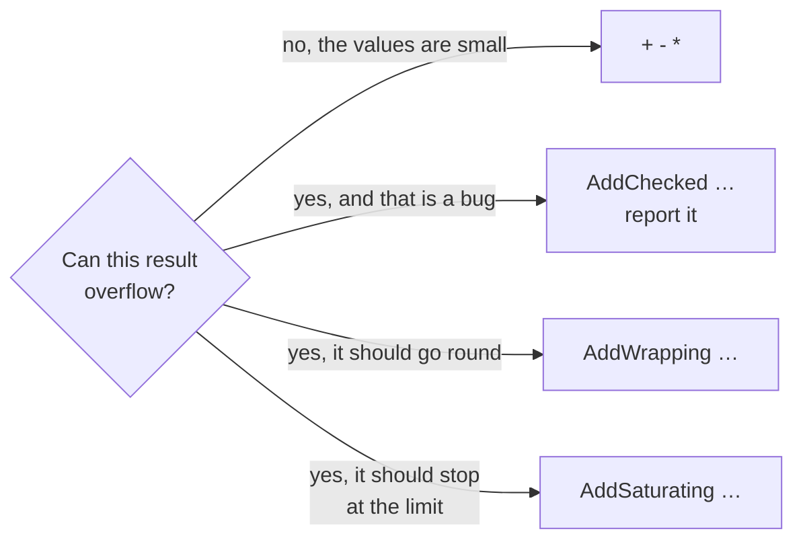

# Wrapping arithmetic

::note
<!-- sync:needs:start -->

**You'll need**: [Checked arithmetic](/docs/learn/checked-arithmetic), [String literal](/docs/learn/string-literal)
<!-- sync:needs:end -->

::

[Checked arithmetic](/docs/learn/checked-arithmetic) treats overflow as a problem to report. Sometimes it is not a problem but the plan, and the only question is what the result should be. `Core` names the two useful answers, at every integer width:

- **Wrapping** — go round, like a car's odometer rolling from 999999 back to 000000.
- **Saturating** — stop at the type's limit and stay there, like a volume knob turned all the way up.

## Wrapping, on purpose

`AddWrapping`, `SubWrapping` and `MulWrapping` compute exactly what `+`, `-` and `*` already do:

```rux
let high: uint8 = 250;
let low: uint8 = 5;
let middle: uint8 = 200;
PrintLine("wrapping     250 + 10 = {}", AddWrapping(high, 10));
PrintLine("wrapping     5 - 10   = {}", SubWrapping(low, 10));
PrintLine("wrapping     200 * 2  = {}", MulWrapping(middle, 2));
```

A `uint8` counts 0 to 255 and then starts again, so 250 + 10 is 260 − 256 = `4`, and 5 − 10 goes below zero and comes round to `251`.

If the answer is the same as `+`, why have the function? For the **reader**. `AddWrapping` says "this wraps on purpose", so nobody mistakes the overflow for a bug — or "fixes" it. Hashes, checksums, random number generators and clock counters all want it.

The program ends with one: a tiny multiplicative hash, where overflow is what mixes the bits together:

```rux
let text = "Hello, World!";
var hash: uint32 = 17;
for i in 0..text.length {
    hash = AddWrapping(MulWrapping(hash, 31), text[i] as uint32);
}
```

Before the text is half done, the product outgrows 32 bits and wraps — as it is meant to. The final value, `1494227876`, is a fingerprint of the text: change a letter and the fingerprint changes.

## Saturating, at the limit

`AddSaturating`, `SubSaturating` and `MulSaturating` stop at the nearest limit instead:

```rux
PrintLine("saturating   250 + 10 = {}", AddSaturating(high, 10));
PrintLine("saturating   5 - 10   = {}", SubSaturating(low, 10));
PrintLine("saturating   200 * 2  = {}", MulSaturating(middle, 2));
```

They give `255`, `0` and `255`. That suits a quantity with a natural ceiling and floor — a volume, a brightness, a health bar. Adding to the maximum keeps it at the maximum, and taking from zero leaves zero, instead of jumping to the other end of the range.

A signed type saturates at whichever end it ran past:

```rux
let cold: int8 = -100;
let warm: int8 = 100;
```

| Operation on `int8` | Wrapping | Saturating |
| ------------------- | -------- | ---------- |
| −100 − 100          | 56       | −128       |
| 100 + 100           | −56      | 127        |

## Choosing a policy

Every integer operation that might overflow has four ways to go. Pick the one that says what you mean:



## Literals take the operand's type

The functions are generic: the type comes from the arguments. In `AddWrapping(high, 10)` the `10` takes the type of the `uint8` beside it, so the sum is worked out in eight bits. With two plain literals the call would be made at `int` — and `AddWrapping(250, 10)` is a plain `260`.

## The program

The whole lesson is one package in the [Examples repository](https://github.com/rux-lang/Examples/tree/main/Numbers/WrappingArithmetic). Its comments explain every step.

<!-- sync:program:start -->

```rux [Src/Main.rux]
// Sometimes overflow is not a mistake but the plan, and the only question is what it should
// produce. `Core` names the two useful answers, at every integer width:
//
//     AddWrapping, SubWrapping, MulWrapping           wrap around, like a car's odometer
//     AddSaturating, SubSaturating, MulSaturating     stop at the type's limit and stay there
//
// Wrapping computes exactly what `+`, `-` and `*` already do. The point of the name is the reader:
// `AddWrapping` says "this wraps on purpose", so nobody mistakes it for a bug or "fixes" it.
// Hashes, checksums and clock arithmetic all want it.
//
// Saturating suits quantities with a natural ceiling and floor, such as a volume control, a
// brightness or a health bar: adding to the maximum keeps it at the maximum, and taking from zero
// leaves zero, instead of jumping to the other end of the range.
import Core::{ AddSaturating, AddWrapping, MulSaturating, MulWrapping, SubSaturating, SubWrapping };
import Io::PrintLine;

func Main() -> int {
    // The same three uint8 sums, answered both ways. Unsuffixed literals take the type of the
    // `uint8` beside them; with two plain literals the call would be made at `int`.
    let high: uint8 = 250;
    let low: uint8 = 5;
    let middle: uint8 = 200;
    PrintLine("wrapping     250 + 10 = {}", AddWrapping(high, 10));
    PrintLine("wrapping     5 - 10   = {}", SubWrapping(low, 10));
    PrintLine("wrapping     200 * 2  = {}", MulWrapping(middle, 2));
    PrintLine("saturating   250 + 10 = {}", AddSaturating(high, 10));
    PrintLine("saturating   5 - 10   = {}", SubSaturating(low, 10));
    PrintLine("saturating   200 * 2  = {}", MulSaturating(middle, 2));
    PrintLine("");

    // A signed type saturates at whichever end it ran past.
    let cold: int8 = -100;
    let warm: int8 = 100;
    PrintLine("int8  -100 - 100  wraps to {}, saturates at {}", SubWrapping(cold, 100),
        SubSaturating(cold, 100));
    PrintLine("int8   100 + 100  wraps to {}, saturates at {}", AddWrapping(warm, 100),
        AddSaturating(warm, 100));
    PrintLine("");

    // Wrapping on purpose: a tiny multiplicative hash, where overflow mixes the bits.
    let text = "Hello, World!";
    var hash: uint32 = 17;
    for i in 0..text.length {
        hash = AddWrapping(MulWrapping(hash, 31), text[i] as uint32);
    }
    PrintLine("hash of {}  {}", text, hash);
    return 0;
}
```

Besides `Io`, its `Rux.toml` lists `Core` under `[Dependencies]`.
<!-- sync:program:end -->

## Run it

```sh
cd Examples/Numbers/WrappingArithmetic
rux run
```

<!-- sync:output:start -->

```
wrapping     250 + 10 = 4
wrapping     5 - 10   = 251
wrapping     200 * 2  = 144
saturating   250 + 10 = 255
saturating   5 - 10   = 0
saturating   200 * 2  = 255

int8  -100 - 100  wraps to 56, saturates at -128
int8   100 + 100  wraps to -56, saturates at 127

hash of Hello, World!  1494227876
```

<!-- sync:output:end -->

## Common mistakes

::warning
**Calling with two plain literals.**\
`AddWrapping(250, 10)` is made at `int`, where nothing wraps, and returns `260`. Give one operand the type you mean, as the program does with `high`, `low` and `middle`.
::

::warning
**Expecting your own limit.**\
Saturation stops at the **type's** limits, not at the range your program has in mind. A `uint8` volume that should stop at 100 still goes up to 255 under `AddSaturating`. Use it for the floor at zero, and compare with your own maximum before adding.
::

::warning
**Wrapping where you meant modulo.**\
Wrapping goes round at the width of the type — 256 for a `uint8`, not 24 or 60. For clock hours, use `%`: `(hours + 5) % 24`.
::

## Try it yourself

1. A health bar is a `uint8`. Take 30 damage from 20 health with `SubWrapping` and then with `SubSaturating`. Which result would a game want?
2. Change the hash to start at 0 instead of 17, and hash `"ab"` and `"ba"`. Do they still differ?
3. Find the first `n` for which `MulWrapping` and `MulSaturating` disagree on `n * n` in a `uint8`.

## Learn more

- [Arithmetic operations](/docs/lang/expressions/arithmetic) in the Rux Reference
- [Checked arithmetic](/docs/learn/checked-arithmetic) — when overflow must be noticed
- [Checked convert](/docs/learn/checked-convert) — `ConvertWrapping` and `ConvertSaturating` for conversions
- [Hash](/docs/learn/hash) — real hash functions from the standard packages
