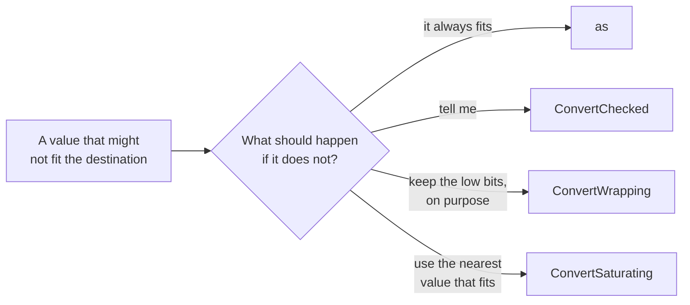

# Checked convert

::note
<!-- sync:needs:start -->

**You'll need**: [Convert](/docs/learn/convert), [Checked arithmetic](/docs/learn/checked-arithmetic), [Optional](/docs/learn/optional), [Presence](/docs/learn/presence)
<!-- sync:needs:end -->

::

`as` always produces a value of the new type, and says nothing when the old value did not fit: 300 as a `uint8` is quietly 44, and −1 is quietly 255. That is fine where the value is known to fit — and a hidden bug everywhere else. A count read from a file, a size passed in by a caller, a result of float arithmetic: none of these is known to fit.

`Core::ConvertChecked` converts the same way **and** tells you whether anything was lost.

## Converting and checking

It follows the out-parameter shape of [checked arithmetic](/docs/learn/checked-arithmetic). The converted value is written through a pointer — which also names the destination type — and the `bool` it returns is `true` when the value did not survive:

```rux
var small: uint8 = 0;
let fits = ConvertChecked(200, @small);
let tooLarge = ConvertChecked(300, @small);
let negative = ConvertChecked(-1, @small);
```

There is no type argument to write: the source type comes from the value, the destination type from the pointer. `@small` points at a `uint8`, so each call converts to `uint8`.

| Source | Destination | Lost    | Written |
| ------ | ----------- | ------- | ------- |
| `200`  | `uint8`     | `false` | 200     |
| `300`  | `uint8`     | `true`  | 44      |
| `-1`   | `uint8`     | `true`  | 255     |
| `42.0` | `int32`     | `false` | 42      |
| `42.7` | `int32`     | `true`  | 42      |
| `NaN`  | `int32`     | `true`  | 0       |

As with checked arithmetic, the pointer is written either way: the value written is what `as` would have produced. Check the flag before you trust it.

## Every way a value can be lost

"Did not survive" covers every way a conversion can go wrong:

- **Too large** for the destination: 300 into a `uint8`.
- **Negative** into an unsigned type: −1 into a `uint8`.
- **A fraction cut off**: 42.7 into an `int32` becomes 42, and the 0.7 counts as lost. 42.0 has no fraction, so it converts cleanly.
- **NaN or an infinity**, which no integer can represent.

```rux
var whole: int32 = 0;
let exact = ConvertChecked(42.0, @whole);
let fraction = ConvertChecked(42.7, @whole);
let nan = ConvertChecked(float64::NaN, @whole);
```

## Two relatives that decide for you

Sometimes the right response to a value that does not fit is not to report it but to pick something. Two functions with the same shape do that, without returning a flag:

- `ConvertWrapping` is `as` with a name that says the loss is intended — the counterpart of [wrapping arithmetic](/docs/learn/wrapping-arithmetic).
- `ConvertSaturating` clamps to the nearest value the destination can hold.

```rux
ConvertSaturating(300, @small);
ConvertSaturating(-1, @small);
```

300 becomes `255`, the largest `uint8`, and −1 becomes `0`, the smallest.



## Reporting it in a type

As with `Area` in checked arithmetic, the flag and the pointer are best kept inside a function whose return type tells the caller what can happen:

```rux
func ToByte(count: int32) -> uint8? {
    var result: uint8 = 0;
    let lost = ConvertChecked(count, @result);
    if lost {
        return none;
    }
    return result;
}
```

`ToByte(99)` is `99`; `ToByte(999)` is `none`, and the caller cannot use a wrong byte without first deciding what `none` means.

## The program

The whole lesson is one package in the [Examples repository](https://github.com/rux-lang/Examples/tree/main/Numbers/CheckedConvert). Its comments explain every step.

<!-- sync:program:start -->

```rux [Src/Main.rux]
// `as` always produces a value of the new type, and says nothing when the old value did not fit:
// 300 as a `uint8` is quietly 44, and -1 is quietly 255. That is fine where the value is known to
// fit, and a hidden bug everywhere else. `Core::ConvertChecked` converts the same way and also
// tells you whether anything was lost.
//
// It follows the out-parameter shape of the checked arithmetic: the converted value is written
// through a pointer, which also names the destination type, and the `bool` it returns is `true`
// when the value did not survive. "Did not survive" covers every way a conversion can go wrong:
// too large, negative into an unsigned type, a fraction cut off a float, and a NaN or infinity.
//
// Two relatives decide what to do with a value that does not fit, without reporting it.
// `ConvertWrapping` is `as` with a name that says the loss is intended, and `ConvertSaturating`
// clamps to the nearest value the destination can hold.
import Core::{ ConvertChecked, ConvertSaturating, float64 };
import Io::PrintLine;

// Turns a count into a byte, or `none` when it does not fit in one.
func ToByte(count: int32) -> uint8? {
    var result: uint8 = 0;
    let lost = ConvertChecked(count, @result);
    if lost {
        return none;
    }
    return result;
}

func Main() -> int {
    var small: uint8 = 0;

    // Each source value, converted to `uint8` and checked.
    let fits = ConvertChecked(200, @small);
    PrintLine("200  -> uint8  lost {:5}  value {}", fits, small);
    let tooLarge = ConvertChecked(300, @small);
    PrintLine("300  -> uint8  lost {:5}  value {}", tooLarge, small);
    let negative = ConvertChecked(-1, @small);
    PrintLine("-1   -> uint8  lost {:5}  value {}", negative, small);

    // From a float, the fraction counts as part of the value.
    var whole: int32 = 0;
    let exact = ConvertChecked(42.0, @whole);
    PrintLine("42.0 -> int32  lost {:5}  value {}", exact, whole);
    let fraction = ConvertChecked(42.7, @whole);
    PrintLine("42.7 -> int32  lost {:5}  value {}", fraction, whole);
    let nan = ConvertChecked(float64::NaN, @whole);
    PrintLine("NaN  -> int32  lost {}", nan);
    PrintLine("");

    // Saturating keeps the nearest value instead.
    ConvertSaturating(300, @small);
    PrintLine("300 saturated  {}", small);
    ConvertSaturating(-1, @small);
    PrintLine("-1 saturated   {}", small);
    PrintLine("");

    // A checking function turns the report into a type.
    PrintLine("ToByte(99)     {}", ToByte(99) ?? 0);
    match ToByte(999) {
        value? => PrintLine("ToByte(999)    {}", value),
        none => PrintLine("ToByte(999)    does not fit")
    }
    return 0;
}
```

Besides `Io`, its `Rux.toml` lists `Core` under `[Dependencies]`.
<!-- sync:program:end -->

## Run it

```sh
cd Examples/Numbers/CheckedConvert
rux run
```

<!-- sync:output:start -->

```
200  -> uint8  lost false  value 200
300  -> uint8  lost true   value 44
-1   -> uint8  lost true   value 255
42.0 -> int32  lost false  value 42
42.7 -> int32  lost true   value 42
NaN  -> int32  lost true

300 saturated  255
-1 saturated   0

ToByte(99)     99
ToByte(999)    does not fit
```

<!-- sync:output:end -->

## Common mistakes

::warning
**Reading the flag the wrong way round.**\
`true` means the value was **lost**. Name it after the problem — `lost`, `tooLarge` — so that `if lost { … }` reads correctly.
::

::warning
**A destination you cannot write.**\
The pointer must be writable. With `let small: uint8 = 0;`, `ConvertChecked(300, @small)` fails with `error: argument 1 to 'ConvertChecked' has type 'int', but parameter 'value' requires 'From'` — the message names the value, but the fix is to declare the destination with `var`.
::

::warning
**Expecting a float to round.**\
`ConvertChecked(42.7, @whole)` writes `42` and reports the value lost — it truncates, like `as`. If rounding is what you want, round first with `Round` from [Math](/docs/learn/math), then convert.
::

## Try it yourself

1. Convert `float64::Infinity` to an `int32` with `ConvertChecked`, and then with `ConvertSaturating`. What does each give?
2. Compare `ConvertWrapping(300, @small)` with `300 as uint8`.
3. Convert the integer 16777217 to a `float32` with `ConvertChecked`. Is anything lost? Look up why in [Float](/docs/learn/float).
4. Write `func ToPercent(ratio: float64) -> uint8?` that multiplies by 100 and returns `none` unless the result is a whole number from 0 to 100.

## Learn more

- [Type casts](/docs/lang/expressions/casts) in the Rux Reference
- [Convert](/docs/learn/convert) — what `as` does with a value that does not fit
- [Checked arithmetic](/docs/learn/checked-arithmetic) — the same out-parameter shape for `+`, `-` and `*`
- [Float special](/docs/learn/float-special) — NaN and infinity
