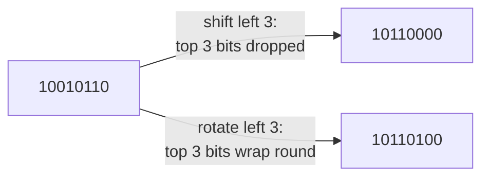

# Bit operation

::note
<!-- sync:needs:start -->

**You'll need**: [Bitwise](/docs/learn/bitwise), [Shift](/docs/learn/shift)
<!-- sync:needs:end -->

::

The bitwise operators **change** bits. A second family of functions, in `Core`, **answers questions** about them: how many are set, where the first and last set bit are, and what the value looks like turned around. They sound like curiosities and turn up everywhere — counting the flags set in a mask, finding how many bits a number needs, choosing the lowest free slot, mixing bits in a hash function.

## Counting bits

| Function        | Answers                                 |
| --------------- | --------------------------------------- |
| `CountOnes`     | How many bits are 1                     |
| `CountZeros`    | How many bits are 0                     |
| `LeadingZeros`  | How many 0 bits sit above the highest 1 |
| `TrailingZeros` | How many 0 bits sit below the lowest 1  |
| `IsPowerOfTwo`  | Whether exactly one bit is set          |

The program asks all four counting questions about one byte:

```rux
let value: uint8 = 0b0010_1100;
PrintLine("CountOnes      {}", CountOnes(value));
PrintLine("CountZeros     {}", CountZeros(value));
PrintLine("LeadingZeros   {}", LeadingZeros(value));
PrintLine("TrailingZeros  {}", TrailingZeros(value));
```

```
 bit:  7 6 5 4 3 2 1 0
       0 0 1 0 1 1 0 0
       └┬┘         └┬┘
  2 leading zeros   2 trailing zeros
```

Three ones, five zeros, two zeros above the highest one and two below the lowest. Counting from bit 0, `TrailingZeros` is also the **position** of the lowest 1 — here bit 2.

## The width matters

Each function works across the full width of its argument's type, so the same number gives different answers in different types:

```rux
let wide: uint32 = 44;
PrintLine("as uint32      LeadingZeros {}", LeadingZeros(wide));
```

44 is the same `101100` either way, but a `uint32` has 24 more bits above it, so `LeadingZeros` is `26`, not `2`. `CountOnes` would not change; the zeros-counting functions do.

That gives a neat way to ask how many bits a number really needs — its width minus the zeros above it:

```rux
PrintLine("bits needed    {}", uint8::Bits - LeadingZeros(value) as uint);
```

44 needs `6` bits: 101100.

## Powers of two

A power of two has exactly one bit set — 4096 is `1` followed by twelve zeros. `IsPowerOfTwo` checks that:

```rux
let block: uint32 = 4096;
PrintLine("4096 is power  {}", IsPowerOfTwo(block));
PrintLine("44 is power    {}", IsPowerOfTwo(wide));
```

It matters because memory sizes, alignments and hash-table capacities are usually powers of two, and code that relies on one should check it.

## Rotating instead of shifting

A shift drops the bits it pushes off the end. A **rotation** brings them round to the other side, so nothing is lost:

```rux
let pattern: uint8 = 0b1001_0110;
PrintLine("<< 3           {:08b}", pattern << 3);
PrintLine("RotateLeft 3   {:08b}", RotateLeft(pattern, 3));
PrintLine("RotateRight 3  {:08b}", RotateRight(pattern, 3));
```



The shift lost the top three bits, `100`, and brought in zeros. The rotation moved those same three bits to the bottom. Every bit survives a rotation, so `CountOnes` is `4` before and after — which is what makes rotations useful for mixing bits in hashes without throwing any away.

## The program

The whole lesson is one package in the [Examples repository](https://github.com/rux-lang/Examples/tree/main/Numbers/BitOperation). Its comments explain every step.

<!-- sync:program:start -->

```rux [Src/Main.rux]
// The bitwise operators change bits. A second family, in `Core`, answers questions about them:
// how many are set, where the first and last set bit are, and what the value looks like turned
// around. Each takes any integer type and works across its full width, so the same call gives a
// different answer on a `uint8` than on a `uint32` holding the same number.
//
//     CountOnes, CountZeros            how many bits are 1, or 0
//     LeadingZeros, TrailingZeros      how many 0 bits sit above the highest 1, or below the
//                                      lowest 1
//     RotateLeft, RotateRight          a shift where the bits that fall off one end come back at
//                                      the other, so nothing is lost
//
// These sound like curiosities and turn up everywhere: counting the flags set in a mask, finding
// how many bits a number needs, choosing the lowest free slot, and mixing bits in hash functions.
import Core::{ CountOnes, CountZeros, IsPowerOfTwo, LeadingZeros, RotateLeft, RotateRight,
               TrailingZeros, uint8 };
import Io::PrintLine;

func Main() -> int {
    let value: uint8 = 0b0010_1100;
    PrintLine("value          {:08b}  ({})", value, value);
    PrintLine("CountOnes      {}", CountOnes(value));
    PrintLine("CountZeros     {}", CountZeros(value));
    PrintLine("LeadingZeros   {}", LeadingZeros(value));
    // Counting from bit 0, TrailingZeros is also the position of the lowest 1.
    PrintLine("TrailingZeros  {}", TrailingZeros(value));
    PrintLine("");

    // The width matters: the same number in 32 bits has 24 more leading zeros.
    let wide: uint32 = 44;
    PrintLine("as uint32      LeadingZeros {}", LeadingZeros(wide));

    // How many bits a number needs: its width minus the zeros above it.
    PrintLine("bits needed    {}", uint8::Bits - LeadingZeros(value) as uint);

    // A power of two has exactly one bit set.
    let block: uint32 = 4096;
    PrintLine("4096 is power  {}", IsPowerOfTwo(block));
    PrintLine("44 is power    {}", IsPowerOfTwo(wide));
    PrintLine("");

    // A shift drops the bits it pushes off the end; a rotation brings them round to the other side.
    let pattern: uint8 = 0b1001_0110;
    PrintLine("pattern        {:08b}", pattern);
    PrintLine("<< 3           {:08b}", pattern << 3);
    PrintLine("RotateLeft 3   {:08b}", RotateLeft(pattern, 3));
    PrintLine("RotateRight 3  {:08b}", RotateRight(pattern, 3));
    PrintLine("ones survive   {} and {}", CountOnes(pattern), CountOnes(RotateLeft(pattern, 3)));
    return 0;
}
```

Besides `Io`, its `Rux.toml` lists `Core` under `[Dependencies]`.
<!-- sync:program:end -->

## Run it

```sh
cd Examples/Numbers/BitOperation
rux run
```

<!-- sync:output:start -->

```
value          00101100  (44)
CountOnes      3
CountZeros     5
LeadingZeros   2
TrailingZeros  2

as uint32      LeadingZeros 26
bits needed    6
4096 is power  true
44 is power    false

pattern        10010110
<< 3           10110000
RotateLeft 3   10110100
RotateRight 3  11010010
ones survive   4 and 4
```

<!-- sync:output:end -->

## Common mistakes

::warning
**Passing a plain literal.**\
An unsuffixed literal is an `int`, 64 bits wide. `LeadingZeros(44)` is therefore `58`, not `2`. Give the value the type whose width you mean: `let value: uint8 = 44;`.
::

::warning
**Forgetting zero.**\
Zero has no 1 bit, so it has no "lowest 1" to find. `TrailingZeros` and `LeadingZeros` of a `uint8` zero are both `8`, the full width, and `IsPowerOfTwo` of zero is `false`. Check for zero first when the answer is used as a position.
::

## Try it yourself

1. A `uint8` mask records which of eight seats are taken. Find the lowest free seat with `TrailingZeros(~taken)`. What happens when every seat is taken?
2. How many bits does 1000 need? Work it out with a `uint16` and `LeadingZeros`.
3. Rotate a `uint8` left by 8. Why is the result the value you started with?
4. Import `ReverseBits` from `Core` and print `0b0010_1100` reversed.

## Learn more

- [Bitwise operations](/docs/lang/expressions/bitwise) and [shift operations](/docs/lang/expressions/shift) in the Rux Reference
- [Bitwise](/docs/learn/bitwise) and [Shift](/docs/learn/shift) — the operators these functions complement
- [Number limit](/docs/learn/number-limit) — `Bits` and the other constants every type carries
- [Hash](/docs/learn/hash) — where rotations earn their keep
