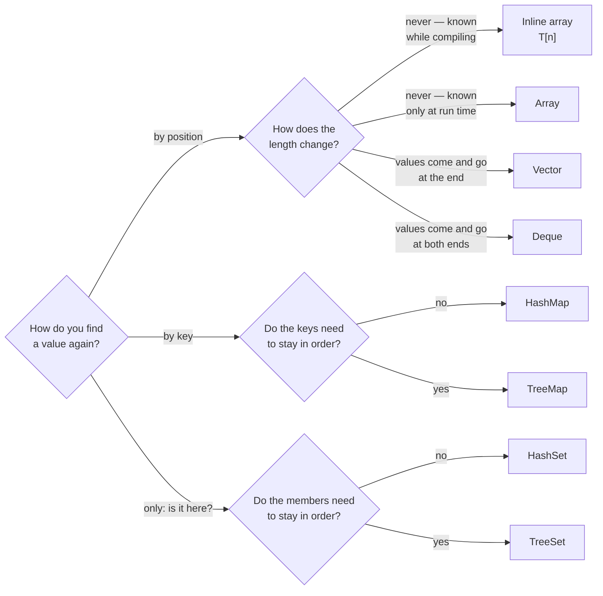

# Part 17: Collections

Until now every sequence had a length fixed while compiling. Real data rarely does: lines read from a file, orders placed today, words in a text. This part introduces the containers of the `Collections` package, which hold as many values as arrive and manage their own memory through an allocator. By the end you will know seven of them, what each is quick and slow at, and which to reach for.

## What you will learn

- `Vector<T>`, the growable sequence, and the difference between its length and its capacity.
- `Array<T>`, a sequence whose length is chosen at run time and then fixed.
- `Deque<T>`, quick at both ends — the natural queue.
- `HashMap<K, V>` and `HashSet<T>`: lookup by key and membership tests in about constant time, with no order.
- `TreeMap<K, V>` and `TreeSet<T>`: the same, kept sorted, with ordered questions such as `Floor`, `Ceiling` and `Range`.
- The pattern every collection shares: made from an allocator, fallible where it needs memory, optional where a value may be missing, and freed by its destructor.

## Which collection?



When in doubt, start with a `Vector` for a list and a `HashMap` for lookups. Switch to a `Deque` when values join at the front, and to a tree when the order of the keys is part of the answer.

## Lessons

<!-- sync:lessons:start -->

|      | Lesson                                     | What you will learn                                            |
| ---- | ------------------------------------------ | -------------------------------------------------------------- |
| 17.1 | [Vector](/docs/learn/vector)               | a growable array that manages its own memory and capacity      |
| 17.2 | [Dynamic array](/docs/learn/dynamic-array) | `Collections::Array`, and how it differs from an inline array  |
| 17.3 | [Deque](/docs/learn/deque)                 | add and remove at both ends, and see where that beats a vector |
| 17.4 | [Hash map](/docs/learn/hash-map)           | look values up by key                                          |
| 17.5 | [Hash set](/docs/learn/hash-set)           | test membership with a hash set                                |
| 17.6 | [Tree map](/docs/learn/tree-map)           | keep keys in order, and walk them in order                     |
| 17.7 | [Tree set](/docs/learn/tree-set)           | keep a set of values in order                                  |

<!-- sync:lessons:end -->

## Before you start

Every collection takes an [allocator](/docs/learn/allocator), so finish [Part 15: Memory](/docs/learn/memory) first. The lessons also lean on [generic types](/docs/learn/generic-type) from Part 13, a [fallible `Main`](/docs/learn/fallible-main) and [`?`](/docs/learn/propagate) from Part 9, [optionals](/docs/learn/optionals) from Part 8, [moves](/docs/learn/move) from Part 11 and [Comparable](/docs/learn/comparable) from Part 12. Each lesson's package is in the Examples repository's `Collections/` folder:

```sh
cd Examples/Collections/Vector
rux run
```

## After this part

[Part 18: Algorithms](/docs/learn/algorithms) sorts, searches and folds the values you can now collect. Parts 18 to 24 tour the standard packages and can be read in any order. Before moving on, try the checkpoint projects [Word count](/docs/learn/word-count), which counts words in a hash map and prints them in order through a tree map, and [Inventory](/docs/learn/inventory), a shop's stock kept as structs in a vector.

For the rules behind the inline sequences these containers are compared with, see [Arrays](/docs/lang/arrays/overview) and [Slices](/docs/lang/slices/overview) in the Rux Reference.
