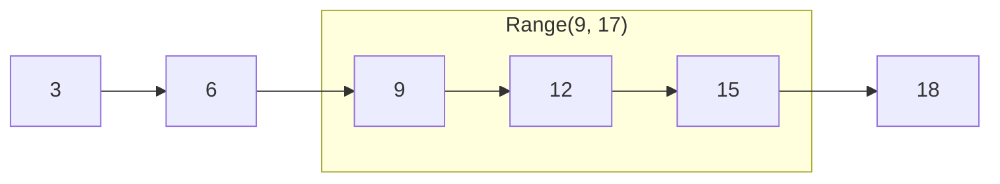

# Tree map

::note
<!-- sync:needs:start -->

**You'll need**: [Hash map](/docs/learn/hash-map), [Comparable](/docs/learn/comparable), [Iterable](/docs/learn/iterable), [Presence](/docs/learn/presence)
<!-- sync:needs:end -->

::

A [hash map](/docs/learn/hash-map) finds an entry fast and keeps no order: walk it, and the entries come out however the hashing scattered them. For a stock list that is fine. For temperatures taken through the day, a timetable or a leaderboard, the order **is** the information.

A `TreeMap<K, V>` keeps its keys sorted. However they were inserted, a walk visits them smallest first, and questions about order become cheap: the first key, the last, the nearest one below a bound, everything between two bounds. A lookup costs a little more than a hash map's — the map is searched rather than jumped into — and that is the trade.

## Making a tree map

A hash map was told how to hash and compare keys for equality. A tree map is told how to put two keys **in order**:

```rux
var readings = TreeMap<int32, int32>(allocator, CompareInt32);
```

`CompareInt32` takes two `int32` keys and returns an `Ordering` — less, equal or greater — as in the [Comparable](/docs/learn/comparable) lesson. `Collections` has the same for other key types, such as `CompareSlice` for text.

## Keys arrive in any order

Temperatures, keyed by the hour they were taken, arrive out of order:

```rux
readings.Insert(15, 21)?;
readings.Insert(6, 9)?;
readings.Insert(12, 19)?;
readings.Insert(9, 14)?;
readings.Insert(18, 16)?;
readings.Insert(3, 7)?;
```

A `for` loop walks the map in key order anyway. Each entry is a `KeyValue`, with `key` and `value` fields:

```rux
for entry in readings {
    PrintLine("  {:2}:00  {} C", entry.key, entry.value);
}
```

The hours come out `3, 6, 9, 12, 15, 18`. `{:2}` pads each hour to two characters, so the colons line up.

## Walking part of the map

`Range(start, end)` walks only the keys from `start` up to, but not including, `end` — the same half-open shape as `a..b`. It starts at `start` rather than at the smallest key, so it does not visit the entries it skips:

```rux
for entry in readings.Range(9, 17) {
    PrintLine("  {:2}:00  {} C", entry.key, entry.value);
}
```



## Ordered questions

A tree map can answer questions a hash map cannot:

| Method       | Returns the entry with…              | Here                   |
| ------------ | ------------------------------------ | ---------------------- |
| `First()`    | the smallest key                     | 3:00                   |
| `Last()`     | the largest key                      | 18:00                  |
| `Floor(k)`   | the largest key at or **below** `k`  | `Floor(14)` is 12:00   |
| `Ceiling(k)` | the smallest key at or **above** `k` | `Ceiling(14)` is 15:00 |

Each returns an optional `KeyValue`, since an empty map has no first key and a bound may have nothing below it. A `match` unwraps it:

```rux
match readings.Floor(14) {
    entry? => PrintLine("latest by 14:00 was {}:00, {} C", entry.key, entry.value),
    none => PrintLine("nothing by 14:00")
}
```

No reading was taken at 14:00, so `Floor` finds the latest before it — 12:00, 19 °C.

## Looking up a key

Lookup reads the same as a hash map's. `Get` returns `int32?`, and `ContainsKey` a `bool`:

```rux
PrintLine("at 12:00 it was {} C", readings.Get(12) ?? 0);
PrintLine("any reading at 13:00? {}", readings.ContainsKey(13));
```

`Insert`, `Replace`, `Remove`, `Get` and `ContainsKey` all work as they do on a hash map; only the order, and the questions it makes possible, are new.

## The program

The whole lesson is one package in the [Examples repository](https://github.com/rux-lang/Examples/tree/main/Collections/TreeMap). Its comments explain every step.

<!-- sync:program:start -->

```rux [Src/Main.rux]
// A hash map finds an entry fast and keeps no order: walk it, and the entries come out however
// the hashing scattered them.
//
// A `TreeMap<K, V>` keeps its keys sorted instead. However they were inserted, a walk visits
// them smallest first, and questions about order become cheap: the first key, the last, the
// nearest one below a bound, everything between two bounds. A lookup costs a little more than a
// hash map's — the map is searched rather than jumped into — and that is the trade.
import Allocator::{ Allocator, SystemAllocator };
import Collections::{ CollectionError, CompareInt32, TreeMap };
import Io::PrintLine;

func Main() -> ! CollectionError {
    var system = SystemAllocator();
    let allocator: Allocator = system;

    // A tree map is told how to put two keys in order, where a hash map was told how to hash and
    // compare them. `CompareInt32` returns an `Ordering`, as in the Comparable lesson.
    var readings = TreeMap<int32, int32>(allocator, CompareInt32);

    // Temperatures, keyed by the hour they were taken, arriving out of order.
    readings.Insert(15, 21)?;
    readings.Insert(6, 9)?;
    readings.Insert(12, 19)?;
    readings.Insert(9, 14)?;
    readings.Insert(18, 16)?;
    readings.Insert(3, 7)?;

    // A `for` loop walks the map in key order. Each entry is a `KeyValue`, with `key` and `value`.
    PrintLine("all readings");
    for entry in readings {
        PrintLine("  {:2}:00  {} C", entry.key, entry.value);
    }

    // `Range(start, end)` walks only the keys from `start` up to, but not including, `end` — the
    // same half-open shape as `a..b`. It starts at `start` rather than at the smallest key.
    PrintLine("working hours, 9 to 17");
    for entry in readings.Range(9, 17) {
        PrintLine("  {:2}:00  {} C", entry.key, entry.value);
    }

    // The ordered questions return optionals, since an empty map has no first key and a bound
    // may have nothing below it. `Floor` finds the largest key at or below the one asked for.
    match readings.Floor(14) {
        entry? => PrintLine("latest by 14:00 was {}:00, {} C", entry.key, entry.value),
        none => PrintLine("nothing by 14:00")
    }
    match readings.First() {
        entry? => PrintLine("first reading at {}:00", entry.key),
        none => PrintLine("no readings")
    }

    // Lookup reads the same as a hash map's: `Get` returns `int32?`.
    PrintLine("at 12:00 it was {} C", readings.Get(12) ?? 0);
    PrintLine("any reading at 13:00? {}", readings.ContainsKey(13));
}
```

Besides `Io`, its `Rux.toml` lists `Allocator` and `Collections` under `[Dependencies]`.
<!-- sync:program:end -->

## Run it

```sh
cd Examples/Collections/TreeMap
rux run
```

<!-- sync:output:start -->

```
all readings
   3:00  7 C
   6:00  9 C
   9:00  14 C
  12:00  19 C
  15:00  21 C
  18:00  16 C
working hours, 9 to 17
   9:00  14 C
  12:00  19 C
  15:00  21 C
latest by 14:00 was 12:00, 19 C
first reading at 3:00
at 12:00 it was 19 C
any reading at 13:00? false
```

<!-- sync:output:end -->

## Common mistakes

::warning
**Expecting `Range` to include its end.**\
`Range(9, 17)` stops **before** 17: a reading taken at 17:00 would not be visited. Pass the first key you do **not** want as the end, as with `a..b`.
::

::warning
**Reading a field through the optional.**\
`readings.Floor(16).key` fails with `error: type 'KeyValue<int32, int32>?' has no field 'key'`. The entry may not exist; unwrap it with a `match` or `?? return` before reading `key` and `value`.
::

::warning
**Choosing a tree map by habit.**\
A tree map pays for its order on every insert and lookup. When nothing ever asks for order — no sorted walk, no `Floor`, no `Range` — a [hash map](/docs/learn/hash-map) does the same job faster.
::

## Try it yourself

1. Print the reading nearest **after** 10:00 with `Ceiling(10)`, and the last reading of the day with `Last()`.
2. Walk the morning readings, from midnight up to but not including noon.
3. Remove the 3:00 reading with `Remove(3)`, and check that `First()` now answers 6:00.
4. Make a `TreeMap<char8[..], int32>` with `CompareSlice`, insert a few names with ages, and print them in alphabetical order.

## Learn more

- [Hash map](/docs/learn/hash-map) — the unordered map, and the methods both share
- [Tree set](/docs/learn/tree-set) — the ordered set, built the same way
- [Comparable](/docs/learn/comparable) — `Ordering`, and how two values are put in order
- [Range](/docs/learn/range) — the half-open `a..b` that `Range(start, end)` mirrors
