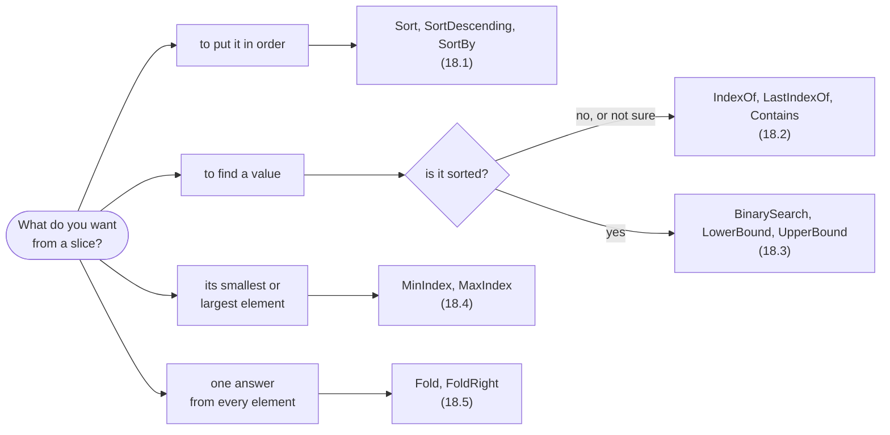

# Part 18: Algorithms

From here on the course tours the standard packages, and it starts with the one every program reaches for sooner or later. The `Algorithms` package is a set of generic functions over slices: sort them, search them, find their extremes, fold them into one answer. Because every function takes a slice, one function serves an array of any length, part of an array, or the contents of a collection — and none of them ever allocates memory.

## What you will learn

- Sorting a slice in place through a writable view, by the element's own `<` or by an order function of yours.
- Searching any slice from the front, and handling the `none` that "not found" is.
- Searching sorted data in logarithmic time, and the promise that comes with it.
- The smaller of two values, and the position of the smallest in a slice — which may not exist.
- Collapsing a slice into one answer with `Fold` and a step function.

## Which function?



The functions share a few habits, and knowing them makes the rest of the package predictable:

| Habit                                               | Functions in this part                                           |
| --------------------------------------------------- | ---------------------------------------------------------------- |
| Take a writable view, `var T[..]`, and change it    | `Sort`, `SortDescending`, `SortBy`                               |
| Answer with `uint?`, `none` when there is no answer | `IndexOf`, `LastIndexOf`, `BinarySearch`, `MinIndex`, `MaxIndex` |
| Always have an answer                               | `Contains`, `LowerBound`, `UpperBound`, `Min`, `Max`, `Fold`     |
| Take a named function for the part that varies      | `SortBy`, `Fold`, `FoldRight`                                    |

## Lessons

<!-- sync:lessons:start -->

|      | Lesson                                     | What you will learn                                 |
| ---- | ------------------------------------------ | --------------------------------------------------- |
| 18.1 | [Sort](/docs/learn/sort)                   | sort a slice in place                               |
| 18.2 | [Search](/docs/learn/search)               | find a value in a slice, and handle not finding it  |
| 18.3 | [Binary search](/docs/learn/binary-search) | find a value in sorted data quickly                 |
| 18.4 | [Min and max](/docs/learn/min-max)         | the smallest and largest values, and the empty case |
| 18.5 | [Fold](/docs/learn/fold)                   | combine all elements into one value with a function |

<!-- sync:lessons:end -->

## Before you start

The lessons lean on [Slice](/docs/learn/slice) and [Writable slice](/docs/learn/writable-slice) from Part 5, [Callback](/docs/learn/callback) and [Generic](/docs/learn/generic) from Part 4, [Presence](/docs/learn/presence) and [Coalesce](/docs/learn/coalesce) from [Part 8: Optionals](/docs/learn/optionals), and [Comparable](/docs/learn/comparable) from Part 12. Each lesson's package is in the Examples repository's `Algorithms/` folder:

```sh
cd Examples/Algorithms/Sort
rux run
```

## After this part

The checkpoint project [Statistics](/docs/learn/statistics) puts the whole part to work: it sorts, finds extremes and folds slices of numbers into a count, a mean, a variance and a median, including the awkward cases of one value and none. Then [Part 19: Files](/docs/learn/files) leaves memory behind and reads and writes the disk.

For the rules underneath this part, see [Slices](/docs/lang/slices/overview), [Function types](/docs/lang/functions/function-types) and [Generic functions](/docs/lang/generics/overview) in the Rux Reference.
