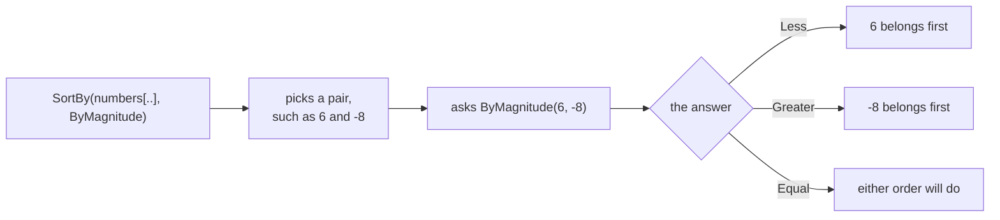

# Sort

::note
<!-- sync:needs:start -->

**You'll need**: [Writable slice](/docs/learn/writable-slice), [Callback](/docs/learn/callback), [Comparable](/docs/learn/comparable)
<!-- sync:needs:end -->

::

Sorting puts a sequence in order, smallest first. It is the first job of the `Algorithms` package, the standard package this part tours: a set of generic functions that work on slices of any element type. `Sort` rearranges the elements **in place** — where they already are, with nothing copied and nothing allocated — so the array itself comes out in order.

Like every standard package, `Algorithms` is a dependency you name in `Rux.toml`, next to `Io`:

```toml
[Dependencies]
Algorithms = { Namespace = "Rux", Version = "*" }
```

## Sorting needs a writable view

In place means `Sort` writes into your array, so it asks for the kind of slice that may write: `var T[..]`, from [Writable slice](/docs/learn/writable-slice).

```rux
var numbers: int[7] = [5, -8, 3, -1, 6, 0, -4];
Show("start       ", numbers);

Sort(numbers[..]);
Show("sorted      ", numbers);
```

`numbers[..]` is a writable view of the whole array. Plain `numbers` would not do: an array turns into a slice on its own, but only into a read-only one, and a sort through a read-only view could not move anything. `Show` takes `int[..]` because it only reads, so plain `numbers` is fine there.

Because `Sort` takes a slice, not an array, one function serves every length, any part of an array, and the contents of a [Vector](/docs/learn/vector), whose `AsMutableSlice` hands out the same kind of writable view.

| Argument        | `numbers` declared with | Gives                             | `Sort` accepts it?     |
| --------------- | ----------------------- | --------------------------------- | ---------------------- |
| `numbers`       | `var`                   | a read-only view                  | no                     |
| `numbers[..]`   | `var`                   | a writable view of every element  | yes                    |
| `numbers[1..6]` | `var`                   | a writable view of indexes 1 to 5 | yes — sorts only those |
| `numbers[..]`   | `let`                   | a read-only view                  | no                     |

## Three ways to order

`Sort` uses the element's own `<`, so the result runs from smallest to largest. `SortDescending` turns that round:

```rux
SortDescending(numbers[..]);
Show("descending  ", numbers);
```

When the order you want is not the type's own, `SortBy` takes it as a function. Given two elements, the function answers with an `Ordering` — `Less`, `Equal` or `Greater` — the same three answers [Comparable](/docs/learn/comparable) introduced. This one orders numbers by their distance from zero, whatever the sign:

```rux
func ByMagnitude(left: int, right: int) -> Ordering {
    if Magnitude(left) < Magnitude(right) {
        return Ordering::Less;
    }
    if Magnitude(right) < Magnitude(left) {
        return Ordering::Greater;
    }
    return Ordering::Equal;
}
```

The function is passed by name, the way [Callback](/docs/learn/callback) passed one — not called:

```rux
SortBy(numbers[..], ByMagnitude);
```



`SortBy` repeats that with other pairs until the slice is in order. It decides which pairs to ask about and how often; your function only ever answers for one pair. `Ordering` lives in `Core`, which is why the lesson imports `Core::Ordering` and lists `Core` as a dependency.

## Sorting part of an array

A range picks out part of the array, and only that part is sorted:

```rux
var part: int[7] = [9, 7, 5, 3, 1, 8, 6];
Sort(part[1..6]);
Show("middle only ", part);
```

`1..6` covers indexes 1 to 5. The 9 at index 0 and the 6 at index 6 are outside the view, so they stay exactly where they were, and the output reads `9 1 3 5 7 8 6`.

## Equal elements may swap

`Sort` and `SortBy` are not **stable**: elements the order calls equal may come out in either order. With `ByMagnitude`, `-1` and `1` are equal, so a slice holding both may put either one first. The sort is deterministic — the same input gives the same output every time — but it promises nothing about ties.

Usually that does not matter. When it does — sort a table by one column, then by another, and you want the first order kept within each group — `StableSort` and `StableSortBy` keep equal elements in the order they arrived. The price is storage: they ask you for a `scratch` slice as long as the one being sorted, because the `Algorithms` package never allocates memory on its own.

## The program

The whole lesson is one package in the [Examples repository](https://github.com/rux-lang/Examples/tree/main/Algorithms/Sort). Its comments explain every step.

<!-- sync:program:start -->

```rux [Src/Main.rux]
// Sorting puts a sequence in order, smallest first. `Sort`, from the Algorithms package, sorts in
// place: it rearranges the elements where they already are instead of building a sorted copy, so
// nothing is allocated and the array itself comes out in order.
//
// That is why it asks for a writable slice, `var T[..]`, the kind the WritableSlice lesson
// introduced. Because it takes a slice rather than an array, the same function sorts an array of
// any length, a part of one, or the contents of a vector.
//
// `Sort` uses the element's own `<`. `SortBy` takes the order as a function instead: given two
// elements it answers `Less`, `Equal` or `Greater`, the `Ordering` from the Comparable lesson.
// Neither sort is stable, so elements the order calls equal may end up in either order.
import Algorithms::{ Sort, SortBy, SortDescending };
import Core::Ordering;
import Io::{ Print, PrintLine };

func Show(label: char8[..], items: int[..]) {
    Print("{}", label);
    for item in items {
        Print(" {}", item);
    }
    PrintLine();
}

func Magnitude(value: int) -> int {
    return value < 0 ? -value : value;
}

// A custom order: closest to zero first, whatever the sign.
func ByMagnitude(left: int, right: int) -> Ordering {
    if Magnitude(left) < Magnitude(right) {
        return Ordering::Less;
    }
    if Magnitude(right) < Magnitude(left) {
        return Ordering::Greater;
    }
    return Ordering::Equal;
}

func Main() -> int {
    var numbers: int[7] = [5, -8, 3, -1, 6, 0, -4];
    Show("start       ", numbers);

    // `numbers[..]` asks for a writable view of the whole array. Writing just `Sort(numbers)` is
    // rejected: an array becomes a slice on its own, but only a read-only one.
    Sort(numbers[..]);
    Show("sorted      ", numbers);

    SortDescending(numbers[..]);
    Show("descending  ", numbers);

    // The function is passed by name, not called. `SortBy` calls it whenever it compares a pair.
    SortBy(numbers[..], ByMagnitude);
    Show("by magnitude", numbers);

    // A range sorts just that part. The two ends are left where they were.
    var part: int[7] = [9, 7, 5, 3, 1, 8, 6];
    Sort(part[1..6]);
    Show("middle only ", part);
    return 0;
}
```

Besides `Io`, its `Rux.toml` lists `Algorithms` and `Core` under `[Dependencies]`.
<!-- sync:program:end -->

## Run it

```sh
cd Examples/Algorithms/Sort
rux run
```

<!-- sync:output:start -->

```
start        5 -8 3 -1 6 0 -4
sorted       -8 -4 -1 0 3 5 6
descending   6 5 3 0 -1 -4 -8
by magnitude 0 -1 3 -4 5 6 -8
middle only  9 1 3 5 7 8 6
```

<!-- sync:output:end -->

## Common mistakes

::warning
**Passing the array itself.**\
`Sort(numbers)` fails with `error: argument 1 to 'Sort' has type 'int[7]', but parameter 'items' requires 'var T[..]'`. An array becomes a read-only view on its own; write `Sort(numbers[..])` to hand over a writable one.
::

::warning
**Sorting a `let` array.**\
Declare the array with `let` and even `Sort(numbers[..])` fails, this time naming `'int[..]'` — a read-only view. A view can never grant more than its array allows, so an array you mean to sort must be `var`.
::

::warning
**Sorting a type that has no `<`.**\
Sort an array of a struct that declares no `<` and the error appears inside the package: `error: operator '<' is not defined for 'P'`, with a note naming the call that instantiated the sort and `help: declare '<' on 'P'`. Either give the struct a `<`, as in [Operator overload](/docs/learn/operator-overload), or sort it with `SortBy` and an order function.
::

::warning
**Calling the order function instead of passing it.**\
`SortBy(numbers[..], ByMagnitude(1, 2))` is rejected. `ByMagnitude(1, 2)` is one `Ordering` value, not a way to compare; pass the name alone and let `SortBy` do the calling.
::

::warning
**A range that runs past the end.**\
`Sort(part[1..9])` on a seven-element array compiles, and stops the program with `Panic: index out of range` when it runs. The view is checked when it is made, before anything is sorted.
::

## Try it yourself

1. Sort an array of `float64` values, and then an array of `char8` letters. Nothing about `Sort` changes.
2. Sort only the first three elements of `numbers` with `numbers[..3]`, and predict the output before you run it.
3. Write an order function `ByLastDigit` for non-negative numbers that compares `value % 10`, and sort `[42, 17, 5, 30, 21]` with it.
4. Sort `[3, -1, -3, 1, 2, -2]` with `SortBy` and `ByMagnitude`. Then sort it with `StableSortBy(mixed[..], scratch[..], ByMagnitude)`, where `scratch` is a `var int[6]`, and check that each pair of equals keeps its original order.

## Learn more

- [Slicing](/docs/lang/arrays/overview#arrays-as-slices) and [Function types](/docs/lang/aliases/function-types) in the Rux Reference
- [Writable slice](/docs/learn/writable-slice) — the `var T[..]` view a sort writes through
- [Comparable](/docs/learn/comparable) — `Ordering`, and giving your own types an order
- [Binary search](/docs/learn/binary-search) — what sorted data lets you do quickly
