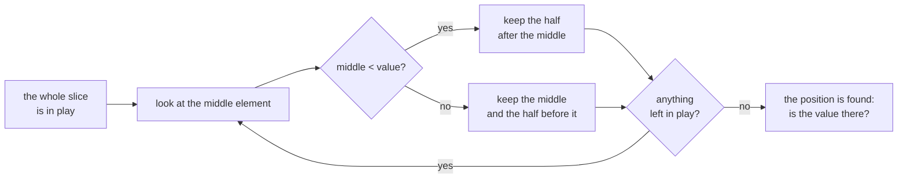

# Binary search

::note
<!-- sync:needs:start -->

**You'll need**: [Search](/docs/learn/search), [Sort](/docs/learn/sort)
<!-- sync:needs:end -->

::

[Search](/docs/learn/search) looked at every element in turn. When the slice is already **sorted**, that is wasted effort. A **binary search** checks the middle element, throws away the half that cannot hold the value, and repeats on the half that is left. Every step halves the work, so a million elements take about twenty steps instead of a million.

## Halving, step by step

`BinarySearch` answers like `IndexOf`, with a `uint?` that is `none` when the value is absent:

```rux
func Report(sorted: int[..], value: int) {
    match BinarySearch(sorted, value) {
        at? => PrintLine("{} found at {}", value, at),
        none => PrintLine("{} not found, would go at {}", value, LowerBound(sorted, value))
    }
}
```

Here is how it finds 8 in `[2, 3, 5, 5, 5, 8, 13, 21]`. It keeps a range of positions that may still hold the answer and looks at the middle one:

| Step | Still in play | Middle | Element there | So the answer is…    |
| ---- | ------------- | ------ | ------------- | -------------------- |
| 1    | 0 to 7        | 4      | 5             | after 4: keep 5 to 7 |
| 2    | 5 to 7        | 6      | 13            | before 6: keep 5     |
| 3    | 5             | 5      | 8             | found at 5           |



Three looks instead of six. The search never reads 2, 3 or 21 at all — and it can only skip them because the order promises what they hold.

## Where a value would go

Notice what the search actually narrows down to: a **position**, the first one whose element is not less than the value. `LowerBound` returns exactly that, and `BinarySearch` is `LowerBound` plus one check — is the element at that position equal to the value?

So `LowerBound` is useful even when the value is absent. It says where the value _would_ go to keep the slice sorted:

```rux
Report(sorted, 4);
Report(sorted, 99);
```

4 belongs at index 2, between the 3 and the first 5. 99 is larger than everything, so its place is 8, the length — one past the end. A position always exists, so `LowerBound` returns a plain `uint`, never `none`.

## Bracketing duplicates

`UpperBound` is the last position where the value could go: one past the last equal element. Between the two bounds lie all the equal elements:

```rux
let first = LowerBound(sorted, 5);
let after = UpperBound(sorted, 5);
PrintLine("5 runs from {} to {}, {} of them", first, after, after - first);
```

The 5s occupy indexes 2, 3 and 4, so the bounds are 2 and 5, and `after - first` counts them without a scan. With duplicates, `BinarySearch` reports the first of them — index 2 — because it is built on `LowerBound`.

| Function                     | Returns | Means                                       |
| ---------------------------- | ------- | ------------------------------------------- |
| `BinarySearch(items, value)` | `uint?` | where an equal element is; `none` if absent |
| `LowerBound(items, value)`   | `uint`  | the first place the value could go          |
| `UpperBound(items, value)`   | `uint`  | the last place the value could go           |

## The promise nothing checks

A binary search is only correct on sorted data, and nothing checks that the data is sorted. Checking would mean reading every element — the very scan a binary search exists to avoid. On unsorted data it still answers, and the answer is meaningless:

```rux
let shuffled: int[3] = [9, 1, 5];
Report(shuffled, 9);
```

9 is right there at index 0. But the first look lands on the 1 in the middle; in sorted data, everything before a 1 would be smaller than 9, so the search drops that half and never looks left again. It reports 9 as not found.

Sort first, with [Sort](/docs/learn/sort), or keep the data sorted as you add to it — `LowerBound` tells you where each new value goes. When in doubt, `IsSorted(items)` answers with a `bool`, at the cost of the full scan.

## The program

The whole lesson is one package in the [Examples repository](https://github.com/rux-lang/Examples/tree/main/Algorithms/BinarySearch). Its comments explain every step.

<!-- sync:program:start -->

```rux [Src/Main.rux]
// When a slice is already sorted, a search does not have to look at every element. A binary
// search checks the middle, discards the half that cannot hold the value, and repeats, so a
// million elements take about twenty steps instead of a million.
//
// `BinarySearch` answers like `IndexOf`, with a `uint?`. With duplicates it reports the first.
// `LowerBound` answers a different question: the first position where the value could be
// inserted without breaking the order. That is a position, not a match, so it is a plain `uint`
// and never `none`. `UpperBound` is the last such position, and the equal elements lie between.
//
// The surprise is the promise that comes with it. The slice must be sorted, and nothing checks:
// checking would cost the very scan a binary search exists to avoid. On unsorted data the search
// still answers, and the answer is meaningless.
import Algorithms::{ BinarySearch, LowerBound, UpperBound };
import Io::PrintLine;

func Report(sorted: int[..], value: int) {
    match BinarySearch(sorted, value) {
        at? => PrintLine("{} found at {}", value, at),
        none => PrintLine("{} not found, would go at {}", value, LowerBound(sorted, value))
    }
}

func Main() -> int {
    let sorted: int[8] = [2, 3, 5, 5, 5, 8, 13, 21];

    Report(sorted, 8);
    Report(sorted, 4);
    Report(sorted, 99);

    // Three 5s. The bounds bracket them, and their difference counts them without a scan.
    let first = LowerBound(sorted, 5);
    let after = UpperBound(sorted, 5);
    PrintLine("5 runs from {} to {}, {} of them", first, after, after - first);
    Report(sorted, 5);

    // 9 is present, but the data is not sorted. The first step looks at the 1 in the middle,
    // concludes 9 must be to its right, and never looks left again.
    let shuffled: int[3] = [9, 1, 5];
    Report(shuffled, 9);
    return 0;
}
```

Besides `Io`, its `Rux.toml` lists `Algorithms` under `[Dependencies]`.
<!-- sync:program:end -->

## Run it

```sh
cd Examples/Algorithms/BinarySearch
rux run
```

<!-- sync:output:start -->

```
8 found at 5
4 not found, would go at 2
99 not found, would go at 8
5 runs from 2 to 5, 3 of them
5 found at 2
9 not found, would go at 3
```

<!-- sync:output:end -->

## Common mistakes

::warning
**Searching data that is not sorted.**\
Nothing stops `BinarySearch` on unsorted data, and nothing reports it either: the program compiles, runs and prints a wrong answer, as the `[9, 1, 5]` example shows. The only cure is to sort first, or to know the data arrives sorted.
::

::warning
**Matching a bound as if it were optional.**\
A bound is always a position. `match LowerBound(sorted, 4) { at? => …, none => … }` fails with `error: a presence suffix needs an optional subject, but the matched value has type 'uint'`, and `LowerBound(sorted, 4) ?? 0` with `error: operator '??' requires an optional left operand, but found 'uint'`.
::

::warning
**Reading the lower bound as a match.**\
`LowerBound(sorted, 4)` is 2, and the element at index 2 is a 5, not a 4. A bound says where a value would go, not that it is there. Compare the element with the value, or use `BinarySearch`, before treating the position as a hit.
::

## Try it yourself

1. Search for 2 and for 21, the two ends. How many steps does each take? Trace them as the table does.
2. Count the 4s in `sorted` with `UpperBound` and `LowerBound`. What do the two bounds tell you when the count is zero?
3. Call `EqualRange(sorted, 5)`. It returns a range; print its `start` and `end` and compare them with the bounds above.
4. Print `IsSorted(shuffled)`, then sort `shuffled` with `Sort` (it must become `var`) and search for 9 again.

## Learn more

- [Ranges](/docs/lang/ranges/overview) in the Rux Reference
- [Search](/docs/learn/search) — the linear search that works on anything
- [Sort](/docs/learn/sort) — getting the data into the order a binary search needs
- [Tree map](/docs/learn/tree-map) — a collection that keeps its keys sorted for you
