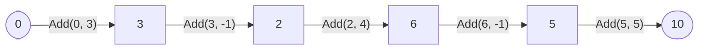

# Fold

::note
<!-- sync:needs:start -->

**You'll need**: [Callback](/docs/learn/callback), [Slice](/docs/learn/slice), [Literal](/docs/learn/literal)
<!-- sync:needs:end -->

::

Many loops over a slice share one shape: start with an answer, walk the elements, and update the answer from each one. A total, a product, a count. `Fold` is that loop written once, so you only write the part that differs — the update.

## The step function

You give `Fold` three things: the slice, the starting answer, and a **step** function. The step takes the answer so far and one element, and returns the new answer:

```rux
func Add(total: int, value: int) -> int {
    return total + value;
}
```

```rux
let values: int[5] = [3, -1, 4, -1, 5];
PrintLine("sum        {}", Fold(values, 0, Add));
PrintLine("product    {}", Fold(values, 1, Multiply));
```

`Fold` calls `Add` once per element, feeding each answer into the next call:



Written as one expression, `Fold(items, initial, step)` computes `step(…step(step(initial, a), b)…, z)`. The product works the same way from a start of 1 — the value that leaves a product unchanged, as 0 leaves a sum unchanged.

The step is a named function, passed by name as in [Callback](/docs/learn/callback). Rux has no closures, so a step cannot reach into the caller's local variables: everything it needs arrives as its two arguments.

## The starting answer

The starting answer is also what an empty slice gives back, untouched:

```rux
PrintLine("empty sum  {}", Fold(values[..0], 0, Add));
```

There are no elements, so `Add` is never called, and the result is the 0 that went in. That is why the start matters: a sum must start at 0 and a product at 1, or every answer is off by the starting value — and the empty case shows it most plainly.

## Left or right

When the step is like `+`, the order of the elements does not change the answer. When it is not, it does. `AppendDigit` shifts a number one decimal place left and puts the digit in the gap:

```rux
func AppendDigit(number: int, digit: int) -> int {
    return number * 10 + digit;
}
```

`Fold` walks from the front; `FoldRight` walks from the back, with the same step:

```rux
let digits: int[3] = [4, 0, 7];
PrintLine("left       {}", Fold(digits, 0, AppendDigit));
PrintLine("right      {}", FoldRight(digits, 0, AppendDigit));
```

| Call                                | Steps            | Result |
| ----------------------------------- | ---------------- | ------ |
| `Fold(digits, 0, AppendDigit)`      | 0 → 4 → 40 → 407 | 407    |
| `FoldRight(digits, 0, AppendDigit)` | 0 → 7 → 70 → 704 | 704    |

## The answer need not be an element

Nothing says the answer has the element's type. `Fold` has two type parameters: `T` for the elements and `A` for the answer, and the step is a `func(A, T) -> A`. This step counts `int` elements into a `uint`:

```rux
func CountNegative(count: uint, value: int) -> uint {
    return value < 0 ? count + 1 : count;
}
```

```rux
PrintLine("negatives  {}", Fold(values, 0, CountNegative));
```

The unsuffixed `0` takes its type from the step function — `A` is `uint` — just as a literal takes the type of its partner in [Literal](/docs/learn/literal).

For the two most common folds, the package has them ready-made: `Sum(items, initial)` adds with `+` and `Product(items, initial)` multiplies with `*`, so `Sum(values, 0)` is 10 with no step function to write.

## The program

The whole lesson is one package in the [Examples repository](https://github.com/rux-lang/Examples/tree/main/Algorithms/Fold). Its comments explain every step.

<!-- sync:program:start -->

```rux [Src/Main.rux]
// Many loops over a slice share one shape: start with an answer, walk the elements, and update
// the answer from each one. A total, a product, a count. `Fold` is that loop written once. You
// give it the slice, the starting answer, and a *step* function, which takes the answer so far and
// one element and returns the new answer:
//
//     Fold(items, initial, step)    computes    step(...step(step(initial, a), b)..., z)
//
// The step must be a named function, passed by name as in the Callback lesson. Rux has no
// closures, so a step cannot reach into the caller's locals; everything it needs arrives as its
// two arguments. Note also that the answer need not have the element's type: the last step below
// counts `int` elements into a `uint`.
import Algorithms::{ Fold, FoldRight };
import Io::PrintLine;

func Add(total: int, value: int) -> int {
    return total + value;
}

func Multiply(product: int, value: int) -> int {
    return product * value;
}

// Shifts the number one decimal place left and puts the digit in the gap.
func AppendDigit(number: int, digit: int) -> int {
    return number * 10 + digit;
}

func CountNegative(count: uint, value: int) -> uint {
    return value < 0 ? count + 1 : count;
}

func Main() -> int {
    let values: int[5] = [3, -1, 4, -1, 5];
    PrintLine("sum        {}", Fold(values, 0, Add));
    PrintLine("product    {}", Fold(values, 1, Multiply));

    // The starting answer is what an empty slice gives back, untouched.
    PrintLine("empty sum  {}", Fold(values[..0], 0, Add));

    // Order matters when the step is not like `+`. `FoldRight` walks from the back.
    let digits: int[3] = [4, 0, 7];
    PrintLine("left       {}", Fold(digits, 0, AppendDigit));
    PrintLine("right      {}", FoldRight(digits, 0, AppendDigit));

    // The answer here is a `uint`. The unsuffixed `0` takes that type from the step function.
    PrintLine("negatives  {}", Fold(values, 0, CountNegative));
    return 0;
}
```

Besides `Io`, its `Rux.toml` lists `Algorithms` under `[Dependencies]`.
<!-- sync:program:end -->

## Run it

```sh
cd Examples/Algorithms/Fold
rux run
```

<!-- sync:output:start -->

```
sum        10
product    60
empty sum  0
left       407
right      704
negatives  2
```

<!-- sync:output:end -->

## Common mistakes

::warning
**Giving the start a type of its own.**\
With `let start = 0;`, the call `Fold(values, start, CountNegative)` fails with `error: argument 2 to 'Fold' has type 'int', but parameter 'initial' requires 'uint'`. A bare literal adapts to the step; a variable already has its type. Declare it `let start: uint = 0;`.
::

::warning
**Writing the step inline.**\
`Fold(values, 0, func(c: uint, v: int) -> uint { … })` fails to parse: `error: expected an expression after ',' in the argument list before 'func'`. Rux has no closures or inline functions. Declare the step as a named function and pass its name.
::

::warning
**Parameters in the wrong order.**\
The step takes the answer first and the element second. A `CountNegative(value: int, count: uint)` does not fit `func(A, T) -> A`, and the call is rejected.
::

::warning
**Calling the step instead of passing it.**\
`Fold(values, 0, Add(0, 1))` passes the number 1, not a function, and is rejected. Write `Add` alone.
::

## Try it yourself

1. Write `func Larger(best: int, value: int) -> int` and fold `values` with it to find the largest value. What should the starting answer be? Why is 0 wrong when every value is negative, and why does `values[0]` work?
2. Count the even numbers in `values` into a `uint`.
3. Print `Sum(values, 0)` and `Product(values, 1)`, and check them against the folds above.
4. Fold `digits` with `AppendDigit` starting from 9 instead of 0. Predict both results first.

## Learn more

- [Function types](/docs/lang/aliases/function-types) and [Generic functions](/docs/lang/functions/generic) in the Rux Reference
- [Callback](/docs/learn/callback) — passing a function by name
- [Generic](/docs/learn/generic) — functions with type parameters, such as `T` and `A` here
- [Min and max](/docs/learn/min-max) — ready-made answers to two common folds
