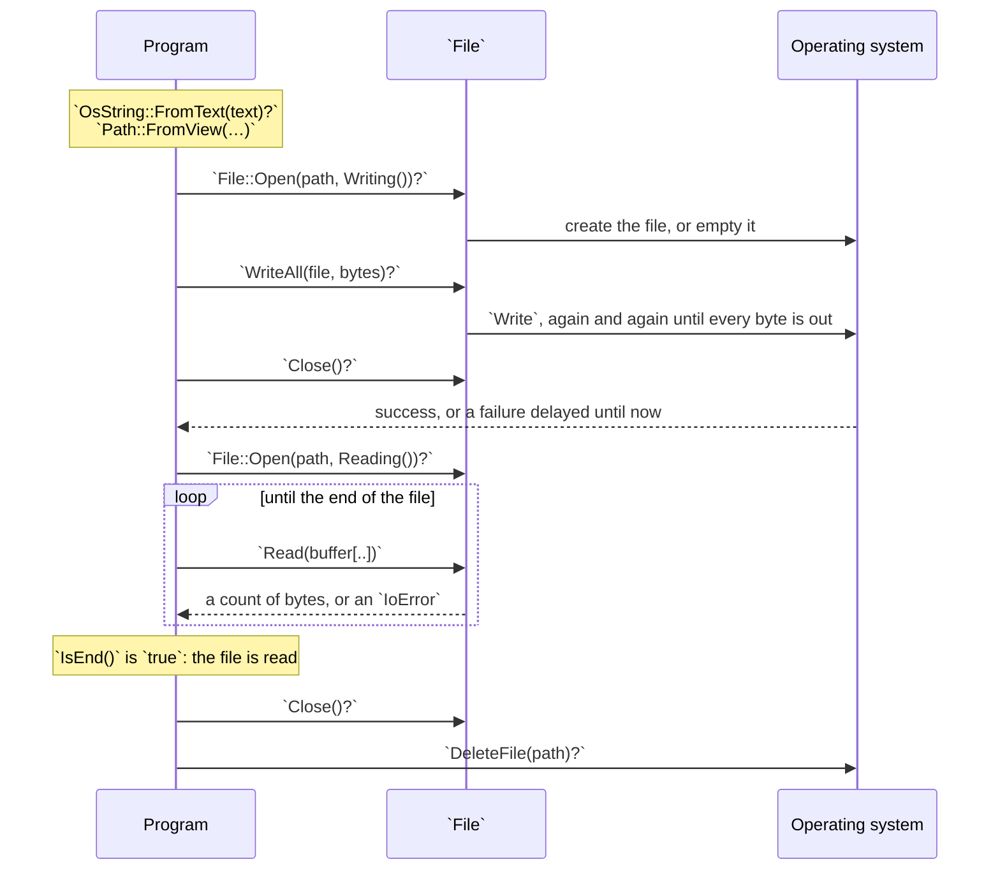

# Part 19: Files

Everything so far has lived in memory and vanished when the program ended. A file is how data outlives the program — and it is also where a program meets a world it does not control: names that are not valid text, disks that fill up, files that someone else deletes or reads half-written. This part tours the `Path` package, which names files, and the `FileSystem` package, which reads, writes and manages them, and it handles every failure along the way.

## What you will learn

- Why a path is not a string, and how `OsString`, `Path` and `PathBuffer` take one apart, build one and tidy one.
- Opening, writing, reading and closing a file, with `IoError` handled at every step — including the end of the file, which arrives as a failure.
- Making, listing and removing directories, and asking the filesystem what a name refers to.
- Writing fixed-width binary records, and refusing one that the file cut short.
- Gathering small writes in a buffer, and knowing when the bytes really reach the file.
- Replacing a file so that no reader ever sees it half-written, and scratch files that clean up after themselves.

## A file's life

Every lesson here covers a piece of one sequence: turn text into a path, open the file, move bytes, close it — and check each step, because each one asks the operating system for something it may refuse.



| You want to…                                 | Use                                | Lesson                                       |
| -------------------------------------------- | ---------------------------------- | -------------------------------------------- |
| take a path apart                            | `Components`, `FileName`, `Parent` | [Path](/docs/learn/path)                     |
| build a path from pieces                     | `Join`, `PathBuffer::Push`         | [Path join](/docs/learn/path-join)           |
| compare or display paths                     | `Normalize`                        | [Path normalize](/docs/learn/path-normalize) |
| read or write a text file                    | `File::Open`, `WriteAll`, `Read`   | [File](/docs/learn/file)                     |
| list a directory                             | `ReadDirectory`, `Next`            | [Directory](/docs/learn/directory)           |
| ask whether a file exists, and what it is    | `MetadataOf`                       | [Metadata](/docs/learn/metadata)             |
| store numbers as bytes                       | `WriteUint32`, `ReadUint32`, …     | [Binary](/docs/learn/binary)                 |
| make many small writes cheaply               | `BufferedWriter`                   | [Buffered I/O](/docs/learn/buffered-io)      |
| replace a file without a half-written moment | `WriteAtomically`, `AtomicWrite`   | [Atomic file](/docs/learn/atomic-file)       |
| scratch space that removes itself            | `TemporaryFile`                    | [Temporary file](/docs/learn/temporary-file) |

## Lessons

<!-- sync:lessons:start -->

|       | Lesson                                       | What you will learn                                                   |
| ----- | -------------------------------------------- | --------------------------------------------------------------------- |
| 19.1  | [Path](/docs/learn/path)                     | split a path into its parts, and see why a path is not a string       |
| 19.2  | [Path join](/docs/learn/path-join)           | build a path from parts                                               |
| 19.3  | [Path normalize](/docs/learn/path-normalize) | tidy a path by removing `.` and `..`                                  |
| 19.4  | [File](/docs/learn/file)                     | write text to a file and read it back, handling failure at every step |
| 19.5  | [Directory](/docs/learn/directory)           | create, list, and remove directories                                  |
| 19.6  | [Metadata](/docs/learn/metadata)             | ask a file for its size and kind                                      |
| 19.7  | [Binary](/docs/learn/binary)                 | read and write fixed-width values and raw bytes                       |
| 19.8  | [Buffered I/O](/docs/learn/buffered-io)      | buffer writes and flush them                                          |
| 19.9  | [Atomic file](/docs/learn/atomic-file)       | replace a file's contents all at once or not at all                   |
| 19.10 | [Temporary file](/docs/learn/temporary-file) | a scratch file that cleans up after itself                            |

<!-- sync:lessons:end -->

## Before you start

This part leans hard on [Part 9: Errors](/docs/learn/errors) — every lesson's `Main` is a [fallible main](/docs/learn/fallible-main) with an [error sum](/docs/learn/error-sum) on its failure side, and the lessons use [Catch](/docs/learn/catch), [Guard](/docs/learn/guard), [Nested fallible](/docs/learn/nested-fallible) and [Coalesce exit](/docs/learn/coalesce-exit). It also uses [Move](/docs/learn/move) and [Destructor](/docs/learn/destructor) from Part 11, [Interface value](/docs/learn/interface-value) and [Iterator](/docs/learn/iterator) from Part 12, [Allocator](/docs/learn/allocator) from Part 15 and [Endian](/docs/learn/endian) from Part 16. Each lesson's package is in the Examples repository's `Files/` folder:

```sh
cd Examples/Files/File
rux run
```

The programs create their files inside their own package's `Bin/` folder and delete them before they finish. If a run stops part-way, a leftover file or `Bin/scratch` directory may need deleting by hand.

## After this part

[Part 20: Utilities](/docs/learn/utilities) covers time, randomness, hashing and UUIDs — including the `Timestamp` that [Metadata](/docs/learn/metadata) reported. [Part 21: Data formats](/docs/learn/data-formats) then gives your files a structure, and its checkpoint project, [Notes](/docs/learn/notes), keeps a to-do list as JSON in a file — saved with `WriteAtomically`, loaded back, and recovered when the file is missing or damaged.

The Rux Reference describes the language features these packages are built from: [Interfaces](/docs/lang/interfaces/overview), the mechanism behind `Reader` and `Writer`, and [Enumerations](/docs/lang/enums/overview), the shape of `IoErrorKind` and `FileKind`.
