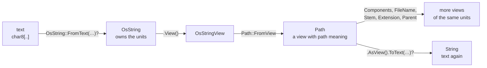

# Path

::note
<!-- sync:needs:start -->

**You'll need**: [Fallible main](/docs/learn/fallible-main), [Coalesce](/docs/learn/coalesce), [Iterator](/docs/learn/iterator), [Allocator](/docs/learn/allocator)
<!-- sync:needs:end -->

::

Every file a program touches is named by a **path**: `Bin/reports/summary.txt`. A path looks like a string, and the first lesson of this part is why it is not one. The `Path` package gives paths their own types, and this lesson takes one apart — into its components, its file name, stem and extension, and its parent — without ever asking the disk whether the file exists.

## A path is not text

The operating system decides what a file name may hold, and its answer is not "valid text". On Windows a name is a run of 16-bit units that need not form valid UTF-16; on Linux and macOS it is bytes that need not form valid UTF-8. A type that insisted on text could not name every file that exists. So the `Path` package has its own types, built on the units the system uses:

| Type           | What it is                                                                      |
| -------------- | ------------------------------------------------------------------------------- |
| `OsString`     | owns a name in the system's own units; needs an allocator                       |
| `OsStringView` | a borrowed, read-only look at such units                                        |
| `Path`         | a borrowed view with path meaning attached: components, parent, extension       |
| `PathBuffer`   | an owned path that can grow — the subject of [Path join](/docs/learn/path-join) |

Text goes in through `OsString::FromText`, which converts it to the system's units and so needs memory — an `Allocator`, the interface from [Allocator](/docs/learn/allocator):

```rux
var system = SystemAllocator();
let allocator: Allocator = system;

var holder = OsString::FromText(allocator, "Bin//reports/summary.txt")?;
let path = Path::FromView(holder.View());
```

`FromText` returns `OsString ! TextError`, so the `?` passes a failure on, and `Main` is fallible — `func Main() -> ! TextError`, as in [Fallible main](/docs/learn/fallible-main). The `OsString` is the **holder**: it owns the units. `path` is only a view of them, so the holder must stay alive for as long as the path is used.



## Components

A path is a sequence of components, and the separators between them belong to the platform: Windows accepts `/` and `\`, the others only `/`. `Components` returns an [iterator](/docs/learn/iterator), so `for` walks it:

```rux
for part in path.Components() {
    Print(" [{}]", part);
}
```

The output is `[Bin] [reports] [summary.txt]`. A run of separators counts as one, so the doubled slash yields no empty component — which is exactly what splitting the text on `"/"` by hand would get wrong.

## Named parts may be missing

`FileName`, `Stem` and `Extension` each return an `OsStringView?`, because each can be absent: a root such as `/` has no file name, and `Makefile` has no extension. `ShowPart` matches the optional before printing:

```rux
func ShowPart(label: char8[..], part: OsStringView?) {
    match part {
        name? => PrintLine("{:10} {}", label, name),
        none => PrintLine("{:10} (none)", label)
    }
}
```

| Call          | For `Bin//reports/summary.txt` |
| ------------- | ------------------------------ |
| `FileName()`  | `summary.txt`                  |
| `Stem()`      | `summary`                      |
| `Extension()` | `txt` — without the dot        |
| `Parent()`    | `Bin//reports`                 |

`Parent` drops the last component and returns a `Path?`, absent once there is nothing left to drop. Here [`??`](/docs/learn/coalesce) supplies an empty `Path()` in that case:

```rux
let parent = path.Parent() ?? Path();
```

The parent keeps the doubled slash: these calls only pick out part of the units, and never rewrite them. Tidying a path is the job of [Path normalize](/docs/learn/path-normalize).

## Back to text

Printing with `{}` always works: any unit that is not text is swapped for the replacement character U+FFFD. That is fine for a message and useless for reopening the file. The exact way back is `ToText`, and it is fallible, because a name from the system may not be text at all:

```rux
let text = path.AsView().ToText(allocator)?;
```

Here it succeeds, because this name began as text. A name read from a directory listing comes with no such guarantee.

## The program

The whole lesson is one package in the [Examples repository](https://github.com/rux-lang/Examples/tree/main/Files/Path). Its comments explain every step.

<!-- sync:program:start -->

```rux [Src/Main.rux]
// A path looks like a string and is not one.
//
// The operating system decides what a file name may hold, and its answer is not "valid text".
// On Windows a name is 16-bit units that need not form valid UTF-16; on Linux and macOS it is
// bytes that need not form valid UTF-8. A type that insisted on text could not name every file
// that exists. So the `Path` package has `OsString`, which holds the units the system holds,
// and `Path`, a borrowed view of them with path meaning attached.
//
// That meaning is structure. A path is a sequence of components, and the separators between
// them belong to the platform: Windows accepts `/` and `\`, the others only `/`. Runs of
// separators count as one, so splitting the text on "/" by hand would invent empty pieces.
// Nothing here asks the filesystem anything: a path need not name a file that exists.
//
// Text goes in through `OsString::FromText` and comes back out through `ToText`. Both return
// `T ! TextError`, and the way out is the one that can really fail: a name from the system may
// not be text at all. `{}` shows a path anyway, swapping any unit that is not text for U+FFFD,
// which is fine for a message and useless for reopening the file.
import Allocator::{ Allocator, SystemAllocator };
import Io::{ Print, PrintLine };
import Path::{ OsString, OsStringView, Path };
import Text::TextError;

// The named parts are optional: a root has no file name, and `Makefile` has no extension.
func ShowPart(label: char8[..], part: OsStringView?) {
    match part {
        name? => PrintLine("{:10} {}", label, name),
        none => PrintLine("{:10} (none)", label)
    }
}

func Main() -> ! TextError {
    var system = SystemAllocator();
    let allocator: Allocator = system;

    var holder = OsString::FromText(allocator, "Bin//reports/summary.txt")?;
    let path = Path::FromView(holder.View());
    PrintLine("{:10} {}", "path", path);

    // `Components` is an iterator, so `for` walks it. The doubled slash yields no empty part.
    Print("{:10}", "components");
    for part in path.Components() {
        Print(" [{}]", part);
    }
    PrintLine();

    ShowPart("file name", path.FileName());
    ShowPart("stem", path.Stem());
    ShowPart("extension", path.Extension());

    // `Parent` drops the last component, and is absent once there is nothing left to drop.
    let parent = path.Parent() ?? Path();
    PrintLine("{:10} {}", "parent", parent);

    // The exact conversion back to text. It succeeds here because the name began as text.
    let text = path.AsView().ToText(allocator)?;
    PrintLine("{:10} {}", "as text", text);
}
```

Besides `Io`, its `Rux.toml` lists `Allocator`, `Path` and `Text` under `[Dependencies]`.
<!-- sync:program:end -->

## Run it

```sh
cd Examples/Files/Path
rux run
```

<!-- sync:output:start -->

```
path       Bin//reports/summary.txt
components [Bin] [reports] [summary.txt]
file name  summary.txt
stem       summary
extension  txt
parent     Bin//reports
as text    Bin//reports/summary.txt
```

<!-- sync:output:end -->

## Common mistakes

::warning
**Forgetting the `?` after `FromText`.**\
Without it, `holder` is the whole `OsString ! TextError`, not the string, and `holder.View()` fails with `error: type 'OsString ! TextError' has no field 'View'`. Unwrap the fallible first.
::

::warning
**Using `?` in a `Main` that returns `int`.**\
`?` needs somewhere to send the failure. In `func Main() -> int`, it fails with `error: '?' propagates native fallible 'OsString ! TextError', but the enclosing function returns 'int'`, and the help suggests the fix: declare the error channel, as `Main` here does with `-> ! TextError`.
::

::warning
**Passing text where a path is expected.**\
`Path::FromView("Bin/notes.txt")` fails with `error: argument 1 to 'Path::FromView' has type 'char8[..]', but parameter 'view' requires 'OsStringView'`. Text never becomes a path on its own; it goes through `OsString::FromText` first.
::

::warning
**Printing a part without unwrapping it.**\
`PrintLine("{}", path.Parent())` fails with `variadic parameter 'args' requires 'Display'`, naming `'Path?'`. An optional has no text of its own; match it or supply a fallback with `??`.
::

::warning
**Backslashes in a string literal.**\
`"C:\Users\me"` fails to compile with `error: escape sequence '\U' is not recognized`, because `\` starts an escape. Write `"C:\\Users\\me"`, or simply use `/`, which Windows accepts too.
::

## Try it yourself

1. Change the path to `archive.tar.gz` and predict the stem and extension before you run it.
2. Try `.gitignore` and `Makefile`. Which parts are `none`, and which are just short?
3. Walk up the tree: call `Parent` in a loop, printing each path, until it returns `none` (`current = current.Parent() ?? break;`). What is the last path printed before that?
4. Print the number of components by counting them in the `for` loop.

## Learn more

- [Path join](/docs/learn/path-join) — building a path from parts with `PathBuffer`
- [Allocator](/docs/learn/allocator) — where an `OsString`'s memory comes from
- [Encoding](/docs/learn/encoding) and [UTF-8](/docs/learn/utf8) — why a name that is not valid text is a real possibility
- [Iterator](/docs/learn/iterator) — what makes `for part in path.Components()` work
